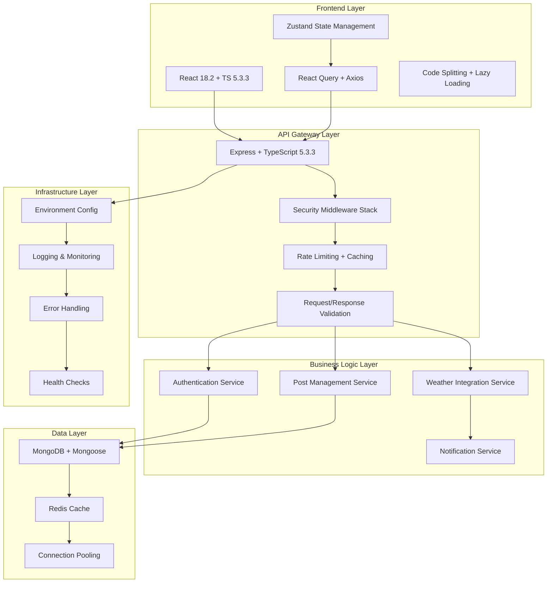
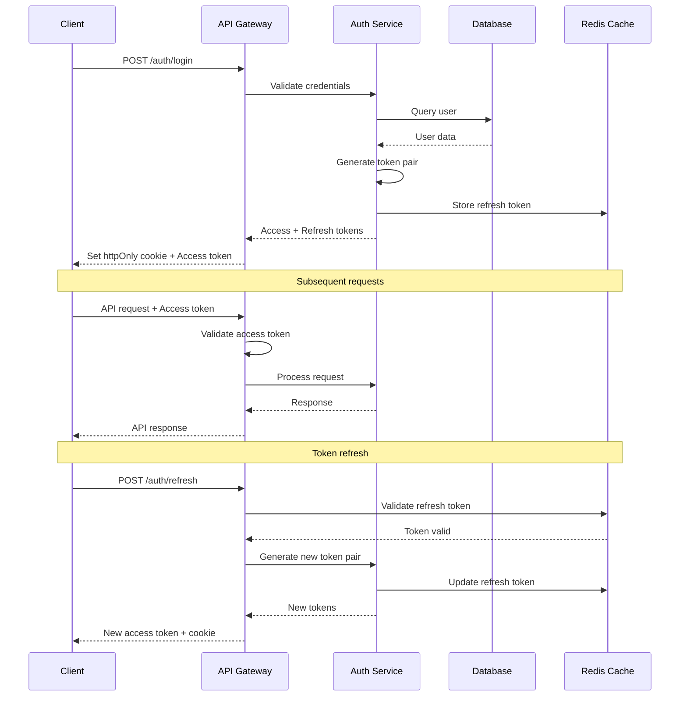
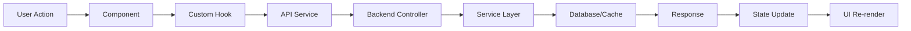
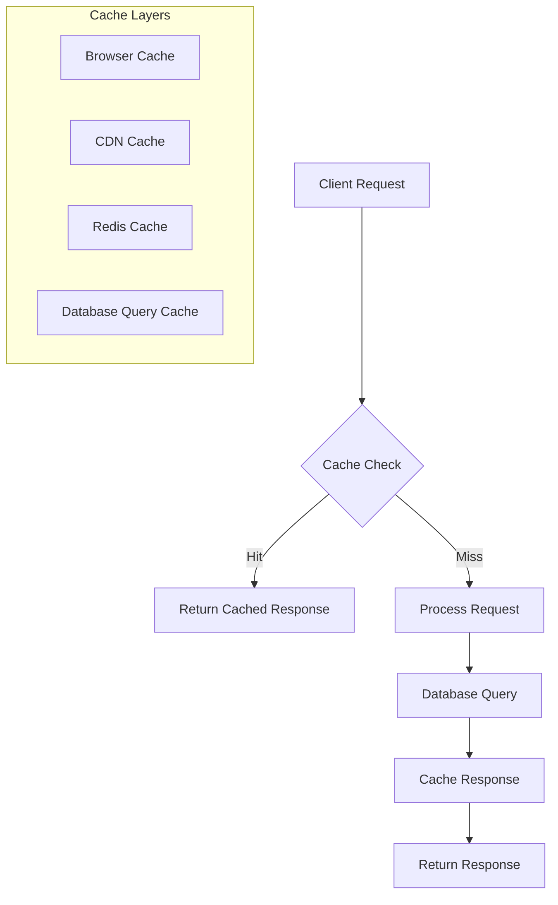

# App_v2 Modernization - Technical Design

## Architecture Overview

### Current State Analysis
Aplikacja app_v2 to full-stack trading application z następującą architekturą:
- **Frontend**: React 18.2 + TypeScript 4.9.5 + Redux Toolkit
- **Backend**: Node.js + Express 4.18 + TypeScript 5.3.3 + MongoDB
- **Authentication**: JWT tokens z localStorage persistence
- **Styling**: Tailwind CSS z utility-first approach

### Target Architecture (2025 Standards)



## Component Architecture

### Frontend Components Hierarchy

```
App
├── Providers
│   ├── AuthProvider (Zustand)
│   ├── QueryProvider (React Query)
│   └── ErrorBoundary
├── Router
│   ├── PublicRoutes
│   │   └── LoginPage
│   └── PrivateRoutes
│       ├── DashboardPage
│       ├── PostsPage
│       └── ProfilePage
└── Shared Components
    ├── UI Components
    ├── Form Components
    └── Layout Components
```

### Backend Service Architecture

```
src/
├── config/
│   ├── database.ts
│   ├── redis.ts
│   ├── environment.ts
│   └── swagger.ts
├── middleware/
│   ├── auth.ts
│   ├── validation.ts
│   ├── security.ts
│   ├── rateLimit.ts
│   └── errorHandler.ts
├── services/
│   ├── AuthService.ts
│   ├── PostService.ts
│   ├── WeatherService.ts
│   └── CacheService.ts
├── controllers/
│   ├── AuthController.ts
│   ├── PostController.ts
│   └── WeatherController.ts
├── models/
│   ├── User.ts
│   ├── Post.ts
│   └── Session.ts
├── routes/
│   ├── auth.ts
│   ├── posts.ts
│   └── weather.ts
└── utils/
    ├── logger.ts
    ├── validators.ts
    └── helpers.ts
```

## Data Flow Architecture

### Authentication Flow



### Data Management Flow



## Security Architecture

### Security Layers Implementation

#### 1. Transport Security
```typescript
// HTTPS enforcement
app.use((req, res, next) => {
  if (req.header('x-forwarded-proto') !== 'https') {
    res.redirect(`https://${req.header('host')}${req.url}`);
  } else {
    next();
  }
});

// Security headers
app.use(helmet({
  contentSecurityPolicy: {
    directives: {
      defaultSrc: ["'self'"],
      styleSrc: ["'self'", "'unsafe-inline'", "https://fonts.googleapis.com"],
      fontSrc: ["'self'", "https://fonts.gstatic.com"],
      scriptSrc: ["'self'"],
      imgSrc: ["'self'", "data:", "https:"],
      connectSrc: ["'self'", process.env.API_URL],
    },
  },
  hsts: {
    maxAge: 31536000,
    includeSubDomains: true,
    preload: true
  }
}));
```

#### 2. Authentication Security
```typescript
// JWT Configuration
const JWT_CONFIG = {
  accessToken: {
    secret: process.env.JWT_ACCESS_SECRET,
    expiresIn: '15m',
    algorithm: 'HS256'
  },
  refreshToken: {
    secret: process.env.JWT_REFRESH_SECRET,
    expiresIn: '7d',
    algorithm: 'HS256'
  }
};

// Secure cookie configuration
const COOKIE_CONFIG = {
  httpOnly: true,
  secure: process.env.NODE_ENV === 'production',
  sameSite: 'strict' as const,
  maxAge: 7 * 24 * 60 * 60 * 1000 // 7 days
};
```

#### 3. Input Validation & Sanitization
```typescript
// Comprehensive validation middleware
export const validateAndSanitize = (schema: ZodSchema) => {
  return async (req: Request, res: Response, next: NextFunction) => {
    try {
      // Sanitize inputs
      req.body = sanitizeObject(req.body);
      req.query = sanitizeObject(req.query);
      
      // Validate with Zod
      const validated = await schema.parseAsync({
        body: req.body,
        query: req.query,
        params: req.params,
      });
      
      req.validated = validated;
      next();
    } catch (error) {
      if (error instanceof ZodError) {
        return res.status(400).json({
          error: 'Validation failed',
          details: error.errors
        });
      }
      next(error);
    }
  };
};
```

## Performance Architecture

### Caching Strategy



#### Cache Implementation
```typescript
// Redis cache service
export class CacheService {
  private redis: Redis;
  
  constructor() {
    this.redis = new Redis(process.env.REDIS_URL);
  }
  
  async get<T>(key: string): Promise<T | null> {
    const cached = await this.redis.get(key);
    return cached ? JSON.parse(cached) : null;
  }
  
  async set(key: string, value: any, ttl: number = 3600): Promise<void> {
    await this.redis.setex(key, ttl, JSON.stringify(value));
  }
  
  async invalidate(pattern: string): Promise<void> {
    const keys = await this.redis.keys(pattern);
    if (keys.length > 0) {
      await this.redis.del(...keys);
    }
  }
}

// Cache middleware
export const cacheMiddleware = (ttl: number = 3600) => {
  return async (req: Request, res: Response, next: NextFunction) => {
    const cacheKey = `api:${req.method}:${req.originalUrl}`;
    const cached = await cacheService.get(cacheKey);
    
    if (cached) {
      return res.json(cached);
    }
    
    const originalSend = res.json;
    res.json = function(data) {
      cacheService.set(cacheKey, data, ttl);
      return originalSend.call(this, data);
    };
    
    next();
  };
};
```

### Frontend Performance Optimization

#### Code Splitting Implementation
```typescript
// Route-based code splitting
import { lazy, Suspense } from 'react';
import { Routes, Route } from 'react-router-dom';
import LoadingSpinner from './components/LoadingSpinner';

const Dashboard = lazy(() => import('./pages/Dashboard'));
const Posts = lazy(() => import('./pages/Posts'));
const Profile = lazy(() => import('./pages/Profile'));

export const AppRoutes = () => (
  <Suspense fallback={<LoadingSpinner />}>
    <Routes>
      <Route path="/" element={<Dashboard />} />
      <Route path="/posts" element={<Posts />} />
      <Route path="/profile" element={<Profile />} />
    </Routes>
  </Suspense>
);
```

#### Bundle Optimization
```typescript
// Webpack bundle analysis configuration
const BundleAnalyzerPlugin = require('webpack-bundle-analyzer').BundleAnalyzerPlugin;

module.exports = {
  plugins: [
    new BundleAnalyzerPlugin({
      analyzerMode: 'static',
      openAnalyzer: false,
      reportFilename: 'bundle-report.html'
    })
  ],
  optimization: {
    splitChunks: {
      chunks: 'all',
      cacheGroups: {
        vendor: {
          test: /[\\/]node_modules[\\/]/,
          name: 'vendors',
          chunks: 'all',
        },
        common: {
          name: 'common',
          minChunks: 2,
          chunks: 'all',
          enforce: true
        }
      }
    }
  }
};
```

## Database Design

### Optimized Schema Design

```typescript
// User schema with optimizations
const UserSchema = new Schema({
  name: { type: String, required: true, trim: true, maxlength: 100 },
  email: { 
    type: String, 
    required: true, 
    unique: true, 
    lowercase: true,
    index: true,
    validate: [validator.isEmail, 'Invalid email']
  },
  password: { 
    type: String, 
    required: true, 
    minlength: 8,
    select: false 
  },
  role: { 
    type: String, 
    enum: ['user', 'admin'], 
    default: 'user',
    index: true 
  },
  isActive: { type: Boolean, default: true, index: true },
  lastLogin: { type: Date },
  loginAttempts: { type: Number, default: 0 },
  lockUntil: { type: Date }
}, {
  timestamps: true,
  toJSON: { virtuals: true },
  toObject: { virtuals: true }
});

// Compound indexes for common queries
UserSchema.index({ email: 1, isActive: 1 });
UserSchema.index({ role: 1, createdAt: -1 });
UserSchema.index({ lastLogin: -1 }, { sparse: true });
```

### Query Optimization Patterns

```typescript
// Optimized post queries with pagination
export class PostService {
  async getPosts(options: {
    page: number;
    limit: number;
    userId?: string;
    sortBy?: string;
  }) {
    const { page = 1, limit = 10, userId, sortBy = 'createdAt' } = options;
    const skip = (page - 1) * limit;
    
    const query = userId ? { author: userId } : {};
    const sort = { [sortBy]: -1 };
    
    const [posts, total] = await Promise.all([
      Post.find(query)
        .populate('author', 'name email')
        .sort(sort)
        .skip(skip)
        .limit(limit)
        .lean(), // Use lean() for read-only operations
      Post.countDocuments(query)
    ]);
    
    return {
      posts,
      pagination: {
        page,
        limit,
        total,
        pages: Math.ceil(total / limit)
      }
    };
  }
}
```

## Error Handling Architecture

### Centralized Error Management

```typescript
// Custom error classes
export class AppError extends Error {
  public statusCode: number;
  public isOperational: boolean;
  
  constructor(message: string, statusCode: number) {
    super(message);
    this.statusCode = statusCode;
    this.isOperational = true;
    
    Error.captureStackTrace(this, this.constructor);
  }
}

// Global error handler
export const globalErrorHandler = (
  err: Error,
  req: Request,
  res: Response,
  next: NextFunction
) => {
  let error = { ...err };
  error.message = err.message;
  
  // Log error
  logger.error({
    error: err,
    request: {
      method: req.method,
      url: req.url,
      headers: req.headers,
      body: req.body
    }
  });
  
  // Mongoose validation error
  if (err.name === 'ValidationError') {
    const message = Object.values(err.errors).map(val => val.message);
    error = new AppError(message.join(', '), 400);
  }
  
  // JWT errors
  if (err.name === 'JsonWebTokenError') {
    error = new AppError('Invalid token', 401);
  }
  
  // Send error response
  res.status(error.statusCode || 500).json({
    success: false,
    error: error.message || 'Server Error',
    ...(process.env.NODE_ENV === 'development' && { stack: err.stack })
  });
};
```

## Monitoring & Observability

### Logging Strategy

```typescript
// Structured logging with Winston
import winston from 'winston';

export const logger = winston.createLogger({
  level: process.env.LOG_LEVEL || 'info',
  format: winston.format.combine(
    winston.format.timestamp(),
    winston.format.errors({ stack: true }),
    winston.format.json()
  ),
  defaultMeta: { service: 'app-v2-api' },
  transports: [
    new winston.transports.File({ filename: 'logs/error.log', level: 'error' }),
    new winston.transports.File({ filename: 'logs/combined.log' }),
    ...(process.env.NODE_ENV !== 'production' ? [
      new winston.transports.Console({
        format: winston.format.simple()
      })
    ] : [])
  ]
});
```

### Health Checks

```typescript
// Comprehensive health check endpoint
export const healthCheck = async (req: Request, res: Response) => {
  const health = {
    status: 'OK',
    timestamp: new Date().toISOString(),
    uptime: process.uptime(),
    checks: {
      database: await checkDatabase(),
      redis: await checkRedis(),
      memory: checkMemory(),
      disk: await checkDisk()
    }
  };
  
  const isHealthy = Object.values(health.checks).every(check => check.status === 'OK');
  
  res.status(isHealthy ? 200 : 503).json(health);
};
```

## Deployment Architecture

### Environment Configuration

```typescript
// Environment validation schema
const envSchema = z.object({
  NODE_ENV: z.enum(['development', 'staging', 'production']),
  PORT: z.string().transform(Number).default('5000'),
  
  // Database
  MONGO_URI: z.string().url(),
  REDIS_URL: z.string().url(),
  
  // Authentication
  JWT_ACCESS_SECRET: z.string().min(32),
  JWT_REFRESH_SECRET: z.string().min(32),
  
  // External APIs
  OPENWEATHERMAP_API_KEY: z.string().optional(),
  
  // Security
  ALLOWED_ORIGINS: z.string().transform(s => s.split(',')),
  RATE_LIMIT_WINDOW_MS: z.string().transform(Number).default('900000'),
  RATE_LIMIT_MAX_REQUESTS: z.string().transform(Number).default('100'),
  
  // Monitoring
  LOG_LEVEL: z.enum(['error', 'warn', 'info', 'debug']).default('info'),
});

export const env = envSchema.parse(process.env);
```

### Docker Configuration

```dockerfile
# Multi-stage build for production
FROM node:18-alpine AS builder

WORKDIR /app
COPY package*.json ./
RUN npm ci --only=production

FROM node:18-alpine AS production

RUN addgroup -g 1001 -S nodejs
RUN adduser -S nextjs -u 1001

WORKDIR /app
COPY --from=builder /app/node_modules ./node_modules
COPY . .

USER nextjs

EXPOSE 5000

CMD ["npm", "start"]
```

## Migration Strategy

### Phase-by-Phase Implementation

#### Phase 1: Foundation (Week 1-2)
1. TypeScript version alignment
2. Security headers implementation
3. Environment configuration validation
4. Basic error handling improvements

#### Phase 2: Architecture (Week 3-4)
1. Service layer refactoring
2. Custom hooks implementation
3. State management optimization
4. API client improvements

#### Phase 3: Performance (Week 5-6)
1. Code splitting implementation
2. Caching layer addition
3. Database query optimization
4. Bundle size optimization

#### Phase 4: Advanced Features (Week 7-8)
1. Advanced authentication flows
2. Real-time capabilities
3. Monitoring and observability
4. Performance monitoring

### Rollback Strategy

```typescript
// Feature flags for gradual rollout
export const featureFlags = {
  useNewAuth: process.env.FEATURE_NEW_AUTH === 'true',
  useCodeSplitting: process.env.FEATURE_CODE_SPLITTING === 'true',
  useRedisCache: process.env.FEATURE_REDIS_CACHE === 'true',
  useAdvancedSecurity: process.env.FEATURE_ADVANCED_SECURITY === 'true'
};

// Graceful degradation
export const withFeatureFlag = (flag: keyof typeof featureFlags, fallback: any) => {
  return featureFlags[flag] ? implementation : fallback;
};
```

## Success Metrics & KPIs

### Technical Metrics
- **Performance**: Page load time < 2s, API response < 500ms
- **Security**: Zero critical vulnerabilities, 100% HTTPS
- **Quality**: Test coverage > 80%, TypeScript strict mode
- **Reliability**: 99.9% uptime, < 1% error rate

### Business Metrics
- **Developer Experience**: Reduced development time by 30%
- **User Experience**: Improved Lighthouse scores by 25%
- **Maintenance**: Reduced bug reports by 40%
- **Scalability**: Support for 10x current load

This design provides a comprehensive roadmap for modernizing the app_v2 application while maintaining backward compatibility and ensuring a smooth transition to 2025 standards.