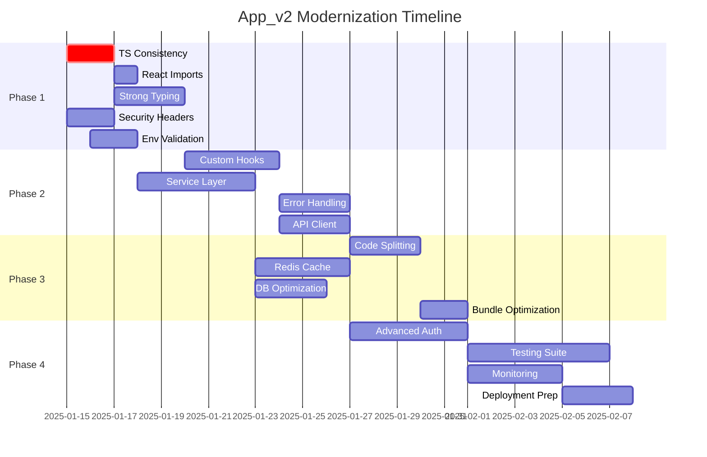

# App_v2 Modernization - Implementation Tasks

## Phase 1: Critical Foundation Updates (Week 1-2)

### Task 1.1: TypeScript Version Consistency
**Priority**: Critical  
**Estimated Effort**: 4 hours  
**Dependencies**: None

**Description**: Ujednolicenie wersji TypeScript między frontend i backend na 5.3.3

**Subtasks**:
- [ ] Upgrade frontend TypeScript z 4.9.5 do 5.3.3
- [ ] Update tsconfig.json dla compatibility z nową wersją
- [ ] Fix compilation errors po upgrade
- [ ] Update @types/* dependencies
- [ ] Test build process na obu projektach
- [ ] Update CI/CD pipeline dla nowej wersji TS

**Acceptance Criteria**:
- Frontend i backend używają TypeScript 5.3.3
- Wszystkie pliki kompilują się bez błędów
- Testy przechodzą po upgrade
- Build process działa poprawnie

**Files to Modify**:
- `app_v2/frontend/package.json`
- `app_v2/frontend/tsconfig.json`
- `app_v2/backend/package.json`
- `app_v2/backend/tsconfig.json`

---

### Task 1.2: React Import Optimization
**Priority**: High  
**Estimated Effort**: 2 hours  
**Dependencies**: Task 1.1

**Description**: Usunięcie niepotrzebnych React importów i konfiguracja JSX transform

**Subtasks**:
- [ ] Configure JSX transform w tsconfig.json
- [ ] Remove `import React from 'react'` z wszystkich komponentów
- [ ] Update ESLint rules dla nowego JSX transform
- [ ] Test wszystkich komponentów po zmianach
- [ ] Update documentation

**Acceptance Criteria**:
- Brak niepotrzebnych React importów
- Wszystkie komponenty renderują się poprawnie
- Brak ESLint warnings
- Bundle size reduction

**Files to Modify**:
- `app_v2/frontend/src/App.tsx`
- `app_v2/frontend/src/components/*.tsx`
- `app_v2/frontend/tsconfig.json`
- `app_v2/frontend/.eslintrc.json`

---

### Task 1.3: Strong TypeScript Typing
**Priority**: High  
**Estimated Effort**: 6 hours  
**Dependencies**: Task 1.1

**Description**: Zastąpienie wszystkich `any` typów silnym typowaniem

**Subtasks**:
- [ ] Define User interface w shared types
- [ ] Define Post interface z proper typing
- [ ] Define API response types
- [ ] Replace `any` w authSlice z proper types
- [ ] Replace `any` w postSlice z proper types
- [ ] Add type guards dla runtime validation
- [ ] Update component props typing

**Acceptance Criteria**:
- Zero `any` types w codebase
- Wszystkie interfaces są zdefiniowane
- Type safety w całej aplikacji
- Runtime type validation

**Files to Create/Modify**:
- `app_v2/frontend/src/types/index.ts`
- `app_v2/frontend/src/types/api.ts`
- `app_v2/frontend/src/store/slices/authSlice.ts`
- `app_v2/frontend/src/store/slices/postSlice.ts`

---

### Task 1.4: Enhanced Security Headers
**Priority**: Critical  
**Estimated Effort**: 4 hours  
**Dependencies**: None

**Description**: Implementacja comprehensive security headers zgodnie z OWASP 2025

**Subtasks**:
- [ ] Configure Content Security Policy (CSP)
- [ ] Setup HSTS headers z preload
- [ ] Add X-Frame-Options, X-Content-Type-Options
- [ ] Configure Referrer-Policy i Permissions-Policy
- [ ] Test security headers z online tools
- [ ] Document security configuration

**Acceptance Criteria**:
- Wszystkie OWASP recommended headers
- CSP policy bez unsafe-eval/unsafe-inline
- Security headers test score A+
- No security warnings w browser console

**Files to Modify**:
- `app_v2/backend/src/server.ts`
- `app_v2/backend/src/middleware/security.ts` (new)
- `app_v2/backend/src/config/security.ts` (new)

---

### Task 1.5: Environment Configuration Validation
**Priority**: High  
**Estimated Effort**: 3 hours  
**Dependencies**: None

**Description**: Dodanie Zod-based validation dla environment variables

**Subtasks**:
- [ ] Create environment schema z Zod
- [ ] Validate env variables na startup
- [ ] Add proper error handling dla missing vars
- [ ] Create separate configs dla environments
- [ ] Update documentation dla required env vars
- [ ] Add env validation tests

**Acceptance Criteria**:
- Comprehensive env validation schema
- Clear error messages dla missing variables
- Type-safe environment configuration
- Separate dev/staging/prod configs

**Files to Create/Modify**:
- `app_v2/backend/src/config/environment.ts` (new)
- `app_v2/backend/src/server.ts`
- `app_v2/backend/.env.example`
- `app_v2/frontend/.env.example`

---

## Phase 2: Architecture Improvements (Week 3-4)

### Task 2.1: Custom Hooks Implementation
**Priority**: Medium  
**Estimated Effort**: 8 hours  
**Dependencies**: Task 1.3

**Description**: Refactoring logic do reusable custom hooks

**Subtasks**:
- [ ] Create useAuth hook dla authentication logic
- [ ] Create useApi hook dla API calls z error handling
- [ ] Create useLocalStorage hook dla persistence
- [ ] Create usePagination hook dla list components
- [ ] Refactor components do używania custom hooks
- [ ] Add tests dla custom hooks

**Acceptance Criteria**:
- Reusable logic w custom hooks
- Components są cleaner i focused
- Proper error handling w hooks
- Comprehensive hook tests

**Files to Create**:
- `app_v2/frontend/src/hooks/useAuth.ts`
- `app_v2/frontend/src/hooks/useApi.ts`
- `app_v2/frontend/src/hooks/useLocalStorage.ts`
- `app_v2/frontend/src/hooks/usePagination.ts`
- `app_v2/frontend/src/hooks/__tests__/`

---

### Task 2.2: Service Layer Refactoring
**Priority**: Medium  
**Estimated Effort**: 10 hours  
**Dependencies**: Task 1.5

**Description**: Wydzielenie business logic do service layer

**Subtasks**:
- [ ] Create AuthService class
- [ ] Create PostService class  
- [ ] Create WeatherService class
- [ ] Create CacheService class
- [ ] Refactor controllers do używania services
- [ ] Add service layer tests
- [ ] Update API documentation

**Acceptance Criteria**:
- Clean separation of concerns
- Reusable business logic
- Proper dependency injection
- Service layer test coverage > 80%

**Files to Create**:
- `app_v2/backend/src/services/AuthService.ts`
- `app_v2/backend/src/services/PostService.ts`
- `app_v2/backend/src/services/WeatherService.ts`
- `app_v2/backend/src/services/CacheService.ts`

---

### Task 2.3: Error Boundaries & Global Error Handling
**Priority**: High  
**Estimated Effort**: 6 hours  
**Dependencies**: Task 2.1

**Description**: Implementacja comprehensive error handling

**Subtasks**:
- [ ] Create React Error Boundary component
- [ ] Implement global error handler dla unhandled promises
- [ ] Add structured logging z correlation IDs
- [ ] Create user-friendly error messages
- [ ] Add error reporting mechanism
- [ ] Test error scenarios

**Acceptance Criteria**:
- Graceful error handling w całej aplikacji
- User-friendly error messages
- Proper error logging i monitoring
- No unhandled promise rejections

**Files to Create/Modify**:
- `app_v2/frontend/src/components/ErrorBoundary.tsx`
- `app_v2/frontend/src/utils/errorHandler.ts`
- `app_v2/backend/src/middleware/errorHandler.ts`
- `app_v2/backend/src/utils/logger.ts`

---

### Task 2.4: API Client Enhancement
**Priority**: Medium  
**Estimated Effort**: 5 hours  
**Dependencies**: Task 2.1

**Description**: Stworzenie robust API client z interceptors

**Subtasks**:
- [ ] Create axios instance z base configuration
- [ ] Add request/response interceptors
- [ ] Implement automatic token refresh
- [ ] Add retry logic dla failed requests
- [ ] Add request/response logging
- [ ] Create API client tests

**Acceptance Criteria**:
- Centralized API configuration
- Automatic authentication handling
- Robust error handling i retries
- Comprehensive logging

**Files to Create**:
- `app_v2/frontend/src/services/apiClient.ts`
- `app_v2/frontend/src/services/authInterceptor.ts`
- `app_v2/frontend/src/services/__tests__/apiClient.test.ts`

---

## Phase 3: Performance Optimization (Week 5-6)

### Task 3.1: Frontend Code Splitting
**Priority**: High  
**Estimated Effort**: 6 hours  
**Dependencies**: Task 2.3

**Description**: Implementacja route-based code splitting

**Subtasks**:
- [ ] Convert components do lazy loading
- [ ] Add Suspense boundaries z loading states
- [ ] Implement progressive loading strategies
- [ ] Optimize bundle splitting configuration
- [ ] Add bundle analyzer setup
- [ ] Test loading performance

**Acceptance Criteria**:
- Route-based code splitting
- Improved initial load time
- Bundle size reduction > 30%
- Lighthouse Performance Score > 90

**Files to Modify**:
- `app_v2/frontend/src/App.tsx`
- `app_v2/frontend/src/components/LoadingSpinner.tsx` (new)
- `app_v2/frontend/webpack.config.js` (if ejected)

---

### Task 3.2: Redis Caching Implementation
**Priority**: High  
**Estimated Effort**: 8 hours  
**Dependencies**: Task 2.2

**Description**: Dodanie Redis cache layer dla API responses

**Subtasks**:
- [ ] Setup Redis connection i configuration
- [ ] Implement cache middleware
- [ ] Add cache invalidation strategies
- [ ] Implement cache warming dla critical data
- [ ] Add cache monitoring i metrics
- [ ] Test cache performance

**Acceptance Criteria**:
- Redis cache layer operational
- Cache hit ratio > 80%
- API response time improvement > 50%
- Proper cache invalidation

**Files to Create**:
- `app_v2/backend/src/config/redis.ts`
- `app_v2/backend/src/middleware/cache.ts`
- `app_v2/backend/src/services/CacheService.ts`

---

### Task 3.3: Database Query Optimization
**Priority**: Medium  
**Estimated Effort**: 6 hours  
**Dependencies**: Task 2.2

**Description**: Optymalizacja MongoDB queries i indexing

**Subtasks**:
- [ ] Add compound indexes dla common queries
- [ ] Implement pagination dla list endpoints
- [ ] Use lean() queries dla read-only operations
- [ ] Add query performance monitoring
- [ ] Optimize aggregation pipelines
- [ ] Add database performance tests

**Acceptance Criteria**:
- Optimized database indexes
- Query performance improvement > 40%
- Proper pagination implementation
- Database monitoring setup

**Files to Modify**:
- `app_v2/backend/src/models/User.ts`
- `app_v2/backend/src/models/Post.ts`
- `app_v2/backend/src/services/PostService.ts`

---

### Task 3.4: Bundle Size Optimization
**Priority**: Medium  
**Estimated Effort**: 4 hours  
**Dependencies**: Task 3.1

**Description**: Optymalizacja bundle size i loading performance

**Subtasks**:
- [ ] Analyze current bundle composition
- [ ] Remove unused dependencies
- [ ] Implement tree shaking optimization
- [ ] Add compression middleware
- [ ] Optimize asset loading
- [ ] Setup performance monitoring

**Acceptance Criteria**:
- Bundle size reduction > 25%
- Improved First Contentful Paint
- Better Core Web Vitals scores
- Performance budget compliance

**Files to Modify**:
- `app_v2/frontend/package.json`
- `app_v2/frontend/src/index.tsx`
- `app_v2/backend/src/server.ts`

---

## Phase 4: Advanced Features (Week 7-8)

### Task 4.1: Advanced Authentication System
**Priority**: Medium  
**Estimated Effort**: 10 hours  
**Dependencies**: Task 3.2

**Description**: Implementacja refresh token mechanism z rotacją

**Subtasks**:
- [ ] Implement refresh token generation i storage
- [ ] Add automatic token rotation
- [ ] Setup secure httpOnly cookies
- [ ] Add session management
- [ ] Implement logout z token invalidation
- [ ] Add authentication tests

**Acceptance Criteria**:
- Secure refresh token mechanism
- Automatic token rotation
- Session management
- Enhanced security posture

**Files to Create/Modify**:
- `app_v2/backend/src/services/AuthService.ts`
- `app_v2/backend/src/models/Session.ts` (new)
- `app_v2/frontend/src/hooks/useAuth.ts`

---

### Task 4.2: Comprehensive Testing Suite
**Priority**: High  
**Estimated Effort**: 12 hours  
**Dependencies**: All previous tasks

**Description**: Rozszerzenie test coverage dla całej aplikacji

**Subtasks**:
- [ ] Add unit tests dla wszystkich services
- [ ] Create integration tests dla API endpoints
- [ ] Add E2E tests dla critical user flows
- [ ] Setup performance testing
- [ ] Add security testing
- [ ] Configure test coverage reporting

**Acceptance Criteria**:
- Unit test coverage > 80%
- Integration tests dla wszystkich endpoints
- E2E tests dla main user journeys
- Performance test suite

**Files to Create**:
- `app_v2/backend/src/**/__tests__/`
- `app_v2/frontend/src/**/__tests__/`
- `app_v2/e2e/` (new directory)

---

### Task 4.3: Monitoring & Observability
**Priority**: Medium  
**Estimated Effort**: 8 hours  
**Dependencies**: Task 4.1

**Description**: Implementacja comprehensive monitoring i logging

**Subtasks**:
- [ ] Setup structured logging z Winston
- [ ] Add application performance monitoring
- [ ] Implement health check endpoints
- [ ] Add metrics collection
- [ ] Setup alerting dla critical issues
- [ ] Create monitoring dashboard

**Acceptance Criteria**:
- Structured logging w całej aplikacji
- Performance metrics collection
- Health check endpoints
- Alerting system setup

**Files to Create**:
- `app_v2/backend/src/utils/logger.ts`
- `app_v2/backend/src/middleware/monitoring.ts`
- `app_v2/backend/src/routes/health.ts`

---

### Task 4.4: Production Deployment Preparation
**Priority**: High  
**Estimated Effort**: 6 hours  
**Dependencies**: Task 4.3

**Description**: Przygotowanie aplikacji do production deployment

**Subtasks**:
- [ ] Create Docker configuration
- [ ] Setup CI/CD pipeline
- [ ] Add security scanning
- [ ] Configure environment-specific settings
- [ ] Add deployment scripts
- [ ] Create deployment documentation

**Acceptance Criteria**:
- Production-ready Docker setup
- Automated CI/CD pipeline
- Security scanning integration
- Deployment automation

**Files to Create**:
- `app_v2/Dockerfile`
- `app_v2/docker-compose.yml`
- `.github/workflows/` (CI/CD)
- `app_v2/scripts/deploy.sh`

---

## Task Dependencies & Timeline

## Success Criteria & Validation

### Phase 1 Validation
- [ ] TypeScript compilation bez błędów
- [ ] Security headers test score A+
- [ ] Environment validation działa
- [ ] Zero `any` types w codebase

### Phase 2 Validation
- [ ] Service layer test coverage > 80%
- [ ] Custom hooks w użyciu
- [ ] Error boundaries działają
- [ ] API client z interceptors

### Phase 3 Validation
- [ ] Bundle size reduction > 30%
- [ ] Cache hit ratio > 80%
- [ ] Database query performance +40%
- [ ] Lighthouse Performance Score > 90

### Phase 4 Validation
- [ ] Refresh token mechanism działa
- [ ] Test coverage > 80%
- [ ] Monitoring i logging operational
- [ ] Production deployment ready

## Risk Mitigation

### High Risk Items
1. **Breaking Changes**: Feature flags dla gradual rollout
2. **Performance Regression**: Performance testing w każdej fazie
3. **Security Issues**: Security scanning w CI/CD
4. **Data Migration**: Backup strategies i rollback plans

### Rollback Strategy
- Feature flags dla każdej major change
- Database migration scripts z rollback
- Blue-green deployment strategy
- Automated rollback triggers

## Resource Requirements

### Development Team
- 1 Senior Full-Stack Developer (lead)
- 1 Frontend Developer (React/TypeScript)
- 1 Backend Developer (Node.js/MongoDB)
- 1 DevOps Engineer (deployment/monitoring)

### Infrastructure
- Development environment
- Staging environment matching production
- Redis instance dla caching
- Monitoring tools (APM, logging)

### Timeline Summary
- **Total Duration**: 8 weeks
- **Phase 1 (Critical)**: 2 weeks
- **Phase 2 (Architecture)**: 2 weeks
- **Phase 3 (Performance)**: 2 weeks
- **Phase 4 (Advanced)**: 2 weeks

This comprehensive task breakdown provides a clear roadmap for modernizing the app_v2 application with specific deliverables, timelines, and success criteria for each phase.