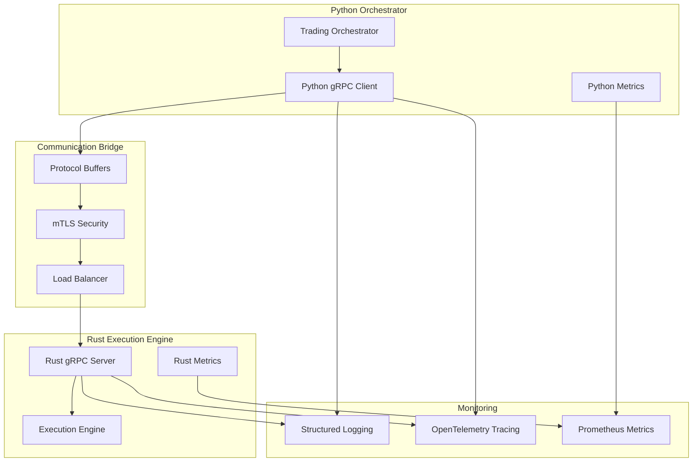

# Design Document

## Overview

The Python ↔ Rust execution bridge is a high-performance, type-safe communication layer that enables the Python trading orchestrator to send trade orders to the ultra-low latency Rust execution engine. The design leverages gRPC with Protocol Buffers for type safety, performance, and cross-language compatibility while maintaining sub-50ms execution latency requirements.

The bridge implements multiple communication patterns (synchronous, asynchronous, streaming) to handle different trading scenarios efficiently. It includes comprehensive error handling, monitoring, security features, and automatic failover mechanisms to ensure reliable production trading operations.

## Architecture

### High-Level Architecture



### Communication Patterns

The bridge supports four primary communication patterns:

1. **Synchronous Request-Response**: For urgent market orders requiring immediate confirmation
2. **Asynchronous Message Queue**: For batch operations and non-urgent requests
3. **Bidirectional Streaming**: For real-time market data and order status updates
4. **Publish-Subscribe**: For broadcasting order updates and system notifications

## Components and Interfaces

### Protocol Buffer Schema

```protobuf
syntax = "proto3";

package smc_trading.execution;

import "google/protobuf/timestamp.proto";

// Core trading message types
message TradeOrder {
  string order_id = 1;
  string symbol = 2;
  OrderType order_type = 3;
  OrderSide side = 4;
  double quantity = 5;
  double price = 6;
  double stop_loss = 7;
  double take_profit = 8;
  google.protobuf.Timestamp timestamp = 9;
  map<string, string> metadata = 10;
}

message OrderResponse {
  string order_id = 1;
  ExecutionStatus status = 2;
  string exchange_order_id = 3;
  double executed_quantity = 4;
  double executed_price = 5;
  google.protobuf.Timestamp execution_time = 6;
  string error_message = 7;
}

message MarketDataUpdate {
  string symbol = 1;
  double bid = 2;
  double ask = 3;
  double last_price = 4;
  double volume = 5;
  google.protobuf.Timestamp timestamp = 6;
}

// Enums
enum OrderType {
  MARKET = 0;
  LIMIT = 1;
  STOP_LOSS = 2;
  TAKE_PROFIT = 3;
}

enum OrderSide {
  BUY = 0;
  SELL = 1;
}

enum ExecutionStatus {
  PENDING = 0;
  FILLED = 1;
  PARTIALLY_FILLED = 2;
  CANCELLED = 3;
  REJECTED = 4;
  FAILED = 5;
}

// Service definitions
service ExecutionService {
  // Synchronous order execution
  rpc ExecuteOrder(TradeOrder) returns (OrderResponse);

  // Batch order processing
  rpc ExecuteBatchOrders(stream TradeOrder) returns (stream OrderResponse);

  // Real-time market data streaming
  rpc StreamMarketData(MarketDataRequest) returns (stream MarketDataUpdate);

  // Order status updates
  rpc SubscribeOrderUpdates(OrderSubscriptionRequest) returns (stream OrderResponse);

  // Health check
  rpc HealthCheck(HealthCheckRequest) returns (HealthCheckResponse);
}
```

### Python Client Implementation

```python
# smc_trading_agent/execution_bridge/python_client.py
import asyncio
import grpc
from grpc import aio
from typing import AsyncIterator, Optional, Dict, Any
import logging
from contextlib import asynccontextmanager

from .generated import execution_pb2, execution_pb2_grpc
from .metrics import ExecutionMetrics
from .security import SecurityManager

class ExecutionBridgeClient:
    def __init__(self, config: Dict[str, Any]):
        self.config = config
        self.logger = logging.getLogger(__name__)
        self.metrics = ExecutionMetrics()
        self.security = SecurityManager(config)
        self._channel: Optional[aio.Channel] = None
        self._stub: Optional[execution_pb2_grpc.ExecutionServiceStub] = None

    async def connect(self):
        """Establish secure gRPC connection with mTLS"""
        credentials = self.security.get_channel_credentials()

        self._channel = aio.secure_channel(
            self.config['rust_endpoint'],
            credentials,
            options=[
                ('grpc.keepalive_time_ms', 30000),
                ('grpc.keepalive_timeout_ms', 5000),
                ('grpc.keepalive_permit_without_calls', True),
                ('grpc.http2.max_pings_without_data', 0),
                ('grpc.http2.min_time_between_pings_ms', 10000),
                ('grpc.http2.min_ping_interval_without_data_ms', 300000)
            ]
        )

        self._stub = execution_pb2_grpc.ExecutionServiceStub(self._channel)

        # Verify connection with health check
        await self.health_check()
        self.logger.info("Connected to Rust execution engine")

    async def execute_order_sync(self, trade_order: Dict[str, Any]) -> Dict[str, Any]:
        """Execute single order synchronously"""
        start_time = asyncio.get_event_loop().time()

        try:
            # Convert to protobuf message
            pb_order = self._dict_to_trade_order(trade_order)

            # Execute with timeout
            response = await self._stub.ExecuteOrder(
                pb_order,
                timeout=self.config.get('sync_timeout', 10.0)
            )

            # Record metrics
            execution_time = (asyncio.get_event_loop().time() - start_time) * 1000
            self.metrics.record_execution_time(execution_time)
            self.metrics.increment_orders_executed()

            return self._order_response_to_dict(response)

        except grpc.RpcError as e:
            self.metrics.increment_execution_errors()
            self.logger.error(f"Order execution failed: {e.code()}: {e.details()}")
            raise

    async def execute_orders_batch(self, orders: List[Dict[str, Any]]) -> AsyncIterator[Dict[str, Any]]:
        """Execute multiple orders asynchronously"""
        async def order_generator():
            for order in orders:
                yield self._dict_to_trade_order(order)

        try:
            async for response in self._stub.ExecuteBatchOrders(order_generator()):
                yield self._order_response_to_dict(response)

        except grpc.RpcError as e:
            self.metrics.increment_execution_errors()
            self.logger.error(f"Batch execution failed: {e.code()}: {e.details()}")
            raise
```

### Rust Server Implementation

```rust
// smc_trading_agent/src/execution_engine/grpc_server.rs
use tonic::{transport::Server, Request, Response, Status, Streaming};
use tonic::transport::{Identity, ServerTlsConfig};
use tokio_stream::{wrappers::ReceiverStream, StreamExt};
use std::sync::Arc;
use tracing::{info, error, instrument};

use crate::execution_pb2::{
    execution_service_server::{ExecutionService, ExecutionServiceServer},
    TradeOrder, OrderResponse, MarketDataUpdate, HealthCheckRequest, HealthCheckResponse
};

pub struct ExecutionServiceImpl {
    executor: Arc<dyn TradeExecutor + Send + Sync>,
    metrics: Arc<ExecutionMetrics>,
    security: Arc<SecurityManager>,
}

#[tonic::async_trait]
impl ExecutionService for ExecutionServiceImpl {
    #[instrument(skip(self))]
    async fn execute_order(
        &self,
        request: Request<TradeOrder>
    ) -> Result<Response<OrderResponse>, Status> {
        let start_time = std::time::Instant::now();
        let order = request.into_inner();

        // Validate request
        self.validate_order(&order)?;

        // Execute trade
        match self.executor.execute_trade(order).await {
            Ok(response) => {
                let execution_time = start_time.elapsed().as_millis() as f64;
                self.metrics.record_execution_time(execution_time);
                self.metrics.increment_orders_executed();

                Ok(Response::new(response))
            }
            Err(e) => {
                self.metrics.increment_execution_errors();
                error!("Order execution failed: {}", e);
                Err(Status::internal(format!("Execution failed: {}", e)))
            }
        }
    }

    type ExecuteBatchOrdersStream = ReceiverStream<Result<OrderResponse, Status>>;

    #[instrument(skip(self))]
    async fn execute_batch_orders(
        &self,
        request: Request<Streaming<TradeOrder>>
    ) -> Result<Response<Self::ExecuteBatchOrdersStream>, Status> {
        let mut stream = request.into_inner();
        let (tx, rx) = tokio::sync::mpsc::channel(100);
        let executor = Arc::clone(&self.executor);
        let metrics = Arc::clone(&self.metrics);

        tokio::spawn(async move {
            while let Some(order_result) = stream.next().await {
                match order_result {
                    Ok(order) => {
                        match executor.execute_trade(order).await {
                            Ok(response) => {
                                metrics.increment_orders_executed();
                                if tx.send(Ok(response)).await.is_err() {
                                    break;
                                }
                            }
                            Err(e) => {
                                metrics.increment_execution_errors();
                                let status = Status::internal(format!("Execution failed: {}", e));
                                if tx.send(Err(status)).await.is_err() {
                                    break;
                                }
                            }
                        }
                    }
                    Err(e) => {
                        if tx.send(Err(e)).await.is_err() {
                            break;
                        }
                    }
                }
            }
        });

        Ok(Response::new(ReceiverStream::new(rx)))
    }
}

pub async fn start_grpc_server(
    config: &ExecutionConfig,
    executor: Arc<dyn TradeExecutor + Send + Sync>
) -> Result<(), Box<dyn std::error::Error>> {
    let addr = config.grpc_address.parse()?;

    // Setup mTLS
    let cert = tokio::fs::read(&config.tls_cert_path).await?;
    let key = tokio::fs::read(&config.tls_key_path).await?;
    let identity = Identity::from_pem(cert, key);

    let tls_config = ServerTlsConfig::new()
        .identity(identity)
        .client_ca_root(tokio::fs::read(&config.ca_cert_path).await?);

    let service = ExecutionServiceImpl {
        executor,
        metrics: Arc::new(ExecutionMetrics::new()),
        security: Arc::new(SecurityManager::new(config)),
    };

    info!("Starting gRPC server on {}", addr);

    Server::builder()
        .tls_config(tls_config)?
        .add_service(ExecutionServiceServer::new(service))
        .serve(addr)
        .await?;

    Ok(())
}
```

## Data Models

### Trade Order Model

```python
@dataclass
class TradeOrderModel:
    order_id: str
    symbol: str
    order_type: OrderType
    side: OrderSide
    quantity: Decimal
    price: Optional[Decimal]
    stop_loss: Optional[Decimal]
    take_profit: Optional[Decimal]
    timestamp: datetime
    metadata: Dict[str, str]

    def validate(self) -> bool:
        """Validate order parameters"""
        if self.quantity <= 0:
            raise ValueError("Quantity must be positive")
        if self.price and self.price <= 0:
            raise ValueError("Price must be positive")
        return True
```

### Execution Response Model

```rust
#[derive(Debug, Clone, Serialize, Deserialize)]
pub struct ExecutionResponseModel {
    pub order_id: String,
    pub status: ExecutionStatus,
    pub exchange_order_id: Option<String>,
    pub executed_quantity: Decimal,
    pub executed_price: Option<Decimal>,
    pub execution_time: DateTime<Utc>,
    pub error_message: Option<String>,
}
```

## Error Handling

### Error Categories

1. **Network Errors**: Connection failures, timeouts, DNS resolution issues
2. **Authentication Errors**: Certificate validation, authorization failures
3. **Validation Errors**: Invalid order parameters, schema validation failures
4. **Execution Errors**: Exchange API failures, insufficient funds, market closed
5. **System Errors**: Internal server errors, resource exhaustion

### Error Handling Strategy

```python
class ExecutionBridgeError(Exception):
    """Base exception for execution bridge errors"""
    pass

class NetworkError(ExecutionBridgeError):
    """Network-related errors with automatic retry"""
    pass

class ValidationError(ExecutionBridgeError):
    """Order validation errors - no retry"""
    pass

class ExecutionError(ExecutionBridgeError):
    """Trade execution errors - conditional retry"""
    pass

# Retry configuration
RETRY_CONFIG = {
    NetworkError: {"max_retries": 3, "backoff": "exponential"},
    ExecutionError: {"max_retries": 1, "backoff": "linear"},
    ValidationError: {"max_retries": 0}
}
```

## Testing Strategy

### Unit Tests

1. **Protocol Buffer Serialization**: Test message conversion between Python/Rust
2. **Client Connection Logic**: Mock gRPC server responses
3. **Server Request Handling**: Mock execution engine responses
4. **Error Handling**: Test all error scenarios and retry logic
5. **Security**: Test certificate validation and mTLS setup

### Integration Tests

1. **End-to-End Communication**: Full Python → Rust → Exchange flow
2. **Performance Testing**: Latency and throughput benchmarks
3. **Failover Testing**: Connection recovery and circuit breaker behavior
4. **Load Testing**: Concurrent order processing under stress
5. **Security Testing**: Certificate rotation and authentication edge cases

### Performance Benchmarks

```python
# Target performance metrics
PERFORMANCE_TARGETS = {
    "sync_order_latency": "< 10ms",
    "batch_throughput": "> 1000 orders/second",
    "connection_recovery": "< 5 seconds",
    "memory_usage": "< 100MB per connection",
    "cpu_usage": "< 5% under normal load"
}
```

## Security Implementation

### mTLS Configuration

```yaml
# Security configuration
security:
  tls:
    cert_path: "/etc/certs/client.crt"
    key_path: "/etc/certs/client.key"
    ca_path: "/etc/certs/ca.crt"
    verify_hostname: true

  authentication:
    method: "mutual_tls"
    token_refresh_interval: "1h"

  authorization:
    rbac_enabled: true
    permissions:
      - "execute_orders"
      - "stream_data"
```

### Certificate Management

```rust
pub struct CertificateManager {
    cert_path: PathBuf,
    key_path: PathBuf,
    ca_path: PathBuf,
    refresh_interval: Duration,
}

impl CertificateManager {
    pub async fn watch_certificates(&self) -> Result<(), SecurityError> {
        // Monitor certificate files for changes
        // Automatically reload on certificate rotation
    }

    pub fn validate_certificate_chain(&self) -> Result<(), SecurityError> {
        // Validate certificate chain and expiration
    }
}
```

## Monitoring and Observability

### Metrics Collection

```python
# Prometheus metrics
EXECUTION_METRICS = {
    "orders_executed_total": Counter("Total orders executed"),
    "execution_latency_seconds": Histogram("Order execution latency"),
    "connection_errors_total": Counter("Connection errors"),
    "active_connections": Gauge("Active gRPC connections"),
    "message_size_bytes": Histogram("Message size distribution")
}
```

### Distributed Tracing

```rust
use opentelemetry::trace::{TraceContextExt, Tracer};
use tracing_opentelemetry::OpenTelemetrySpanExt;

#[instrument(skip(self))]
async fn execute_order(&self, order: TradeOrder) -> Result<OrderResponse, Status> {
    let span = tracing::Span::current();
    span.set_attribute("order.id", order.order_id.clone());
    span.set_attribute("order.symbol", order.symbol.clone());

    // Execution logic with tracing
}
```

### Health Checks

```python
async def health_check(self) -> HealthStatus:
    """Comprehensive health check"""
    checks = {
        "grpc_connection": await self._check_grpc_connection(),
        "certificate_validity": await self._check_certificates(),
        "execution_engine": await self._check_execution_engine(),
        "metrics_collection": await self._check_metrics()
    }

    overall_healthy = all(checks.values())
    return HealthStatus(healthy=overall_healthy, checks=checks)
```

## Deployment Configuration

### Docker Configuration

```dockerfile
# Rust execution engine
FROM rust:1.75-slim as builder
WORKDIR /app
COPY . .
RUN cargo build --release

FROM debian:bookworm-slim
RUN apt-get update && apt-get install -y ca-certificates
COPY --from=builder /app/target/release/execution-engine /usr/local/bin/
COPY certs/ /etc/certs/
EXPOSE 50051
CMD ["execution-engine"]
```

### Kubernetes Deployment

```yaml
apiVersion: apps/v1
kind: Deployment
metadata:
  name: execution-bridge
spec:
  replicas: 3
  selector:
    matchLabels:
      app: execution-bridge
  template:
    spec:
      containers:
        - name: rust-execution
          image: smc-trading/execution-engine:latest
          ports:
            - containerPort: 50051
          env:
            - name: RUST_LOG
              value: "info"
          volumeMounts:
            - name: tls-certs
              mountPath: /etc/certs
              readOnly: true
          resources:
            requests:
              memory: "256Mi"
              cpu: "100m"
            limits:
              memory: "512Mi"
              cpu: "500m"
      volumes:
        - name: tls-certs
          secret:
            secretName: execution-bridge-tls
```

This design provides a robust, secure, and high-performance bridge between the Python orchestrator and Rust execution engine, meeting all the requirements for ultra-low latency trading operations while maintaining production-grade reliability and observability.
