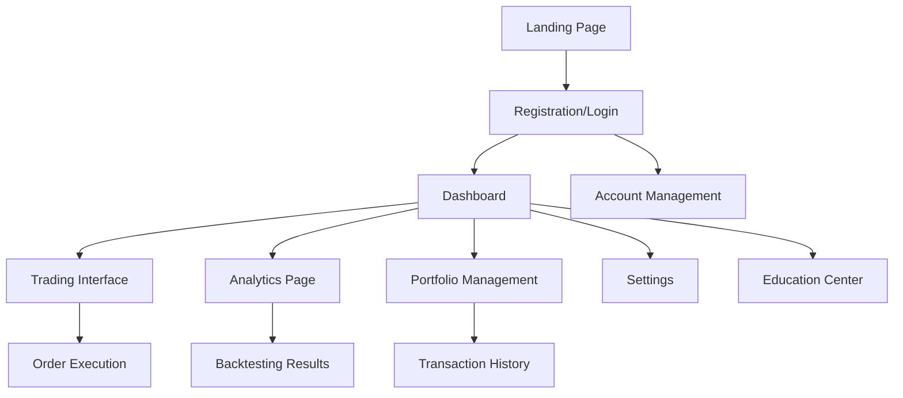

# Agent66 - SMC Trading Agent Web Application

## Product Requirements Document

## 1. Product Overview

Agent66 is a sophisticated web-based SMC (Smart Money Concepts) Trading Agent that combines advanced AI/ML algorithms with real-time market analysis to provide automated trading solutions. The platform transforms complex trading strategies into an intuitive web interface, enabling both retail traders and institutional clients to leverage professional-grade algorithmic trading with Smart Money Concepts methodology.

The system addresses the challenge of manual SMC trading by providing automated pattern detection, risk management, and trade execution while maintaining full transparency and control through a modern web dashboard.

## 2. Core Features

### 2.1 User Roles

| Role                | Registration Method       | Core Permissions                                                           |
| ------------------- | ------------------------- | -------------------------------------------------------------------------- |
| Demo User           | Email registration        | View demo dashboard, access educational content, limited backtesting       |
| Retail Trader       | Email + KYC verification  | Full dashboard access, live trading, portfolio management, basic analytics |
| Professional Trader | Invitation + advanced KYC | Advanced analytics, custom strategies, API access, priority support        |
| Administrator       | Internal access           | System monitoring, user management, configuration control                  |

### 2.2 Feature Module

Our Agent66 web application consists of the following main pages:

1. **Landing Page**: hero section with trading performance metrics, feature highlights, pricing tiers, and call-to-action.
2. **Dashboard**: real-time trading overview, active positions, P\&L summary, market analysis widgets.
3. **Trading Interface**: SMC pattern visualization, order management, risk controls, execution interface.
4. **Analytics Page**: performance reports, backtesting results, strategy analysis, risk metrics.
5. **Portfolio Management**: position tracking, balance overview, transaction history, asset allocation.
6. **Settings & Configuration**: trading parameters, risk limits, API keys, notification preferences.
7. **Education Center**: SMC concepts, strategy guides, video tutorials, market insights.
8. **Account Management**: profile settings, subscription management, billing, support tickets.

### 2.3 Page Details

| Page Name            | Module Name         | Feature description                                                                                  |
| -------------------- | ------------------- | ---------------------------------------------------------------------------------------------------- |
| Landing Page         | Hero Section        | Display real-time performance metrics, Sharpe ratio, total returns with animated counters and charts |
| Landing Page         | Feature Showcase    | Interactive SMC pattern demonstrations, order block detection examples, live market analysis         |
| Landing Page         | Pricing Tiers       | Subscription plans comparison, feature matrix, trial signup with payment integration                 |
| Dashboard            | Trading Overview    | Real-time P\&L display, active positions summary, daily/weekly/monthly performance charts            |
| Dashboard            | Market Analysis     | Live SMC pattern detection, order blocks visualization, market structure analysis                    |
| Dashboard            | Quick Actions       | One-click trade execution, emergency stop-all button, risk adjustment controls                       |
| Trading Interface    | Chart Analysis      | Advanced TradingView integration with custom SMC indicators, multi-timeframe analysis                |
| Trading Interface    | Order Management    | Create, modify, cancel orders with advanced order types, position sizing calculator                  |
| Trading Interface    | Risk Controls       | Real-time risk monitoring, drawdown alerts, position limits, circuit breaker status                  |
| Analytics Page       | Performance Reports | Detailed trading statistics, Sharpe ratio analysis, maximum drawdown tracking                        |
| Analytics Page       | Backtesting Engine  | Historical strategy testing, walk-forward analysis, Monte Carlo simulations                          |
| Analytics Page       | Strategy Analysis   | SMC pattern success rates, order block effectiveness, market regime performance                      |
| Portfolio Management | Position Tracking   | Real-time position monitoring, unrealized P\&L, margin utilization                                   |
| Portfolio Management | Transaction History | Complete trade log, execution details, commission tracking, export functionality                     |
| Portfolio Management | Asset Allocation    | Portfolio composition charts, correlation analysis, diversification metrics                          |
| Settings             | Trading Parameters  | Risk limits configuration, position sizing rules, SMC detection sensitivity                          |
| Settings             | API Integration     | Exchange API key management, webhook configuration, third-party integrations                         |
| Settings             | Notifications       | Email/SMS alerts setup, trading signals, risk warnings, system status updates                        |
| Education Center     | SMC Learning        | Interactive tutorials on order blocks, CHOCH/BOS, liquidity sweeps, market structure                 |
| Education Center     | Strategy Guides     | Step-by-step trading strategies, risk management principles, market analysis techniques              |
| Education Center     | Market Insights     | Daily market analysis, economic calendar integration, news sentiment analysis                        |
| Account Management   | Profile Settings    | Personal information, security settings, two-factor authentication                                   |
| Account Management   | Subscription        | Plan management, billing history, upgrade/downgrade options, usage statistics                        |
| Account Management   | Support             | Help desk integration, live chat, documentation access, community forum                              |

## 3. Core Process

**Demo User Flow:**
Users can explore the platform through a comprehensive demo experience. They start on the landing page, view performance metrics and features, then access a demo dashboard with simulated trading data. The demo includes interactive SMC pattern examples and basic backtesting capabilities to showcase the platform's power.

**Retail Trader Flow:**
After registration and KYC verification, traders access the full dashboard with real market data. They configure their trading parameters and risk limits, then monitor live SMC pattern detection. When patterns are identified, they can execute trades manually or enable automated execution. The system continuously monitors positions and provides real-time risk management.

**Professional Trader Flow:**
Advanced users access additional analytics, custom strategy development tools, and API integration. They can create sophisticated trading algorithms, perform advanced backtesting, and integrate with external systems. The platform provides institutional-grade reporting and compliance features.

## 4. User Interface Design

### 4.1 Design Style

* **Primary Colors**: Deep Navy (#1a1d29) for backgrounds, Electric Blue (#00d4ff) for accents and CTAs

* **Secondary Colors**: Charcoal Gray (#2d3748) for cards, Success Green (#48bb78) for profits, Warning Red (#f56565) for losses

* **Button Style**: Modern rounded buttons with subtle gradients, hover animations, and loading states

* **Typography**: Inter font family - 16px base size, 14px for secondary text, 24px+ for headings

* **Layout Style**: Card-based design with subtle shadows, clean grid layouts, responsive sidebar navigation

* **Icons**: Lucide React icons with custom trading-specific SVG icons, consistent 20px sizing

* **Animations**: Smooth transitions (300ms), number counters for metrics, subtle hover effects

### 4.2 Page Design Overview

| Page Name            | Module Name         | UI Elements                                                                                                   |
| -------------------- | ------------------- | ------------------------------------------------------------------------------------------------------------- |
| Landing Page         | Hero Section        | Full-screen gradient background, animated performance counters, floating trading charts, prominent CTA button |
| Landing Page         | Feature Showcase    | Interactive card grid, hover animations, embedded chart demos, progressive disclosure                         |
| Dashboard            | Trading Overview    | Multi-column layout, real-time updating widgets, color-coded P\&L indicators, responsive charts               |
| Trading Interface    | Chart Analysis      | Full-width TradingView integration, floating control panels, collapsible sidebars, multi-monitor support      |
| Analytics Page       | Performance Reports | Tabbed interface, interactive charts, data tables with sorting/filtering, export buttons                      |
| Portfolio Management | Position Tracking   | Real-time updating tables, progress bars for margin usage, expandable row details                             |
| Settings             | Configuration       | Organized sections with tabs, toggle switches, range sliders, validation feedback                             |
| Education Center     | Learning Modules    | Video player integration, progress tracking, interactive quizzes, bookmark functionality                      |

### 4.3 Responsiveness

The application is designed mobile-first with desktop enhancement. Touch interactions are optimized for tablet trading, with swipe gestures for chart navigation and tap-friendly button sizing. The responsive breakpoints ensure optimal viewing on all devices while maintaining professional trading functionality.

## 5. Technical Integration

The web application serves as the frontend interface for the sophisticated SMC Trading Agent backend system, which includes:

* Real-time market data processing via WebSocket connections

* ML-based pattern detection using LSTM and Transformer models

* Rust-based ultra-low latency execution engine (<50ms)

* Comprehensive risk management and circuit breaker systems

* Multi-exchange support (Binance, ByBit, OANDA)

* Advanced backtesting and performance

