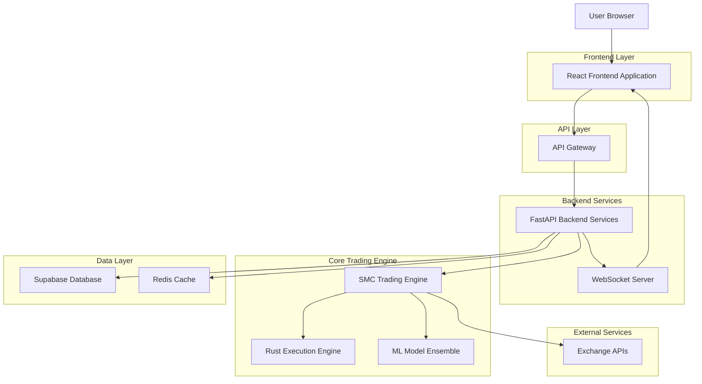
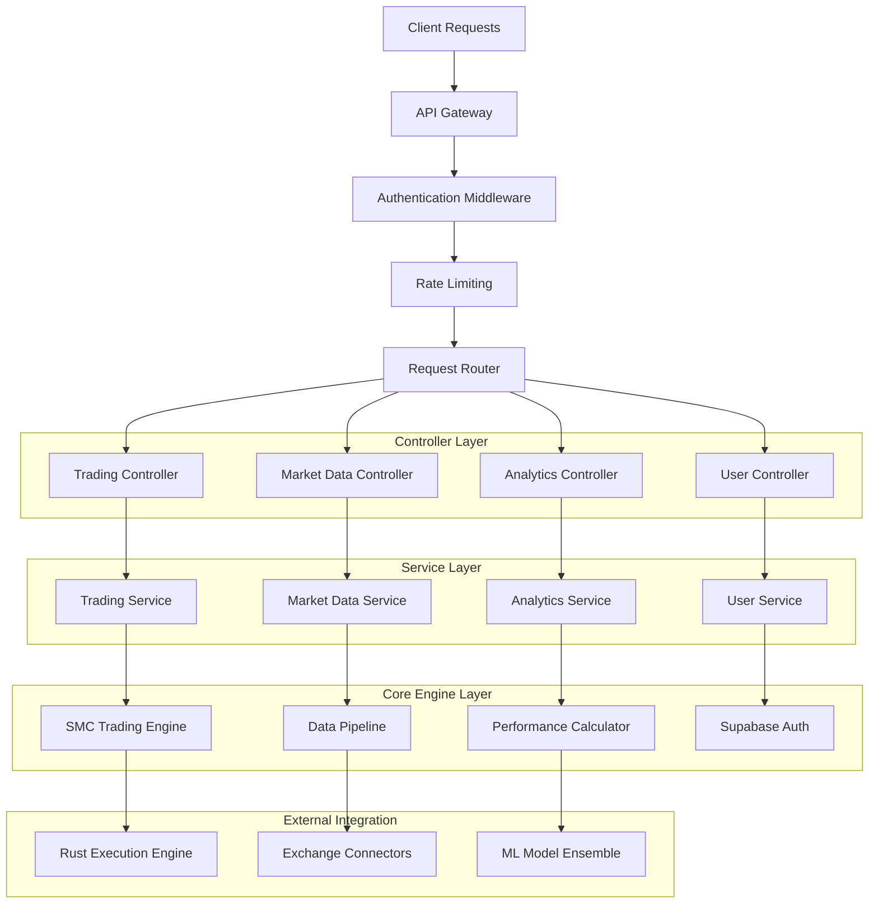
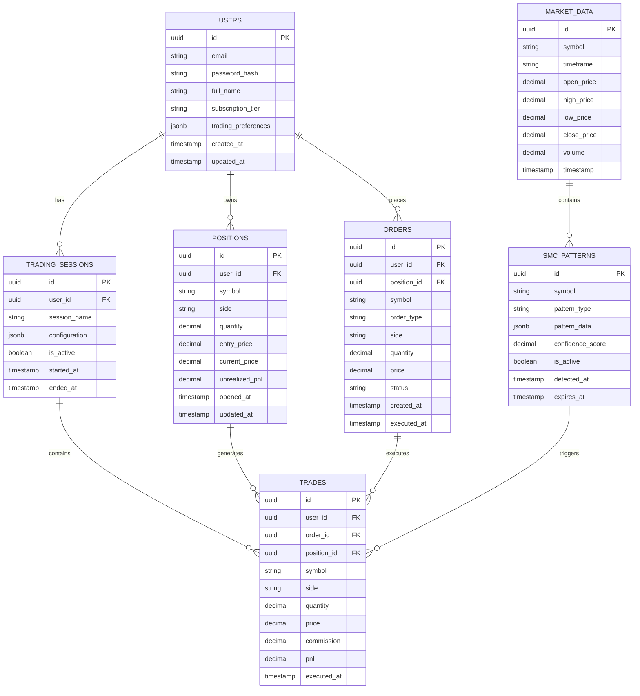

# Agent66 - SMC Trading Agent Technical Architecture Document

## 1. Architecture Design



## 2. Technology Description

* **Frontend**: React\@18 + TypeScript + TailwindCSS + Vite + TradingView Charting Library

* **Backend**: FastAPI + Python\@3.11 + Rust execution engine + WebSocket support

* **Database**: Supabase (PostgreSQL) with TimescaleDB extension for time-series data

* **Cache**: Redis for real-time data caching and session management

* **Authentication**: Supabase Auth with JWT tokens and row-level security

* **Real-time**: WebSocket connections for live trading data and notifications

* **ML/AI**: TensorFlow + PyTorch for model ensemble, Numba for performance optimization

* **Monitoring**: Prometheus + Grafana for system metrics and trading analytics

## 3. Route Definitions

| Route      | Purpose                                                     |
| ---------- | ----------------------------------------------------------- |
| /          | Landing page with hero section, features, and pricing       |
| /login     | User authentication and registration                        |
| /dashboard | Main trading dashboard with real-time data and controls     |
| /trading   | Advanced trading interface with charts and order management |
| /analytics | Performance analytics, backtesting, and reporting           |
| /portfolio | Portfolio management and position tracking                  |
| /settings  | User preferences, trading parameters, and API configuration |
| /education | Learning center with SMC tutorials and market insights      |
| /account   | Account management, billing, and subscription settings      |
| /api/docs  | Interactive API documentation (FastAPI auto-generated)      |

## 4. API Definitions

### 4.1 Core API Endpoints

**Authentication & User Management**

```
POST /api/v1/auth/login
```

Request:

| Param Name | Param Type | isRequired | Description        |
| ---------- | ---------- | ---------- | ------------------ |
| email      | string     | true       | User email address |
| password   | string     | true       | User password      |

Response:

| Param Name     | Param Type | Description              |
| -------------- | ---------- | ------------------------ |
| access\_token  | string     | JWT access token         |
| refresh\_token | string     | JWT refresh token        |
| user           | object     | User profile information |
| expires\_in    | number     | Token expiration time    |

**Trading Operations**

```
POST /api/v1/trading/execute
```

Request:

| Param Name  | Param Type | isRequired | Description                             |
| ----------- | ---------- | ---------- | --------------------------------------- |
| symbol      | string     | true       | Trading pair (e.g., "BTCUSDT")          |
| action      | string     | true       | "buy" or "sell"                         |
| quantity    | number     | true       | Order quantity                          |
| order\_type | string     | true       | "market", "limit", "stop\_loss"         |
| price       | number     | false      | Limit price (required for limit orders) |

Response:

| Param Name      | Param Type | Description             |
| --------------- | ---------- | ----------------------- |
| order\_id       | string     | Unique order identifier |
| status          | string     | Order execution status  |
| executed\_price | number     | Actual execution price  |
| timestamp       | string     | Execution timestamp     |

**Market Data**

```
GET /api/v1/market/data/{symbol}
```

Request:

| Param Name | Param Type | isRequired | Description                      |
| ---------- | ---------- | ---------- | -------------------------------- |
| symbol     | string     | true       | Trading pair symbol              |
| timeframe  | string     | false      | Chart timeframe (default: "1h")  |
| limit      | number     | false      | Number of candles (default: 100) |

Response:

| Param Name      | Param Type | Description             |
| --------------- | ---------- | ----------------------- |
| ohlcv\_data     | array      | OHLCV candlestick data  |
| smc\_patterns   | array      | Detected SMC patterns   |
| order\_blocks   | array      | Identified order blocks |
| volume\_profile | object     | Volume analysis data    |

**SMC Analysis**

```
GET /api/v1/smc/analysis/{symbol}
```

Response:

| Param Name        | Param Type | Description                                     |
| ----------------- | ---------- | ----------------------------------------------- |
| choch\_bos        | array      | Change of Character/Break of Structure patterns |
| liquidity\_sweeps | array      | Detected liquidity sweep events                 |
| order\_blocks     | array      | Active order block zones                        |
| market\_structure | object     | Current market structure analysis               |
| confidence\_score | number     | Overall pattern confidence (0-1)                |

**Portfolio Management**

```
GET /api/v1/portfolio/positions
```

Response:

| Param Name      | Param Type | Description              |
| --------------- | ---------- | ------------------------ |
| positions       | array      | Active trading positions |
| total\_balance  | number     | Account total balance    |
| unrealized\_pnl | number     | Unrealized profit/loss   |
| margin\_used    | number     | Used margin amount       |
| free\_margin    | number     | Available margin         |

**Performance Analytics**

```
GET /api/v1/analytics/performance
```

Request:

| Param Name  | Param Type | isRequired | Description                      |
| ----------- | ---------- | ---------- | -------------------------------- |
| start\_date | string     | false      | Analysis start date (ISO format) |
| end\_date   | string     | false      | Analysis end date (ISO format)   |
| timeframe   | string     | false      | Aggregation timeframe            |

Response:

| Param Name     | Param Type | Description                      |
| -------------- | ---------- | -------------------------------- |
| total\_return  | number     | Total return percentage          |
| sharpe\_ratio  | number     | Risk-adjusted return metric      |
| max\_drawdown  | number     | Maximum drawdown percentage      |
| win\_rate      | number     | Percentage of winning trades     |
| profit\_factor | number     | Gross profit / gross loss ratio  |
| trade\_history | array      | Detailed trade execution history |

### 4.2 WebSocket API

**Real-time Market Data**

```
ws://localhost:8000/ws/market/{symbol}
```

Messages:

* `price_update`: Real-time price changes

* `volume_spike`: Significant volume events

* `smc_pattern`: New SMC pattern detection

* `order_execution`: Trade execution updates

**Trading Notifications**

```
ws://localhost:8000/ws/trading/{user_id}
```

Messages:

* `position_update`: Position changes

* `risk_alert`: Risk management warnings

* `order_filled`: Order execution confirmations

* `system_status`: Trading system health updates

## 5. Server Architecture Diagram



## 6. Data Model

### 6.1 Data Model Definition



### 6.2 Data Definition Language

**Users Table**

```sql
-- Create users table with Supabase auth integration
CREATE TABLE users (
    id UUID PRIMARY KEY DEFAULT gen_random_uuid(),
    email VARCHAR(255) UNIQUE NOT NULL,
    full_name VARCHAR(100) NOT NULL,
    subscription_tier VARCHAR(20) DEFAULT 'demo' CHECK (subscription_tier IN ('demo', 'retail', 'professional')),
    trading_preferences JSONB DEFAULT '{}',
    risk_limits JSONB DEFAULT '{"max_position_size": 10000, "max_daily_loss": 1000}',
    created_at TIMESTAMP WITH TIME ZONE DEFAULT NOW(),
    updated_at TIMESTAMP WITH TIME ZONE DEFAULT NOW()
);

-- Enable Row Level Security
ALTER TABLE users ENABLE ROW LEVEL SECURITY;

-- Create policy for users to only access their own data
CREATE POLICY "Users can only access their own data" ON users
    FOR ALL USING (auth.uid() = id);
```

**Market Data Table (TimescaleDB)**

```sql
-- Create hypertable for time-series market data
CREATE TABLE market_data (
    id UUID DEFAULT gen_random_uuid(),
    symbol VARCHAR(20) NOT NULL,
    timeframe VARCHAR(10) NOT NULL,
    open_price DECIMAL(20,8) NOT NULL,
    high_price DECIMAL(20,8) NOT NULL,
    low_price DECIMAL(20,8) NOT NULL,
    close_price DECIMAL(20,8) NOT NULL,
    volume DECIMAL(20,8) NOT NULL,
    timestamp TIMESTAMP WITH TIME ZONE NOT NULL,
    PRIMARY KEY (symbol, timeframe, timestamp)
);

-- Convert to hypertable for time-series optimization
SELECT create_hypertable('market_data', 'timestamp');

-- Create indexes for efficient querying
CREATE INDEX idx_market_data_symbol_timeframe ON market_data(symbol, timeframe, timestamp DESC);
CREATE INDEX idx_market_data_timestamp ON market_data(timestamp DESC);
```

**Trading Positions Table**

```sql
-- Create positions table
CREATE TABLE positions (
    id UUID PRIMARY KEY DEFAULT gen_random_uuid(),
    user_id UUID REFERENCES users(id) ON DELETE CASCADE,
    symbol VARCHAR(20) NOT NULL,
    side VARCHAR(10) NOT NULL CHECK (side IN ('long', 'short')),
    quantity DECIMAL(20,8) NOT NULL,
    entry_price DECIMAL(20,8) NOT NULL,
    current_price DECIMAL(20,8),
    stop_loss DECIMAL(20,8),
    take_profit DECIMAL(20,8),
    unrealized_pnl DECIMAL(20,8) DEFAULT 0,
    status VARCHAR(20) DEFAULT 'open' CHECK (status IN ('open', 'closed', 'liquidated')),
    opened_at TIMESTAMP WITH TIME ZONE DEFAULT NOW(),
    closed_at TIMESTAMP WITH TIME ZONE,
    updated_at TIMESTAMP WITH TIME ZONE DEFAULT NOW()
);

-- Enable RLS and create policies
ALTER TABLE positions ENABLE ROW LEVEL SECURITY;
CREATE POLICY "Users can only access their own positions" ON positions
    FOR ALL USING (auth.uid() = user_id);

-- Create indexes
CREATE INDEX idx_positions_user_id ON positions(user_id);
CREATE INDEX idx_positions_symbol ON positions(symbol);
CREATE INDEX idx_positions_status ON positions(status);
```

**SMC Patterns Table**

```sql
-- Create SMC patterns detection table
CREATE TABLE smc_patterns (
    id UUID PRIMARY KEY DEFAULT gen_random_uuid(),
    symbol VARCHAR(20) NOT NULL,
    timeframe VARCHAR(10) NOT NULL,
    pattern_type VARCHAR(50) NOT NULL CHECK (pattern_type IN ('order_block', 'choch', 'bos', 'liquidity_sweep', 'fair_value_gap')),
    pattern_data JSONB NOT NULL,
    confidence_score DECIMAL(3,2) NOT NULL CHECK (confidence_score >= 0 AND confidence_score <= 1),
    price_level_high DECIMAL(20,8),
    price_level_low DECIMAL(20,8),
    is_active BOOLEAN DEFAULT true,
    detected_at TIMESTAMP WITH TIME ZONE DEFAULT NOW(),
    expires_at TIMESTAMP WITH TIME ZONE,
    triggered_at TIMESTAMP WITH TIME ZONE
);

-- Create indexes for pattern queries
CREATE INDEX idx_smc_patterns_symbol_timeframe ON smc_patterns(symbol, timeframe, detected_at DESC);
CREATE INDEX idx_smc_patterns_type ON smc_patterns(pattern_type, is_active);
CREATE INDEX idx_smc_patterns_confidence ON smc_patterns(confidence_score DESC);

-- Grant permissions
GRANT SELECT ON market_data TO anon;
GRANT SELECT ON smc_patterns TO anon;
GRANT ALL PRIVILEGES ON users TO authenticated;
GRANT ALL PRIVILEGES ON positions TO authenticated;
GRANT ALL PRIVILEGES ON orders TO authenticated;
GRANT ALL PRIVILEGES ON trades TO authenticated;
```

**Initial Configuration Data**

```sql
-- Insert default trading pairs
INSERT INTO trading_pairs (symbol, base_asset, quote_asset, min_quantity, tick_size, is_active) VALUES
('BTCUSDT', 'BTC', 'USDT', 0.00001, 0.01, true),
('ETHUSDT', 'ETH', 'USDT', 0.0001, 0.01, true),
('ADAUSDT', 'ADA', 'USDT', 0.1, 0.0001, true),
('DOTUSDT', 'DOT', 'USDT', 0.01, 0.001, true),
('LINKUSDT', 'LINK', 'USDT', 0.01, 0.001, true);

-- Insert default risk management templates
INSERT INTO risk_templates (name, max_position_size, max_daily_loss, max_drawdown, stop_loss_pct, take_profit_pct) VALUES
('Conservative', 5000, 500, 0.05, 0.02, 0.04),
('Moderate', 10000, 1000, 0.10, 0.03, 0.06),
('Aggressive', 25000, 2500, 0.15, 0.05, 0.10);
```

