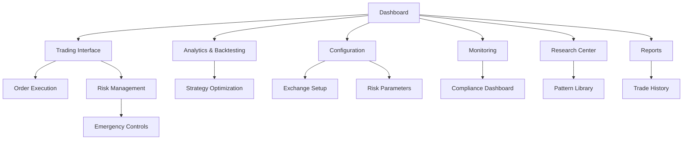

# SMC Trading Agent - Product Requirements Document

## 1. Product Overview

SMC Trading Agent is an advanced algorithmic trading platform that leverages Smart Money Concepts (SMC) for automated cryptocurrency and forex trading. The system combines real-time market analysis, machine learning decision-making, and ultra-low latency execution to detect and capitalize on institutional trading patterns.

The platform targets sophisticated retail traders, quantitative analysts, and trading firms who need professional-grade tools for SMC-based strategies. It solves the problem of manual SMC analysis by providing automated detection of Order Blocks, Change of Character (CHoCH), Break of Structure (BoS), and liquidity sweeps with institutional-grade execution capabilities.

The system aims to achieve consistent profitability through automated SMC strategies with target metrics of >1.5 Sharpe ratio, <8% maximum drawdown, and >65% CHoCH hit rate.

## 2. Core Features

### 2.1 User Roles

| Role | Registration Method | Core Permissions |
|------|---------------------|------------------|
| Trader | Email registration + API key verification | Can configure strategies, view analytics, execute trades |
| Analyst | Invitation-based registration | Can access backtesting, research tools, performance analytics |
| Administrator | System-level access | Can manage users, system configuration, compliance reporting |

### 2.2 Feature Module

Our SMC Trading Agent web application consists of the following main pages:

1. **Dashboard**: Real-time market overview, active positions, performance metrics, system health monitoring
2. **Trading Interface**: Live SMC pattern detection, order management, position sizing, risk controls
3. **Analytics & Backtesting**: Historical performance analysis, strategy optimization, walk-forward testing
4. **Configuration**: Exchange connections, trading parameters, risk management settings, model ensemble configuration
5. **Monitoring**: System performance metrics, latency monitoring, circuit breaker status, compliance reporting
6. **Research Center**: SMC pattern library, market structure analysis, educational resources
7. **Risk Management**: Portfolio overview, drawdown monitoring, position limits, emergency controls
8. **Reports**: Trade history, performance attribution, regulatory compliance, audit trails

### 2.3 Page Details

| Page Name | Module Name | Feature description |
|-----------|-------------|---------------------|
| Dashboard | Market Overview | Display real-time market data, active trading pairs, current positions with P&L |
| Dashboard | Performance Metrics | Show key performance indicators: Sharpe ratio, max drawdown, win rate, daily/monthly returns |
| Dashboard | System Health | Monitor data pipeline status, model ensemble health, execution engine latency, circuit breaker states |
| Trading Interface | SMC Pattern Detection | Real-time detection and visualization of Order Blocks, CHoCH/BoS patterns, liquidity sweeps with confidence scores |
| Trading Interface | Order Management | Create, modify, cancel orders with smart order routing, position sizing based on SMC levels |
| Trading Interface | Risk Controls | Pre-trade risk checks, position limits, stop-loss/take-profit based on SMC structure levels |
| Analytics & Backtesting | Historical Analysis | Comprehensive backtesting framework with walk-forward analysis, out-of-sample testing |
| Analytics & Backtesting | Strategy Optimization | Model ensemble performance comparison, adaptive selection optimization, parameter tuning |
| Analytics & Backtesting | Performance Attribution | Detailed breakdown of returns by strategy, time period, market conditions, SMC pattern types |
| Configuration | Exchange Setup | Configure API connections for Binance, ByBit, OANDA with credential management and testing |
| Configuration | Trading Parameters | Set SMC detection thresholds, model ensemble weights, execution timeouts, slippage limits |
| Configuration | Risk Management | Configure position limits, daily loss limits, drawdown thresholds, circuit breaker parameters |
| Monitoring | Execution Metrics | Real-time latency monitoring, order fill rates, slippage analysis, exchange connectivity status |
| Monitoring | Model Performance | Track model ensemble accuracy, prediction confidence, adaptive selection decisions |
| Monitoring | Compliance Dashboard | MiFID II reporting, audit trail management, regulatory compliance monitoring |
| Research Center | Pattern Library | Interactive SMC pattern encyclopedia with historical examples and success rates |
| Research Center | Market Analysis | Advanced market structure analysis tools, liquidity mapping, institutional flow detection |
| Research Center | Educational Resources | SMC trading guides, video tutorials, best practices documentation |
| Risk Management | Portfolio Overview | Real-time portfolio exposure, correlation analysis, sector allocation, currency exposure |
| Risk Management | Drawdown Monitoring | Real-time drawdown tracking, recovery analysis, risk-adjusted return calculations |
| Risk Management | Emergency Controls | Emergency position closure, trading halt controls, risk override mechanisms |
| Reports | Trade History | Detailed trade log with entry/exit reasons, SMC pattern triggers, execution quality metrics |
| Reports | Performance Reports | Automated daily/weekly/monthly performance reports with benchmark comparisons |
| Reports | Compliance Reports | Regulatory reporting for MiFID II, transaction cost analysis, best execution reports |

## 3. Core Process

**Main Trading Flow:**
Users start at the Dashboard to monitor overall system status and market conditions. They navigate to the Trading Interface to observe real-time SMC pattern detection and manage active positions. The system automatically executes trades based on configured strategies, with all decisions logged for analysis. Users can access Analytics & Backtesting to optimize strategies and review historical performance. Configuration allows users to adjust trading parameters and risk controls. The Monitoring section provides real-time system health and performance metrics. Research Center offers educational resources and pattern analysis tools. Risk Management provides portfolio oversight and emergency controls. Reports section generates comprehensive trading and compliance documentation.

**Admin Flow:**
Administrators access the system through a dedicated admin interface to manage user accounts, system configuration, and compliance reporting. They monitor system-wide performance, manage exchange connections, and ensure regulatory compliance through automated reporting tools.

## 4. User Interface Design

### 4.1 Design Style

- **Primary Colors**: Deep blue (#1a365d) for headers and navigation, green (#38a169) for bullish elements, red (#e53e3e) for bearish elements
- **Secondary Colors**: Light gray (#f7fafc) for backgrounds, dark gray (#2d3748) for text, yellow (#d69e2e) for alerts
- **Button Style**: Modern flat design with subtle shadows, rounded corners (4px radius), hover animations
- **Font**: Inter for UI elements (14px base), JetBrains Mono for numerical data and code (12px)
- **Layout Style**: Card-based design with clean spacing, top navigation with sidebar for main sections
- **Icons**: Feather icons for UI elements, custom SMC pattern icons for trading-specific elements

### 4.2 Page Design Overview

| Page Name | Module Name | UI Elements |
|-----------|-------------|-------------|
| Dashboard | Market Overview | Grid layout with real-time price cards, candlestick charts, position summary tables with color-coded P&L |
| Dashboard | Performance Metrics | KPI dashboard with gauge charts for Sharpe ratio, line charts for equity curve, heatmap for monthly returns |
| Trading Interface | SMC Detection | Interactive TradingView-style charts with SMC pattern overlays, confidence indicators, pattern alerts panel |
| Trading Interface | Order Management | Order book interface, position sizing calculator, one-click trading buttons with confirmation modals |
| Analytics & Backtesting | Historical Analysis | Multi-timeframe chart analysis, strategy comparison tables, performance metrics visualization |
| Configuration | Exchange Setup | Form-based configuration with connection status indicators, API key management with encryption |
| Monitoring | System Health | Real-time status dashboard with traffic light indicators, latency graphs, system resource monitoring |
| Research Center | Pattern Library | Interactive pattern gallery with search/filter, detailed pattern descriptions with success rate statistics |
| Risk Management | Portfolio View | Portfolio allocation pie charts, risk metrics dashboard, position heat map with exposure analysis |
| Reports | Trade Analysis | Filterable trade tables, export functionality, performance attribution charts with drill-down capability |

### 4.3 Responsiveness

The application is desktop-first with mobile-adaptive design for monitoring and basic controls. Touch interaction optimization is implemented for mobile devices, with simplified interfaces for smaller screens. Key trading functions remain desktop-focused due to the complexity of professional trading interfaces, while monitoring and alert features are fully mobile-responsive.