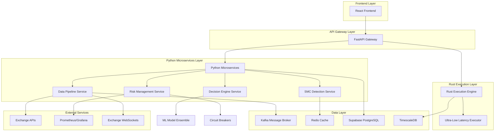
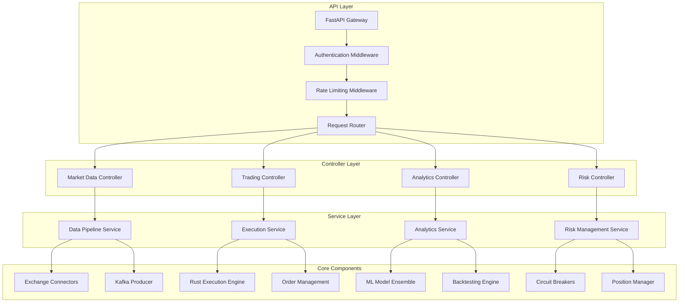
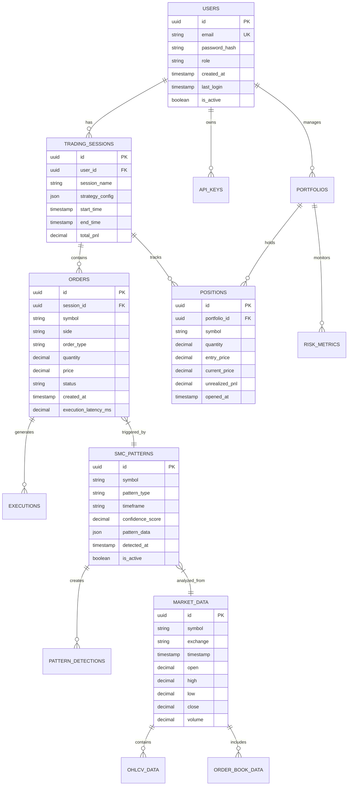

# SMC Trading Agent - Technical Architecture Document

## 1. Architecture Design



## 2. Technology Description

* **Frontend**: React\@18 + TypeScript + TailwindCSS + Vite + TradingView Charting Library

* **API Gateway**: FastAPI + Uvicorn + WebSocket support

* **Backend Services**: Python\@3.11 + AsyncIO + Microservices Architecture

* **Execution Engine**: Rust + Tokio + CCXT-RS + Ultra-low latency (<50ms)

* **Machine Learning**: PyTorch + TensorFlow + Stable-Baselines3 + Numba optimization

* **Message Broker**: Apache Kafka + Kafka Streams

* **Databases**: Supabase (PostgreSQL) + TimescaleDB + Redis

* **Monitoring**: Prometheus + Grafana + Custom metrics

* **Deployment**: Docker + Kubernetes + GitHub Actions CI/CD

## 3. Route Definitions

| Route       | Purpose                                                                 |
| ----------- | ----------------------------------------------------------------------- |
| /           | Dashboard - Main trading overview with real-time metrics                |
| /trading    | Trading Interface - Live SMC pattern detection and order management     |
| /analytics  | Analytics & Backtesting - Historical analysis and strategy optimization |
| /config     | Configuration - Exchange setup and trading parameters                   |
| /monitoring | System Monitoring - Performance metrics and health status               |
| /research   | Research Center - SMC pattern library and educational resources         |
| /risk       | Risk Management - Portfolio overview and risk controls                  |
| /reports    | Reports - Trade history and compliance documentation                    |
| /login      | Authentication - User login and API key management                      |
| /admin      | Admin Panel - System administration and user management                 |

## 4. API Definitions

### 4.1 Core Trading APIs

**Market Data Streaming**

```
WS /api/v1/market/stream
```

WebSocket connection for real-time market data, SMC patterns, and trading signals.

Request:

| Param Name  | Param Type | isRequired | Description                                        |
| ----------- | ---------- | ---------- | -------------------------------------------------- |
| symbols     | string\[]  | true       | Trading pairs to subscribe to                      |
| data\_types | string\[]  | true       | Data types: trade, orderbook, kline, smc\_patterns |

Response:

| Param Name | Param Type | Description                                             |
| ---------- | ---------- | ------------------------------------------------------- |
| type       | string     | Message type: market\_data, smc\_pattern, trade\_signal |
| symbol     | string     | Trading pair symbol                                     |
| data       | object     | Market data or pattern information                      |
| timestamp  | number     | Unix timestamp in milliseconds                          |

**SMC Pattern Detection**

```
POST /api/v1/smc/detect
```

Request:

| Param Name     | Param Type | isRequired | Description                          |
| -------------- | ---------- | ---------- | ------------------------------------ |
| symbol         | string     | true       | Trading pair symbol                  |
| timeframe      | string     | true       | Chart timeframe (1m, 5m, 1h, 4h, 1d) |
| pattern\_types | string\[]  | false      | Specific patterns to detect          |

Response:

| Param Name        | Param Type | Description                                  |
| ----------------- | ---------- | -------------------------------------------- |
| patterns          | object\[]  | Detected SMC patterns with confidence scores |
| order\_blocks     | object\[]  | Active order blocks with price levels        |
| liquidity\_levels | object\[]  | Key liquidity zones                          |
| market\_structure | object     | Current market structure analysis            |

**Order Execution**

```
POST /api/v1/orders/create
```

Request:

| Param Name   | Param Type | isRequired | Description                             |
| ------------ | ---------- | ---------- | --------------------------------------- |
| symbol       | string     | true       | Trading pair symbol                     |
| side         | string     | true       | Order side: buy, sell                   |
| type         | string     | true       | Order type: market, limit, stop\_loss   |
| quantity     | number     | true       | Order quantity                          |
| price        | number     | false      | Limit price (required for limit orders) |
| stop\_loss   | number     | false      | Stop loss price                         |
| take\_profit | number     | false      | Take profit price                       |

Response:

| Param Name          | Param Type | Description                              |
| ------------------- | ---------- | ---------------------------------------- |
| order\_id           | string     | Unique order identifier                  |
| status              | string     | Order status: pending, filled, cancelled |
| execution\_time\_ms | number     | Order execution latency                  |
| fill\_price         | number     | Actual fill price                        |

**Risk Management**

```
GET /api/v1/risk/portfolio
```

Response:

| Param Name      | Param Type | Description                         |
| --------------- | ---------- | ----------------------------------- |
| total\_exposure | number     | Total portfolio exposure in USD     |
| positions       | object\[]  | Active positions with risk metrics  |
| daily\_pnl      | number     | Current day P\&L                    |
| max\_drawdown   | number     | Current maximum drawdown percentage |
| risk\_limits    | object     | Current risk limit utilization      |

### 4.2 Analytics APIs

**Backtesting**

```
POST /api/v1/analytics/backtest
```

Request:

| Param Name       | Param Type | isRequired | Description                       |
| ---------------- | ---------- | ---------- | --------------------------------- |
| strategy\_config | object     | true       | Strategy configuration parameters |
| start\_date      | string     | true       | Backtest start date (ISO format)  |
| end\_date        | string     | true       | Backtest end date (ISO format)    |
| initial\_capital | number     | true       | Starting capital amount           |

Response:

| Param Name           | Param Type | Description                                |
| -------------------- | ---------- | ------------------------------------------ |
| performance\_metrics | object     | Sharpe ratio, max drawdown, win rate, etc. |
| equity\_curve        | object\[]  | Historical equity progression              |
| trade\_log           | object\[]  | Detailed trade history                     |
| risk\_metrics        | object     | VaR, volatility, correlation analysis      |

## 5. Server Architecture Diagram



## 6. Data Model

### 6.1 Data Model Definition



### 6.2 Data Definition Language

**Users Table**

```sql
-- Create users table
CREATE TABLE users (
    id UUID PRIMARY KEY DEFAULT gen_random_uuid(),
    email VARCHAR(255) UNIQUE NOT NULL,
    password_hash VARCHAR(255) NOT NULL,
    role VARCHAR(50) DEFAULT 'trader' CHECK (role IN ('trader', 'analyst', 'admin')),
    created_at TIMESTAMP WITH TIME ZONE DEFAULT NOW(),
    last_login TIMESTAMP WITH TIME ZONE,
    is_active BOOLEAN DEFAULT true,
    api_key_hash VARCHAR(255),
    risk_limits JSONB DEFAULT '{}'
);

-- Create indexes
CREATE INDEX idx_users_email ON users(email);
CREATE INDEX idx_users_role ON users(role);
CREATE INDEX idx_users_active ON users(is_active);
```

**Trading Sessions Table**

```sql
-- Create trading sessions table
CREATE TABLE trading_sessions (
    id UUID PRIMARY KEY DEFAULT gen_random_uuid(),
    user_id UUID NOT NULL REFERENCES users(id) ON DELETE CASCADE,
    session_name VARCHAR(255) NOT NULL,
    strategy_config JSONB NOT NULL DEFAULT '{}',
    start_time TIMESTAMP WITH TIME ZONE DEFAULT NOW(),
    end_time TIMESTAMP WITH TIME ZONE,
    total_pnl DECIMAL(15,8) DEFAULT 0,
    max_drawdown DECIMAL(10,4) DEFAULT 0,
    total_trades INTEGER DEFAULT 0,
    winning_trades INTEGER DEFAULT 0
);

-- Create indexes
CREATE INDEX idx_sessions_user_id ON trading_sessions(user_id);
CREATE INDEX idx_sessions_start_time ON trading_sessions(start_time DESC);
```

**Orders Table (TimescaleDB Hypertable)**

```sql
-- Create orders table as TimescaleDB hypertable for time-series data
CREATE TABLE orders (
    id UUID DEFAULT gen_random_uuid(),
    session_id UUID NOT NULL REFERENCES trading_sessions(id),
    symbol VARCHAR(20) NOT NULL,
    side VARCHAR(10) NOT NULL CHECK (side IN ('buy', 'sell')),
    order_type VARCHAR(20) NOT NULL CHECK (order_type IN ('market', 'limit', 'stop_loss', 'take_profit')),
    quantity DECIMAL(20,8) NOT NULL,
    price DECIMAL(20,8),
    filled_quantity DECIMAL(20,8) DEFAULT 0,
    filled_price DECIMAL(20,8),
    status VARCHAR(20) DEFAULT 'pending' CHECK (status IN ('pending', 'filled', 'cancelled', 'rejected')),
    created_at TIMESTAMP WITH TIME ZONE DEFAULT NOW(),
    filled_at TIMESTAMP WITH TIME ZONE,
    execution_latency_ms INTEGER,
    exchange VARCHAR(50) NOT NULL,
    external_order_id VARCHAR(255),
    fees DECIMAL(15,8) DEFAULT 0,
    PRIMARY KEY (id, created_at)
);

-- Convert to TimescaleDB hypertable
SELECT create_hypertable('orders', 'created_at');

-- Create indexes
CREATE INDEX idx_orders_session_id ON orders(session_id, created_at DESC);
CREATE INDEX idx_orders_symbol ON orders(symbol, created_at DESC);
CREATE INDEX idx_orders_status ON orders(status, created_at DESC);
```

**SMC Patterns Table**

```sql
-- Create SMC patterns table
CREATE TABLE smc_patterns (
    id UUID PRIMARY KEY DEFAULT gen_random_uuid(),
    symbol VARCHAR(20) NOT NULL,
    pattern_type VARCHAR(50) NOT NULL CHECK (pattern_type IN ('order_block', 'choch', 'bos', 'liquidity_sweep', 'fvg')),
    timeframe VARCHAR(10) NOT NULL,
    confidence_score DECIMAL(5,4) NOT NULL CHECK (confidence_score BETWEEN 0 AND 1),
    pattern_data JSONB NOT NULL,
    price_level_high DECIMAL(20,8),
    price_level_low DECIMAL(20,8),
    detected_at TIMESTAMP WITH TIME ZONE DEFAULT NOW(),
    expires_at TIMESTAMP WITH TIME ZONE,
    is_active BOOLEAN DEFAULT true,
    triggered_orders INTEGER DEFAULT 0
);

-- Create indexes
CREATE INDEX idx_patterns_symbol_time ON smc_patterns(symbol, detected_at DESC);
CREATE INDEX idx_patterns_type ON smc_patterns(pattern_type, is_active);
CREATE INDEX idx_patterns_confidence ON smc_patterns(confidence_score DESC);
CREATE INDEX idx_patterns_active ON smc_patterns(is_active, expires_at);
```

**Market Data Table (TimescaleDB)**

```sql
-- Create market data table as TimescaleDB hypertable
CREATE TABLE market_data (
    symbol VARCHAR(20) NOT NULL,
    exchange VARCHAR(50) NOT NULL,
    timestamp TIMESTAMP WITH TIME ZONE NOT NULL,
    timeframe VARCHAR(10) NOT NULL,
    open DECIMAL(20,8) NOT NULL,
    high DECIMAL(20,8) NOT NULL,
    low DECIMAL(20,8) NOT NULL,
    close DECIMAL(20,8) NOT NULL,
    volume DECIMAL(20,8) NOT NULL,
    trades_count INTEGER,
    PRIMARY KEY (symbol, exchange, timeframe, timestamp)
);

-- Convert to TimescaleDB hypertable
SELECT create_hypertable('market_data', 'timestamp');

-- Create indexes
CREATE INDEX idx_market_data_symbol ON market_data(symbol, timestamp DESC);
CREATE INDEX idx_market_data_exchange ON market_data(exchange, timestamp DESC);
```

**Initial Configuration Data**

```sql
-- Insert default admin user
INSERT INTO users (email, password_hash, role, is_active) VALUES
('admin@smctrading.com', '$2b$12$example_hash', 'admin', true);

-- Insert default SMC pattern configurations
INSERT INTO smc_patterns (symbol, pattern_type, timeframe, confidence_score, pattern_data, is_active) VALUES
('BTCUSDT', 'order_block', '1h', 0.85, '{"type": "bullish", "volume_confirmation": true}', false),
('ETHUSDT', 'choch', '4h', 0.75, '{"direction": "bearish", "structure_break": true}', false);
```

**Supabase Row Level Security (RLS) Policies**

```sql
-- Enable RLS on all tables
ALTER TABLE users ENABLE ROW LEVEL SECURITY;
ALTER TABLE trading_sessions ENABLE ROW LEVEL SECURITY;
ALTER TABLE orders ENABLE ROW LEVEL SECURITY;

-- Users can only access their own data
CREATE POLICY "Users can view own profile" ON users
    FOR SELECT USING (auth.uid() = id);

CREATE POLICY "Users can update own profile" ON users
    FOR UPDATE USING (auth.uid() = id);

-- Trading sessions policy
CREATE POLICY "Users can manage own sessions" ON trading_sessions
    FOR ALL USING (user_id = auth.uid());

-- Orders policy
CREATE POLICY "Users can manage own orders" ON orders
    FOR ALL USING (session_id IN (
        SELECT id FROM trading_sessions WHERE user_id = auth.uid()
    ));

-- Grant permissions
GRANT SELECT ON market_data TO anon;
GRANT SELECT ON smc_patterns TO anon;
GRANT ALL PRIVILEGES ON users TO authenticated;
GRANT ALL PRIVILEGES ON trading_sessions TO authenticated;
GRANT ALL PRIVILEGES ON orders TO authenticated;
```

