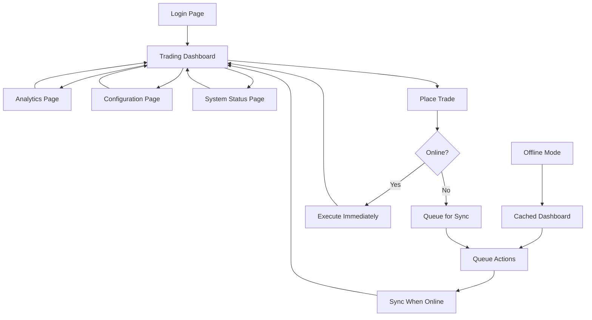

# SMC Trading Agent - Product Requirements Document

## 1. Product Overview

SMC Trading Agent is an advanced offline-first cryptocurrency and forex trading platform that leverages Smart Money Concepts (SMC) for intelligent trade execution. The system operates seamlessly in both online and offline modes, ensuring continuous trading capabilities even during network disruptions.

The platform solves critical problems in algorithmic trading: network dependency, configuration complexity, and lack of robust error handling. It targets professional traders, trading firms, and algorithmic trading enthusiasts who require reliable, high-performance trading infrastructure.

Target market value: $50M+ algorithmic trading software market with focus on retail and institutional traders seeking offline-capable solutions.

## 2. Core Features

### 2.1 User Roles

| Role          | Registration Method | Core Permissions                                          |
| ------------- | ------------------- | --------------------------------------------------------- |
| Trader        | Email + 2FA setup   | Execute trades, view analytics, manage positions          |
| Administrator | Invitation-based    | Full system access, user management, system configuration |
| Analyst       | Email registration  | Read-only access to analytics, reports, and market data   |
| API User      | API key generation  | Programmatic access to trading endpoints                  |

### 2.2 Feature Module

Our SMC Trading Agent consists of the following main pages:

1. **Trading Dashboard**: Real-time market data, active positions, order management, SMC indicators
2. **Analytics Page**: Performance metrics, trade history, profit/loss analysis, risk assessment
3. **Configuration Page**: Exchange settings, trading parameters, offline mode configuration
4. **System Status Page**: Health monitoring, service status, offline sync status
5. **Login/Authentication Page**: Secure authentication with 2FA support

### 2.3 Page Details

| Page Name          | Module Name            | Feature Description                                                                   |
| ------------------ | ---------------------- | ------------------------------------------------------------------------------------- |
| Trading Dashboard  | Market Data Display    | Real-time price feeds, order book visualization, candlestick charts with SMC overlays |
| Trading Dashboard  | Position Management    | View active positions, P\&L tracking, position sizing calculator                      |
| Trading Dashboard  | Order Execution        | Place market/limit orders, stop-loss/take-profit management, one-click trading        |
| Trading Dashboard  | SMC Indicators         | Order blocks detection, liquidity zones, market structure analysis                    |
| Trading Dashboard  | Offline Mode Indicator | Visual status of connectivity, pending sync actions, cached data timestamp            |
| Analytics Page     | Performance Metrics    | Win rate, profit factor, Sharpe ratio, maximum drawdown statistics                    |
| Analytics Page     | Trade History          | Detailed trade log with filters, export functionality, trade replay                   |
| Analytics Page     | Risk Analysis          | Position sizing recommendations, portfolio risk metrics, correlation analysis         |
| Analytics Page     | Reports Generation     | Automated daily/weekly/monthly reports, custom date ranges                            |
| Configuration Page | Exchange Management    | Add/remove exchange connections, API key management, connection testing               |
| Configuration Page | Trading Parameters     | Risk limits, position sizing rules, SMC detection sensitivity                         |
| Configuration Page | Offline Settings       | Cache duration, sync frequency, offline data retention policies                       |
| Configuration Page | Notification Setup     | Trade alerts, system notifications, email/SMS preferences                             |
| System Status Page | Health Dashboard       | Service status indicators, system resource usage, error logs                          |
| System Status Page | Sync Management        | Offline sync queue, conflict resolution, manual sync triggers                         |
| System Status Page | Performance Monitor    | API response times, database performance, memory usage                                |
| Login Page         | Authentication         | Email/password login, 2FA verification, password recovery                             |
| Login Page         | Session Management     | Remember device, session timeout, security settings                                   |

## 3. Core Process

### Main User Flow (Trader)

1. **Authentication**: User logs in with email/password and completes 2FA verification
2. **Dashboard Access**: System loads trading dashboard with cached data if offline
3. **Market Analysis**: User reviews SMC indicators, market structure, and liquidity zones
4. **Trade Execution**: User places trades based on analysis, orders queued if offline
5. **Position Monitoring**: Real-time tracking of active positions and P\&L
6. **Offline Sync**: When connection restored, pending actions sync automatically

### Administrator Flow

1. **System Access**: Admin logs in with elevated privileges
2. **User Management**: Create/modify user accounts, assign roles, manage permissions
3. **System Configuration**: Update trading parameters, exchange settings, risk limits
4. **Monitoring**: Review system health, performance metrics, error logs
5. **Maintenance**: Perform system updates, database maintenance, backup operations

### Offline Mode Flow

1. **Connection Loss Detection**: System automatically detects network interruption
2. **Offline Mode Activation**: UI switches to offline mode with cached data
3. **Local Operations**: User can view data, analyze positions, queue new trades
4. **Sync Queue Management**: All actions stored locally for later synchronization
5. **Connection Restoration**: Automatic sync of pending actions when online

## 4. User Interface Design

### 4.1 Design Style

* **Primary Colors**: Dark theme with blue accents (#1E293B background, #3B82F6 primary, #10B981 success, #EF4444 danger)

* **Secondary Colors**: Gray scale for text and borders (#64748B, #94A3B8, #CBD5E1)

* **Button Style**: Rounded corners (8px), subtle shadows, hover animations with color transitions

* **Font**: Inter font family, 14px base size, 16px for headings, 12px for small text

* **Layout Style**: Card-based design with clean spacing, top navigation with sidebar for advanced features

* **Icons**: Lucide React icons with consistent 20px size, outlined style for better visibility

* **Animations**: Smooth transitions (200ms), loading spinners, progress indicators for sync operations

### 4.2 Page Design Overview

| Page Name          | Module Name         | UI Elements                                                                                                     |
| ------------------ | ------------------- | --------------------------------------------------------------------------------------------------------------- |
| Trading Dashboard  | Market Data Display | Dark theme cards with real-time price updates, green/red color coding for price changes, responsive grid layout |
| Trading Dashboard  | Order Execution     | Modal dialogs for trade placement, input validation with real-time feedback, one-click buy/sell buttons         |
| Trading Dashboard  | SMC Indicators      | Interactive charts with TradingView-style interface, overlay indicators, zoom and pan functionality             |
| Trading Dashboard  | Offline Indicator   | Top banner with orange background when offline, sync status with progress bar, last update timestamp            |
| Analytics Page     | Performance Charts  | Recharts library for interactive graphs, tooltip hover effects, date range selectors                            |
| Analytics Page     | Trade History Table | Sortable columns, pagination, search filters, export buttons with CSV/PDF options                               |
| Configuration Page | Settings Forms      | Grouped form sections, toggle switches for boolean options, validation messages                                 |
| Configuration Page | API Management      | Secure input fields for API keys, connection test buttons, status indicators                                    |
| System Status Page | Health Metrics      | Real-time status cards with color-coded indicators, progress bars for resource usage                            |
| System Status Page | Log Viewer          | Scrollable log container with syntax highlighting, filter options, auto-refresh toggle                          |
| Login Page         | Authentication Form | Centered card layout, input field focus states, 2FA code input with auto-advance                                |

### 4.3 Responsiveness

The application is desktop-first with mobile-adaptive design. Key responsive features:

* **Desktop (1200px+)**: Full sidebar navigation, multi-column layouts, detailed charts and tables

* **Tablet (768px-1199px)**: Collapsible sidebar, stacked card layouts, simplified charts

* **Mobile (320px-767px)**: Bottom navigation, single-column layout, touch-optimized controls

* **Touch Optimization**: Larger tap targets (44px minimum), swipe gestures for navigation, pull-to-refresh

### 4.4 Offline Mode Visual Indicators

* **Connection Status**: Persistent indicator in top navigation (green dot = online, orange = offline)

* **Data Freshness**: Timestamps on all data displays showing last update time

* **Sync Queue**: Badge showing number of pending actions waiting for sync

* **Cached Data Warning**: Subtle background pattern or border to indicate cached content

* **Sync Progress**: Progress bar during synchronization with detailed status messages

## 5. Offline-First Features

### 5.1 Data Caching Strategy

* **Market Data**: Cache last 24 hours of price data for analysis

* **Trade History**: Store complete trade history locally for offline access

* **Configuration**: Cache all user settings and preferences

* **Static Assets**: Service worker caches all UI components and assets

### 5.2 Offline Capabilities

* **View Positions**: Access current positions and P\&L calculations

* **Analyze Data**: Use cached market data for technical analysis

* **Queue Trades**: Place orders that execute when connection restored

* **Review History**: Access complete trade history and performance metrics

* **Modify Settings**: Update configuration (synced when online)

### 5.3 Sync Management

* **Automatic Sync**: Background synchronization when connection restored

* **Conflict Resolution**: Smart merging of offline changes with server state

* **Manual Sync**: User-triggered sync with progress feedback

* **Selective Sync**: Choose which data to sync first (trades, settings, etc.)

## 6. Performance Requirements

### 6.1 Loading Performance

* **Initial Load**: < 2 seconds for dashboard with cached data

* **Page Transitions**: < 200ms between pages

* **Chart Rendering**: < 500ms for complex SMC indicator overlays

* **Trade Execution**: < 100ms for order placement (online mode)

### 6.2 Offline Performance

* **Offline Detection**: < 1 second to switch to offline mode

* **Cache Access**: < 50ms for cached data retrieval

* **Sync Speed**: < 5 seconds for typical sync operations

* **Storage Efficiency**: < 50MB total offline storage usage

## 7. Security Requirements

### 7.1 Authentication Security

* **Multi-Factor Authentication**: TOTP-based 2FA for all user accounts

* **Session Management**: Secure JWT tokens with automatic refresh

* **Password Policy**: Minimum 12 characters with complexity requirements

* **Account Lockout**: Temporary lockout after 5 failed login attempts

### 7.2 Data Security

* **Encryption**: AES-256 encryption for sensitive data in offline storage

* **API Security**: All API communications over HTTPS with certificate pinning

* **Key Management**: Secure storage of API keys with encryption at rest

* **Audit Logging**: Complete audit trail of all trading and configuration actions

## 8. Integration Requirements

### 8.1 Exchange Integrations

* **Binance**: WebSocket and REST API integration for crypto trading

* **ByBit**: Derivatives trading with advanced order types

* **OANDA**: Forex trading with competitive spreads

* **Mock Exchanges**: Simulated trading for testing and offline development

### 8.2 External Services

* **Price Feeds**: Real-time market data with WebSocket connections

* **News APIs**: Economic calendar and market news integration

* **Notification Services**: Email and SMS alerts for trade execution

* **Backup Services**: Automated backup of configuration and trade data

## 9. Compliance and Risk Management

### 9.1 Trading Compliance

* **Position Limits**: Configurable maximum position sizes per symbol

* **Risk Limits**: Daily loss limits and maximum drawdown protection

* **Regulatory Reporting**: MiFID II compliance for European users

* **Audit Trail**: Complete record of all trading decisions and executions

### 9.2 System Risk Management

* **Circuit Breakers**: Automatic trading halt on excessive losses

* **Health Monitoring**: Continuous system health checks and alerts

* **Failover Systems**: Automatic failover to backup systems

* **Data Validation**: Input validation and sanitization at all entry points

## 10. Success Metrics

### 10.1 Performance Metrics

* **Uptime**: 99.9% system availability

* **Response Time**: 95% of API calls under 100ms

* **Offline Capability**: 100% functionality available offline for cached operations

* **Sync Success Rate**: 99.5% successful synchronization of offline actions

### 10.2 User Experience Metrics

* **User Satisfaction**: 4.5+ star rating from user feedback

* **Feature Adoption**: 80%+ users actively using offline mode

* **Error Rate**: < 0.1% of user actions result in errors

* **Support Tickets**: < 5% of users require support assistance

### 10.3 Business Metrics

* **Trade Volume**: Support for $1M+ daily trading volume per user

* **User Retention**: 90%+ monthly active user retention

* **Performance**: 15%+ improvement in trading performance vs manual trading

* **Cost Efficiency**: 50% reduction in infrastructure costs vs always-online systems

