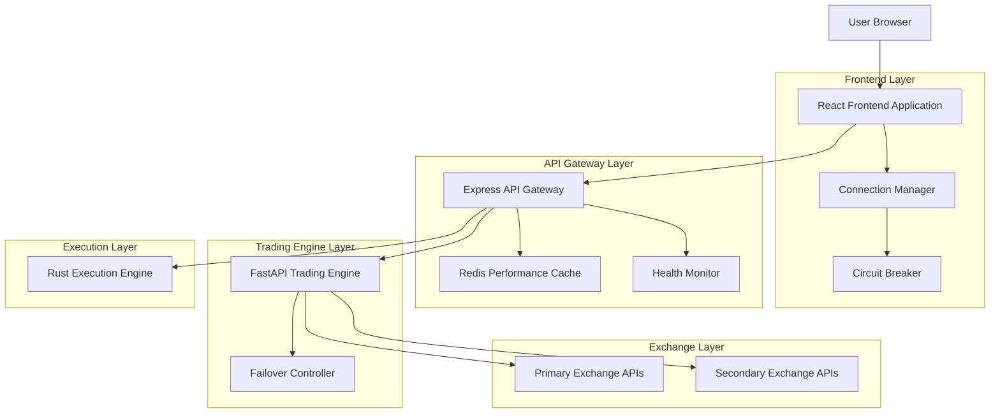
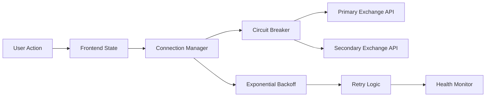

# SMC Trading Agent - Technical Architecture & Refactoring Plan

## 1. Architecture Design



## 2. Technology Description

- Frontend: React@18 + TypeScript + Vite + TailwindCSS + Zustand
- API Gateway: Express@4 + TypeScript + Redis + JWT + Circuit Breaker
- Trading Engine: FastAPI + Python + PostgreSQL + Pydantic
- Execution Engine: Rust + Tokio + Connection Pooling
- Performance Caching: Redis + In-Memory Cache + Query Optimization
- Connection Management: Exponential Backoff + Health Monitoring + Failover
- Configuration: Zod (TypeScript) + Pydantic (Python) + YAML
- Testing: Vitest + Pytest + Integration Tests

## 3. Critical Issues Analysis

### 3.1 Configuration Issues

**Problem**: Duplicate JWT_SECRET in config.yaml (lines 200-201)
```yaml
# Current problematic configuration
security:
  jwt_secret: ""  # Empty string
  jwt_secret: "${JWT_SECRET:}"  # Duplicate key
```

**Solution**: Unified configuration schema with validation
```yaml
# Fixed configuration
security:
  jwt_secret: "${JWT_SECRET}"
  jwt_expiration: 3600
  api_key_required: true
  encryption_enabled: true
```

### 3.2 Import Errors in Data Pipeline

**Problem**: Missing exports in exchange_connectors/__init__.py
- OANDAConnector import fails due to conditional import handling
- Inconsistent error handling for missing connectors

**Solution**: Robust import system with fallbacks
```python
# Enhanced __init__.py with proper error handling
try:
    from .binance_connector import BinanceConnector
    from .bybit_connector import ByBitConnector
    from .oanda_connector import OANDAConnector
except ImportError as e:
    logger.warning(f"Could not import connector: {e}")
    # Create mock connectors for offline mode
    BinanceConnector = create_mock_connector('Binance')
    ByBitConnector = create_mock_connector('ByBit')
    OANDAConnector = create_mock_connector('OANDA')
```

### 3.3 Error Boundary Issues

**Problem**: Basic error boundary without structured reporting
**Solution**: Enhanced error boundary with telemetry and recovery

### 3.4 Service Discovery Issues

**Problem**: Mock services without proper health checks
**Solution**: Service registry with health monitoring

## 4. Resilient Online-First Architecture Design

### 4.1 Connection Management Strategy



### 4.2 Automatic Reconnection Implementation

**Features**:
- Exponential backoff for failed connections
- Circuit breaker pattern for API protection
- Health monitoring with real-time status
- Graceful degradation when connections fail

**Reconnection Strategy**:
```typescript
// Connection Manager with Exponential Backoff
class ConnectionManager {
  private retryDelays = [1000, 2000, 4000, 8000, 16000]; // ms
  private maxRetries = 5;
  
  async connectWithBackoff(apiEndpoint: string, attempt = 0): Promise<Connection> {
    try {
      return await this.connect(apiEndpoint);
    } catch (error) {
      if (attempt < this.maxRetries) {
        const delay = this.retryDelays[attempt] || 16000;
        await this.sleep(delay);
        return this.connectWithBackoff(apiEndpoint, attempt + 1);
      }
      throw new ConnectionError('Max retries exceeded');
    }
  }
}
```

### 4.3 Failover Between Data Sources

**Failover Patterns**:
1. **Primary-Secondary**: Automatic switch to backup exchange
2. **Load Balancing**: Distribute requests across multiple sources
3. **Health-Based Routing**: Route based on real-time health status

## 5. Configuration Management

### 5.1 Unified Schema Validation

**TypeScript Schema (Zod)**:
```typescript
import { z } from 'zod';

export const ConfigSchema = z.object({
  app: z.object({
    name: z.string(),
    version: z.string(),
    environment: z.enum(['development', 'production', 'test'])
  }),
  security: z.object({
    jwt_secret: z.string().min(32),
    jwt_expiration: z.number().positive(),
    api_key_required: z.boolean()
  }),
  database: z.object({
    type: z.enum(['postgresql', 'sqlite']),
    host: z.string().optional(),
    port: z.number().optional(),
    name: z.string()
  })
});
```

**Python Schema (Pydantic)**:
```python
from pydantic import BaseModel, Field
from typing import Optional, Literal

class SecurityConfig(BaseModel):
    jwt_secret: str = Field(min_length=32)
    jwt_expiration: int = Field(gt=0)
    api_key_required: bool = True

class DatabaseConfig(BaseModel):
    type: Literal['postgresql', 'sqlite']
    host: Optional[str] = None
    port: Optional[int] = None
    name: str

class AppConfig(BaseModel):
    name: str
    version: str
    environment: Literal['development', 'production', 'test']
    security: SecurityConfig
    database: DatabaseConfig
```

### 5.2 Environment Variable Management

**Centralized Environment Loading**:
```typescript
// config/environment.ts
export const loadEnvironment = () => {
  const config = {
    JWT_SECRET: process.env.JWT_SECRET || generateSecureSecret(),
    DATABASE_URL: process.env.DATABASE_URL || 'sqlite:///smc_offline.db',
    OFFLINE_MODE: process.env.OFFLINE_MODE === 'true',
    MOCK_EXCHANGES: process.env.MOCK_EXCHANGES === 'true'
  };
  
  return ConfigSchema.parse(config);
};
```

## 6. Error Boundaries and Structured Logging

### 6.1 Enhanced Error Boundary

```typescript
interface ErrorInfo {
  componentStack: string;
  errorBoundary?: string;
  eventType?: string;
}

class EnhancedErrorBoundary extends Component<Props, State> {
  private errorReportingService: ErrorReportingService;
  
  constructor(props: Props) {
    super(props);
    this.errorReportingService = new ErrorReportingService();
  }
  
  componentDidCatch(error: Error, errorInfo: ErrorInfo) {
    // Structured error reporting
    this.errorReportingService.reportError({
      error: error.message,
      stack: error.stack,
      componentStack: errorInfo.componentStack,
      userAgent: navigator.userAgent,
      timestamp: new Date().toISOString(),
      userId: this.props.userId,
      sessionId: this.props.sessionId
    });
  }
}
```

### 6.2 Structured Logging System

**Log Levels and Categories**:
```python
import structlog
from typing import Dict, Any

class StructuredLogger:
    def __init__(self, service_name: str):
        self.logger = structlog.get_logger(service_name)
    
    def log_trade_execution(self, trade_data: Dict[str, Any]):
        self.logger.info(
            "trade_executed",
            symbol=trade_data['symbol'],
            size=trade_data['size'],
            price=trade_data['price'],
            execution_time_ms=trade_data['execution_time']
        )
    
    def log_error(self, error: Exception, context: Dict[str, Any]):
        self.logger.error(
            "system_error",
            error_type=type(error).__name__,
            error_message=str(error),
            **context
        )
```

## 7. Circuit Breaker and Performance Caching

### 7.1 Circuit Breaker Implementation

```typescript
// Circuit Breaker for API Protection
class CircuitBreaker {
  private failureCount = 0;
  private lastFailureTime = 0;
  private state: 'CLOSED' | 'OPEN' | 'HALF_OPEN' = 'CLOSED';
  
  constructor(
    private failureThreshold = 5,
    private recoveryTimeout = 30000
  ) {}
  
  async execute<T>(operation: () => Promise<T>): Promise<T> {
    if (this.state === 'OPEN') {
      if (Date.now() - this.lastFailureTime > this.recoveryTimeout) {
        this.state = 'HALF_OPEN';
      } else {
        throw new Error('Circuit breaker is OPEN');
      }
    }
    
    try {
      const result = await operation();
      this.onSuccess();
      return result;
    } catch (error) {
      this.onFailure();
      throw error;
    }
  }
  
  private onSuccess() {
    this.failureCount = 0;
    this.state = 'CLOSED';
  }
  
  private onFailure() {
    this.failureCount++;
    this.lastFailureTime = Date.now();
    
    if (this.failureCount >= this.failureThreshold) {
      this.state = 'OPEN';
    }
  }
}
```

### 7.2 Performance-Focused Caching

```typescript
// Redis-based performance caching
class PerformanceCache {
  constructor(private redis: RedisClient) {}
  
  async getMarketData(symbol: string): Promise<MarketData | null> {
    const cacheKey = `market:${symbol}`;
    const cached = await this.redis.get(cacheKey);
    
    if (cached) {
      const data = JSON.parse(cached);
      // Check if data is still fresh (< 1 second old)
      if (Date.now() - data.timestamp < 1000) {
        return data;
      }
    }
    
    return null;
  }
  
  async setMarketData(symbol: string, data: MarketData): Promise<void> {
    const cacheKey = `market:${symbol}`;
    const cacheData = { ...data, timestamp: Date.now() };
    
    // Cache for 5 seconds for high-frequency data
    await this.redis.setex(cacheKey, 5, JSON.stringify(cacheData));
  }
}
```

## 8. Testing Strategy for Resilient Online-First

### 8.1 Unit Testing

**Frontend Tests (Vitest)**:
```typescript
// tests/connection-resilience.test.ts
import { describe, it, expect, beforeEach, vi } from 'vitest';
import { render, screen, waitFor } from '@testing-library/react';
import { ConnectionManager } from '../src/services/ConnectionManager';

describe('Connection Resilience', () => {
  let connectionManager: ConnectionManager;
  
  beforeEach(() => {
    connectionManager = new ConnectionManager();
  });
  
  it('should retry with exponential backoff on connection failure', async () => {
    const mockConnect = vi.fn()
      .mockRejectedValueOnce(new Error('Connection failed'))
      .mockRejectedValueOnce(new Error('Connection failed'))
      .mockResolvedValueOnce({ status: 'connected' });
    
    connectionManager.connect = mockConnect;
    
    const result = await connectionManager.connectWithBackoff('api.exchange.com');
    
    expect(mockConnect).toHaveBeenCalledTimes(3);
    expect(result.status).toBe('connected');
  });
  
  it('should switch to secondary exchange on primary failure', async () => {
    render(<TradingDashboard />);
    
    // Simulate primary exchange failure
    vi.mocked(fetch).mockRejectedValueOnce(new Error('Primary exchange down'));
    
    await waitFor(() => {
      expect(screen.getByText('Using backup exchange')).toBeInTheDocument();
    });
  });
});
```

**Backend Tests (Pytest)**:
```python
# tests/test_connection_resilience.py
import pytest
from unittest.mock import patch, AsyncMock
from fastapi.testclient import TestClient
from services.circuit_breaker import CircuitBreaker

@pytest.fixture
def resilient_client():
    from api_fastapi import app
    return TestClient(app)

def test_circuit_breaker_opens_on_failures():
    circuit_breaker = CircuitBreaker(failure_threshold=3)
    
    # Simulate 3 failures
    for _ in range(3):
        with pytest.raises(Exception):
            await circuit_breaker.execute(lambda: raise Exception('API Error'))
    
    # Circuit should be open now
    with pytest.raises(Exception, match='Circuit breaker is OPEN'):
        await circuit_breaker.execute(lambda: 'success')

def test_failover_to_secondary_exchange(resilient_client):
    with patch('services.exchange_connector.primary_exchange') as mock_primary:
        mock_primary.get_market_data.side_effect = Exception('Primary down')
        
        response = resilient_client.get('/api/market/BTCUSDT')
        
        assert response.status_code == 200
        assert 'secondary_source' in response.json()
```

### 8.2 Integration Testing

**E2E Tests with Playwright**:
```typescript
// tests/e2e/connection-resilience.spec.ts
import { test, expect } from '@playwright/test';

test('connection resilience and failover', async ({ page, context }) => {
  // Start with healthy connection
  await page.goto('/');
  await expect(page.locator('[data-testid="connection-healthy"]')).toBeVisible();
  
  // Simulate network issues
  await page.route('**/api/exchange/primary/**', route => {
    route.abort('failed');
  });
  
  // Verify failover to secondary exchange
  await expect(page.locator('[data-testid="failover-indicator"]')).toBeVisible();
  await expect(page.locator('[data-testid="secondary-exchange-active"]')).toBeVisible();
  
  // Test trading functionality with backup exchange
  await page.click('[data-testid="place-trade-btn"]');
  await page.fill('[data-testid="symbol-input"]', 'BTCUSDT');
  await page.fill('[data-testid="amount-input"]', '0.001');
  await page.click('[data-testid="submit-trade"]');
  
  // Verify trade executes successfully via backup
  await expect(page.locator('[data-testid="trade-success"]')).toBeVisible();
  await expect(page.locator('[data-testid="backup-execution"]')).toBeVisible();
});
```

## 9. Performance Optimization Plan

### 9.1 Frontend Optimizations

**Code Splitting Strategy**:
```typescript
// Lazy loading for trading components
const TradingDashboard = lazy(() => import('./pages/TradingDashboard'));
const AnalyticsPage = lazy(() => import('./pages/Analytics'));
const SettingsPage = lazy(() => import('./pages/Settings'));

// Route-based code splitting
const AppRoutes = () => (
  <Suspense fallback={<LoadingSpinner />}>
    <Routes>
      <Route path="/" element={<TradingDashboard />} />
      <Route path="/analytics" element={<AnalyticsPage />} />
      <Route path="/settings" element={<SettingsPage />} />
    </Routes>
  </Suspense>
);
```

**Bundle Optimization**:
```typescript
// vite.config.ts optimizations
export default defineConfig({
  build: {
    rollupOptions: {
      output: {
        manualChunks: {
          'react-vendor': ['react', 'react-dom'],
          'trading-core': ['./src/services/trading'],
          'charts': ['recharts', 'd3'],
          'ui-components': ['@headlessui/react', 'framer-motion']
        }
      }
    }
  }
});
```

### 9.2 Backend Optimizations

**Exchange Connection Pooling**:
```python
# Enhanced connection pool for exchange APIs
class ExchangeConnectionPool:
    def __init__(self, max_connections: int = 20):
        self.primary_pool = aiohttp.TCPConnector(
            limit=max_connections,
            limit_per_host=10,
            keepalive_timeout=30,
            enable_cleanup_closed=True
        )
        self.secondary_pool = aiohttp.TCPConnector(
            limit=max_connections // 2,
            limit_per_host=5,
            keepalive_timeout=30
        )
    
    async def get_session(self, exchange_type: str) -> aiohttp.ClientSession:
        connector = self.primary_pool if exchange_type == 'primary' else self.secondary_pool
        return aiohttp.ClientSession(
            connector=connector,
            timeout=aiohttp.ClientTimeout(total=10)
        )
```

**API Response Caching**:
```python
# Redis-based caching with fallback
from functools import wraps
import json

def cache_response(ttl: int = 300):
    def decorator(func):
        @wraps(func)
        async def wrapper(*args, **kwargs):
            cache_key = f"{func.__name__}:{hash(str(args) + str(kwargs))}"
            
            # Try Redis first
            try:
                cached = await redis_client.get(cache_key)
                if cached:
                    return json.loads(cached)
            except:
                pass  # Fallback to function execution
            
            result = await func(*args, **kwargs)
            
            # Cache the result
            try:
                await redis_client.setex(
                    cache_key, 
                    ttl, 
                    json.dumps(result, default=str)
                )
            except:
                pass  # Continue without caching
            
            return result
        return wrapper
    return decorator
```

## 10. Implementation Roadmap

### Phase 1: Critical Fixes (Week 1)
- [ ] Fix duplicate JWT_SECRET in config.yaml
- [ ] Resolve import errors in exchange_connectors
- [ ] Implement enhanced ErrorBoundary
- [ ] Add basic health checks to main.py
- [ ] Update package.json scripts for resilient mode

### Phase 2: Configuration & Validation (Week 2)
- [ ] Implement Zod schema validation for TypeScript
- [ ] Add Pydantic models for Python configuration
- [ ] Create unified environment variable loading
- [ ] Add configuration validation tests

### Phase 3: Resilient Online-First Implementation (Week 3-4)
- [ ] Implement Connection Manager with exponential backoff
- [ ] Add Circuit Breaker pattern for API protection
- [ ] Create failover mechanism between exchanges
- [ ] Implement real-time health monitoring
- [ ] Add performance-focused Redis caching

### Phase 4: Testing & Monitoring (Week 5)
- [ ] Add comprehensive unit tests for connection resilience
- [ ] Implement E2E tests for failover scenarios
- [ ] Add connection performance monitoring
- [ ] Create detailed health check endpoints
- [ ] Test circuit breaker functionality

### Phase 5: Performance Optimization (Week 6)
- [ ] Optimize bundle splitting and lazy loading
- [ ] Implement exchange connection pooling
- [ ] Add intelligent API response caching
- [ ] Performance testing for high-frequency trading
- [ ] Load balancing between multiple exchanges

## 11. Security Considerations

### 11.1 Connection Security
- Implement TLS/SSL for all exchange connections
- Use API key rotation and secure storage
- Add request signing and authentication
- Validate all incoming data from exchanges
- Implement rate limiting to prevent abuse

### 11.2 Configuration Security
- Never commit secrets to version control
- Use environment-specific configuration files
- Implement configuration validation
- Add audit logging for configuration changes
- Secure API keys with proper encryption

### 11.3 Failover Security
- Validate secondary exchange credentials
- Implement secure failover authentication
- Log all failover events for audit
- Ensure consistent security policies across exchanges

## 12. Monitoring & Observability

### 12.1 Health Checks
```python
# Comprehensive health check endpoint
@app.get("/health")
async def health_check():
    checks = {
        'database': await check_database_connection(),
        'redis': await check_redis_connection(),
        'exchange_connectors': await check_exchange_health(),
        'disk_space': check_disk_space(),
        'memory_usage': get_memory_usage()
    }
    
    overall_status = 'healthy' if all(checks.values()) else 'unhealthy'
    
    return {
        'status': overall_status,
        'timestamp': datetime.utcnow().isoformat(),
        'checks': checks,
        'version': app.version
    }
```

### 12.2 Performance Metrics
- API response times per exchange
- Connection establishment times
- Memory and CPU usage
- Cache hit rates for market data
- Failover success rates and timing
- Circuit breaker state transitions
- Exchange API rate limit utilization
- Connection pool efficiency

### 12.3 Resilience Metrics
- Connection uptime per exchange
- Automatic reconnection success rate
- Failover trigger frequency
- Data staleness detection
- Circuit breaker activation events
- Health check response times

This comprehensive technical architecture provides a solid foundation for refactoring the SMC Trading Agent into a robust, resilient online-first trading system with automatic failover, connection management, and performance optimization focused on real-time trading requirements.