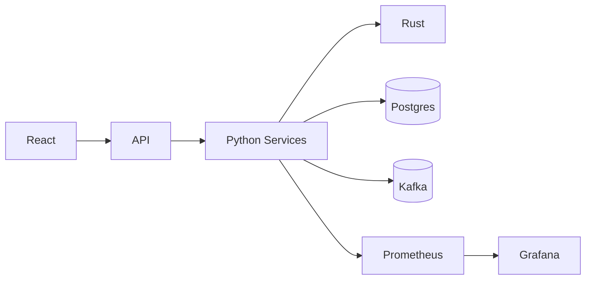

# Architecture – Context‑7

## Business Context
- Objective: Automated SMC‑based trading with robust risk management and learning loops
- Users: Advanced retail traders, small funds, quants
- Outcomes: Reliable execution, controlled risk, observability, auditability

## User Context
- Personas: Trader (configure, monitor), Quant (extend signals/models)
- Interfaces: Web UI (Vite/React), API (Express), health/metrics endpoints

## System Context
- Integrations: Exchanges (Binance/Bybit/OANDA), Kafka, Supabase Postgres, Redis, Prometheus/Grafana
- Trust zones: Public UI/API, internal services, secrets store

## Code Context
- Python: Orchestration, ingestion, risk, decision
- Node: API gateway and exchange utility endpoints
- Rust: Low‑latency execution engine
- Shared: Config in YAML; tests via pytest and vitest

## Data Context
- DB schema: `users`, `user_api_keys`, `user_configurations`, `trading_sessions`, `trades`, `smc_signals`, `market_data_cache` with RLS
- Streams: Kafka topics `market_data.*`

## Operations Context
- Containerization: Dockerfiles; Compose for local; K8s Deployment + Service + HPA samples
- Monitoring: `/health`, `/health/ready`, `/metrics`; Grafana dashboard JSON stub

## Risk Context
- Technical: Rate limits, timeouts, circuit breakers; key management; dependency risks
- Operational: Exchange outages, data quality, latency SLOs
- Compliance: RLS, audit logs, PII handling

