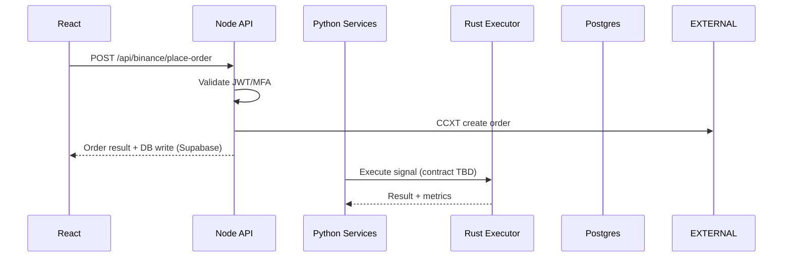

# Integration Points Analysis

## React ↔ Node API
- REST endpoints `/api/binance/*`; JWT via Supabase; flows for test‑connection, account‑info, place‑order

## Node ↔ Exchanges (CCXT)
- Direct CCXT calls for status, balance, orders; map errors to HTTP responses; add idempotency & backoff

## Python Services
- Data ingestion → Kafka topics; health + performance monitors; decision/risk pipelines

## Python ↔ Rust Executor
- Bridge TBD; recommend gRPC over Unix domain sockets for low overhead; strict timeouts

## DB and Caching
- Supabase Postgres with RLS; Redis for caching per config; ensure TLS & auth

