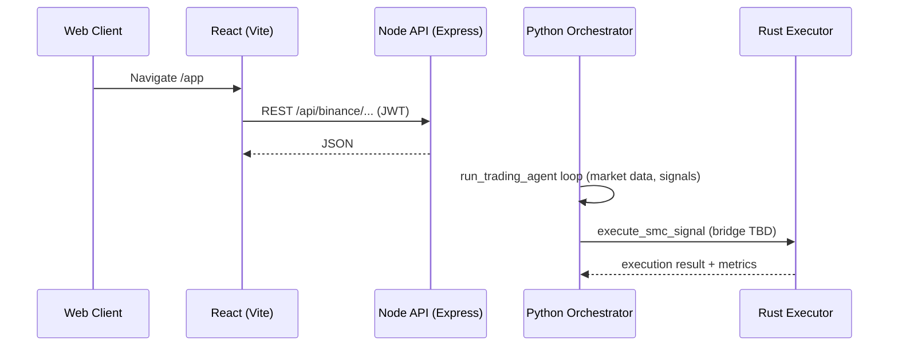

# SMC Trading Agent – Repository Audit Report (Context‑7)

## Executive Summary
This report consolidates a full‑stack audit of the SMC Trading Agent using the Context‑7 framework. The system spans Python backend services, a Node.js API, a React frontend, and a Rust execution engine. Core patterns include service orchestration in Python, exchange integrations via CCXT (Node + Rust), Supabase‑backed auth, Kafka streaming for market data, and monitoring hooks. Key gaps include API ↔ backend integration alignment, Rust ↔ Python bridge definition, production security hardening, CI/CD standardization, and observability depth.

- Entry points: `smc_trading_agent/main.py`, `smc_trading_agent/api/server.ts`, `smc_trading_agent/src/main.tsx`
- Configuration: `smc_trading_agent/config.yaml`
- Database: Supabase Postgres with RLS (`supabase/migrations/001_initial_schema.sql`)
- Deployment: Dockerfiles, Docker Compose, Kubernetes manifest

## Context‑7 Overview
- See detailed analysis in `docs/audit/architecture_context7.md`.
- Entry point details in `docs/audit/entry_points_mapping.md`.
- Dependency inventory in `docs/audit/dependency_inventory.json`.
- Gaps and risks in: `missing_components_analysis.md`, `security_gap_assessment.md`, `integration_points_analysis.md`.
- Ops: `deployment_configuration_review.md`, `monitoring_observability_assessment.md`.
- Data: `data_architecture_review.md`.
- Plan: `recommendations_roadmap.md`.

## Entry Points Mapping (Summary)
- Python: Orchestrates services, health monitor, metrics. Port from `config.yaml` → `monitoring.port` (default 8008).
- Node.js: Express server in `api/server.ts` uses `PORT` env (default 3002).
- React: `src/main.tsx` renders app via Vite dev server; routes map to API calls (to be aligned).

## Dependency Analysis (Summary)
See `docs/audit/dependency_inventory.json`. Python includes FastAPI, Kafka, ML stacks; Node includes Express, Supabase, CCXT, React ecosystem. Security‑sensitive libs identified (JWT, crypto, bcrypt).

## Architecture Snapshot
- Python `ServiceManager` coordinates core components; `EnhancedHealthMonitor` exposes `/health`, `/metrics`.
- Data ingestion integrates multiple exchanges with Kafka.
- Node routes provide Binance account ops and order placement via CCXT.
- Rust execution engine provides low‑latency order execution with circuit breaker + metrics.

## Security Gap Summary
- API auth present via Supabase; missing CSP/Helmet, rate limiting, mTLS between services, secret management hardening.
- DB uses RLS; key storage process requires encryption-at-rest and rotation policy confirmation.

## Recommendations (High‑level)
- Define & implement Python↔Rust bridge with typed contract.
- Align Node API with backend service boundaries (auth, rate limits, idempotency).
- Establish CI/CD with lint/type/test/build/SCA/SBOM.
- Implement observability end‑to‑end (metrics, logs, traces, alerts).
- Harden security (CSP/Helmet, mTLS, secret store, RBAC/ABAC, rate limiting).
