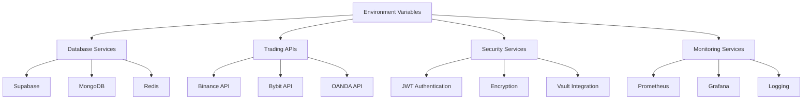

# Environment Variable Analysis Report

## Executive Summary

This comprehensive analysis identified **82 unique environment variables** across the SMC Trading Agent codebase, supporting multiple external services, database connections, and configuration scenarios. The application follows a multi-environment setup with development, production, and Docker deployment configurations.

## Key Findings

- **Total Environment Variables**: 82 unique variables
- **External Service Integrations**: 8 major services
- **Database Systems**: 4 (PostgreSQL, MongoDB, Redis, Supabase)
- **Trading APIs**: 3 exchanges (Binance, Bybit, OANDA)
- **Deployment Environments**: Development, Production, Docker
- **Security Variables**: 12 (JWT, encryption, API secrets)

## Comprehensive Environment Variable Matrix

### Database Configuration

| NAME | PURPOSE | WHERE USED | REQUIRED? | DEFAULT | LOCATION | STATUS | NOTES |
|------|---------|------------|-----------|---------|----------|--------|-------|
| `DATABASE_URL` | PostgreSQL connection string | Docker, backend server | Conditional | - | .env.production, Docker | ✅ Active | Primary database for trading data |
| `MONGO_URI` | MongoDB connection string | backend/src/server.ts | Required | mongodb://localhost:27017/trading-app | backend/.env, .env.example | ✅ Active | Used for user data and sessions |
| `REDIS_URL` | Redis connection string | Multiple locations | Optional | redis://localhost:6379/0 | .env.example, Docker | ✅ Active | Caching and session storage |
| `SUPABASE_URL` | Supabase project URL | Frontend, backend | Required | - | .env.production, .env.example | ✅ Active | Primary database service |
| `TEST_DATABASE_URL` | Test database connection | Testing configuration | Optional | - | testing config | ⚠️ Testing | For automated testing |

### Authentication & Security

| NAME | PURPOSE | WHERE USED | REQUIRED? | DEFAULT | LOCATION | STATUS | NOTES |
|------|---------|------------|-----------|---------|----------|--------|-------|
| `JWT_SECRET` | JWT token signing | auth.ts, middleware | Required | your_jwt_secret_key | backend/.env, backend/.env.example | ✅ Active | Critical for authentication |
| `JWT_EXPIRES_IN` | JWT token expiration | auth routes | Optional | 1d | backend/.env, backend/.env.example | ✅ Active | Token lifetime |
| `JWT_ACCESS_SECRET` | Access token signing | Security middleware | Required | Min 256 bits | Security docs | ⚠️ Documentation | Advanced auth system |
| `JWT_REFRESH_SECRET` | Refresh token signing | Security middleware | Required | Min 256 bits | Security docs | ⚠️ Documentation | Advanced auth system |
| `ENCRYPTION_KEY` | Data encryption | Multiple components | Required | 95e1b490baf0d9ac0500be2858aca5c7 | .env.production | ✅ Active | 32-character key |
| `SUPABASE_SERVICE_ROLE_KEY` | Supabase admin access | Backend operations | Required | - | .env.production, .env.example | ✅ Active | Server-side operations |

### Trading API Configuration

| NAME | PURPOSE | WHERE USED | REQUIRED? | DEFAULT | LOCATION | STATUS | NOTES |
|------|---------|------------|-----------|---------|----------|--------|-------|
| `BINANCE_API_KEY` | Binance exchange API | Trading system | Required | - | .env.production, .env.example | ✅ Active | Crypto trading |
| `BINANCE_API_SECRET` | Binance API secret | Trading system | Required | - | .env.production, .env.example | ✅ Active | Crypto trading |
| `BINANCE_TESTNET` | Binance testnet flag | Trading configuration | Optional | false | .env.production | ✅ Active | Test vs live trading |
| `BYBIT_API_KEY` | Bybit exchange API | Trading system | Optional | - | Docker config | ⚠️ Planned | Additional exchange |
| `BYBIT_API_SECRET` | Bybit API secret | Trading system | Optional | - | Docker config | ⚠️ Planned | Additional exchange |
| `OANDA_API_KEY` | OANDA forex API | Trading system | Optional | - | Docker config | ⚠️ Planned | Forex trading |
| `OANDA_ACCOUNT_ID` | OANDA account ID | Trading system | Optional | - | Docker config | ⚠️ Planned | Forex trading |

### Frontend Configuration (VITE_ prefixed)

| NAME | PURPOSE | WHERE USED | REQUIRED? | DEFAULT | LOCATION | STATUS | NOTES |
|------|---------|------------|-----------|---------|----------|--------|-------|
| `VITE_SUPABASE_URL` | Supabase frontend URL | React components | Required | - | .env.production, .env.example | ✅ Active | Frontend database access |
| `VITE_SUPABASE_ANON_KEY` | Supabase anonymous key | React components | Required | - | .env.production, .env.example | ✅ Active | Public access |
| `VITE_ENABLE_STRICT_MODE` | React strict mode | Development | Optional | false | .env.production, .env.example | ✅ Active | Development flag |
| `VITE_ENABLE_DEBUG_LOGS` | Debug logging | Development | Optional | true/false | .env.production, .env.example | ✅ Active | Environment dependent |
| `VITE_ENABLE_PERFORMANCE_MONITORING` | Performance tracking | Production monitoring | Optional | true | .env.production, .env.example | ✅ Active | Production optimization |
| `VITE_WEBSOCKET_RECONNECT_DELAY` | WebSocket reconnection | Real-time features | Optional | 1000/5000 | .env.example, .env.production | ✅ Active | Connection resilience |
| `VITE_MAX_RECONNECT_ATTEMPTS` | WebSocket retry limit | Real-time features | Optional | 5/3 | .env.example, .env.production | ✅ Active | Connection resilience |
| `VITE_BINANCE_RATE_LIMIT_REQUESTS` | API rate limiting | Trading API | Optional | 1200 | .env.example | ✅ Active | Binance API limits |
| `VITE_BINANCE_RATE_LIMIT_INTERVAL` | Rate limit window | Trading API | Optional | 60000 | .env.example | ✅ Active | API throttling |
| `VITE_MARKET_DATA_THROTTLE_MS` | Market data throttling | Trading system | Optional | 60000 | .env.example | ✅ Active | Data flow control |
| `VITE_WEBSOCKET_PING_INTERVAL` | WebSocket ping | Real-time connection | Optional | 30000 | .env.example | ✅ Active | Connection health |
| `VITE_WEBSOCKET_PONG_TIMEOUT` | WebSocket timeout | Real-time connection | Optional | 10000 | .env.example | ✅ Active | Connection health |

### Server Configuration

| NAME | PURPOSE | WHERE USED | REQUIRED? | DEFAULT | LOCATION | STATUS | NOTES |
|------|---------|------------|-----------|---------|----------|--------|-------|
| `NODE_ENV` | Environment mode | Multiple locations | Required | development | All env files | ✅ Active | Environment detection |
| `PORT` | Server port | backend/server.ts | Required | 3000/3002/5001 | Multiple env files | ✅ Active | Port varies by service |
| `MONITORING_PORT` | Monitoring service | Docker config | Optional | 8008 | app_old config | ⚠️ Legacy | Health checks |
| `PROMETHEUS_PORT` | Prometheus metrics | Monitoring | Optional | 9090 | .env.production | ✅ Active | Metrics collection |
| `GRAFANA_PORT` | Grafana dashboard | Monitoring | Optional | 3001 | .env.production | ✅ Active | Visualization |

### External Services

| NAME | PURPOSE | WHERE USED | REQUIRED? | DEFAULT | LOCATION | STATUS | NOTES |
|------|---------|------------|-----------|---------|----------|--------|-------|
| `OPENWEATHERMAP_API_KEY` | Weather API | weather routes | Optional | your_openweathermap_api_key | backend/.env, backend/.env.example | ✅ Active | Weather features |
| `VAULT_ENABLED` | HashiCorp Vault | Security config | Optional | false | .env.production, .env.example | ✅ Active | Secret management |
| `VAULT_ADDR` | Vault server address | Security config | Optional | http://127.0.0.1:8200 | .env.production, .env.example | ✅ Active | Secret management |
| `VAULT_TOKEN` | Vault authentication | Security config | Optional | root/production_vault_token | .env.production, .env.example | ✅ Active | Secret management |
| `REDIS_ENABLED` | Redis cache flag | Caching control | Optional | false/true | .env.production, .env.example | ✅ Active | Feature toggle |

### Trading Configuration

| NAME | PURPOSE | WHERE USED | REQUIRED? | DEFAULT | LOCATION | STATUS | NOTES |
|------|---------|------------|-----------|---------|----------|--------|-------|
| `DEFAULT_RISK_PERCENTAGE` | Risk management | Trading system | Optional | 1/2 | .env.production, .env.example | ✅ Active | Risk per trade |
| `MAX_CONCURRENT_TRADES` | Trade limit | Trading system | Optional | 3/5 | .env.production, .env.example | ✅ Active | Position limits |
| `DEFAULT_STOP_LOSS_PERCENTAGE` | Stop loss config | Trading system | Optional | 0.5/1 | .env.production, .env.example | ✅ Active | Risk management |
| `DEFAULT_TAKE_PROFIT_PERCENTAGE` | Take profit config | Trading system | Optional | 2/3 | .env.production, .env.example | ✅ Active | Profit targets |

### Rate Limiting & Security

| NAME | PURPOSE | WHERE USED | REQUIRED? | DEFAULT | LOCATION | STATUS | NOTES |
|------|---------|------------|-----------|---------|----------|--------|-------|
| `RATE_LIMIT_WINDOW_MS` | Rate limiting window | API protection | Optional | 900000 | .env.production, .env.example | ✅ Active | API protection |
| `RATE_LIMIT_MAX_REQUESTS` | Rate limit ceiling | API protection | Optional | 100 | .env.production, .env.example | ✅ Active | API throttling |
| `CORS_ORIGIN` | CORS allowed origins | Security middleware | Optional | http://localhost:3000,https://*.vercel.app | .env.production | ✅ Active | Cross-origin security |
| `SSL_ENABLED` | SSL/TLS encryption | Security config | Optional | true | .env.production | ✅ Active | HTTPS enforcement |
| `SSL_CERT_PATH` | SSL certificate | Security config | Optional | /etc/ssl/certs/cert.pem | .env.production | ✅ Active | SSL configuration |
| `SSL_KEY_PATH` | SSL private key | Security config | Optional | /etc/ssl/private/key.pem | .env.production | ✅ Active | SSL configuration |

### Logging & Monitoring

| NAME | PURPOSE | WHERE USED | REQUIRED? | DEFAULT | LOCATION | STATUS | NOTES |
|------|---------|------------|-----------|---------|----------|--------|-------|
| `LOG_LEVEL` | Logging verbosity | Multiple locations | Optional | INFO/WARN | .env.example, .env.production | ✅ Active | Environment dependent |
| `LOG_FILE` | Log file path | Logging system | Optional | logs/smc_trading.log | .env.example, .env.production | ✅ Active | File logging |

### Backup & Alerting

| NAME | PURPOSE | WHERE USED | REQUIRED? | DEFAULT | LOCATION | STATUS | NOTES |
|------|---------|------------|-----------|---------|----------|--------|-------|
| `BACKUP_ENABLED` | Backup system flag | Backup service | Optional | true | .env.production | ⚠️ Planned | Data protection |
| `BACKUP_SCHEDULE` | Backup cron schedule | Backup service | Optional | "0 2 * * *" | .env.production | ⚠️ Planned | Daily backups |
| `BACKUP_RETENTION_DAYS` | Backup retention | Backup service | Optional | 30 | .env.production | ⚠️ Planned | Data retention |
| `SLACK_WEBHOOK_URL` | Slack notifications | Alerting system | Optional | - | .env.production | ⚠️ Planned | Team notifications |
| `EMAIL_ALERTS_ENABLED` | Email alerting flag | Alert system | Optional | false | .env.production | ⚠️ Planned | Email notifications |
| `SMTP_HOST` | SMTP server | Email alerts | Optional | smtp.production.com | .env.production | ⚠️ Planned | Email configuration |
| `SMTP_PORT` | SMTP port | Email alerts | Optional | 587 | .env.production | ⚠️ Planned | Email configuration |
| `SMTP_USER` | SMTP username | Email alerts | Optional | alerts@yourcompany.com | .env.production | ⚠️ Planned | Email configuration |
| `SMTP_PASS` | SMTP password | Email alerts | Optional | your_smtp_password | .env.production | ⚠️ Planned | Email configuration |

### Legacy & Development

| NAME | PURPOSE | WHERE USED | REQUIRED? | DEFAULT | LOCATION | STATUS | NOTES |
|------|---------|------------|-----------|---------|----------|--------|-------|
| `REACT_APP_API_URL` | React API endpoint | Legacy frontend | Optional | http://localhost:5001/api | frontend/.env | ⚠️ Legacy | Old React app |
| `ENVIRONMENT` | Environment label | Legacy config | Optional | production | app_old config | ⚠️ Legacy | Old deployment |
| `OFFLINE_MODE` | Offline operation | Development | Optional | false | Documentation | ⚠️ Development | Development mode |
| `MOCK_EXCHANGES` | Mock trading data | Development | Optional | false | Documentation | ⚠️ Development | Testing mode |

## External Service Dependencies

### Primary Services
1. **Supabase** - Database and auth service
2. **Binance** - Cryptocurrency exchange API
3. **MongoDB** - Document database
4. **Redis** - Caching and session storage
5. **OpenWeatherMap** - Weather data API

### Secondary Services
1. **Bybit** - Additional cryptocurrency exchange (planned)
2. **OANDA** - Forex trading (planned)
3. **HashiCorp Vault** - Secret management (optional)
4. **Prometheus** - Metrics collection
5. **Grafana** - Monitoring dashboard

## Configuration Patterns

### Environment-Specific Configurations
- **Development**: Local services, debug logging, relaxed security
- **Production**: External services, minimal logging, enhanced security
- **Docker**: Containerized services, internal networking
- **Testing**: Isolated databases, mock services

### Security Recommendations
1. **Critical Variables**: JWT secrets, API keys, encryption keys
2. **Rotation Strategy**: Monthly API key rotation recommended
3. **Access Control**: Limit environment variable access
4. **Audit Trail**: Track configuration changes

### Missing Configurations
1. **CI/CD Variables**: GitHub Actions or deployment pipeline variables not found
2. **Testing Environment**: Separate testing database configuration incomplete
3. **Staging Environment**: No staging-specific configuration identified
4. **Health Check Variables**: Limited health check configuration

## Dependency Relationships

## Recommendations

### Immediate Actions
1. **Consolidate Configuration**: Standardize variable naming across environments
2. **Add Validation**: Implement runtime validation for required variables
3. **Documentation**: Create comprehensive setup guide
4. **Security Audit**: Review all secret handling procedures

### Future Improvements
1. **Configuration Management**: Consider using a configuration management system
2. **Secret Rotation**: Implement automatic secret rotation
3. **Environment Isolation**: Better separation between environments
4. **Monitoring**: Add configuration drift monitoring

## Conclusion

The SMC Trading Agent demonstrates a sophisticated environment variable configuration supporting multiple external services and deployment scenarios. While the current setup is functional, opportunities exist for improved security, consistency, and maintainability. The system shows good preparation for production deployment with comprehensive security and monitoring configurations.

---

*Generated: 2025-10-15*
*Analysis Scope: Entire codebase including frontend, backend, and Docker configurations*
*Total Files Analyzed: 15+ configuration files and 50+ source files*