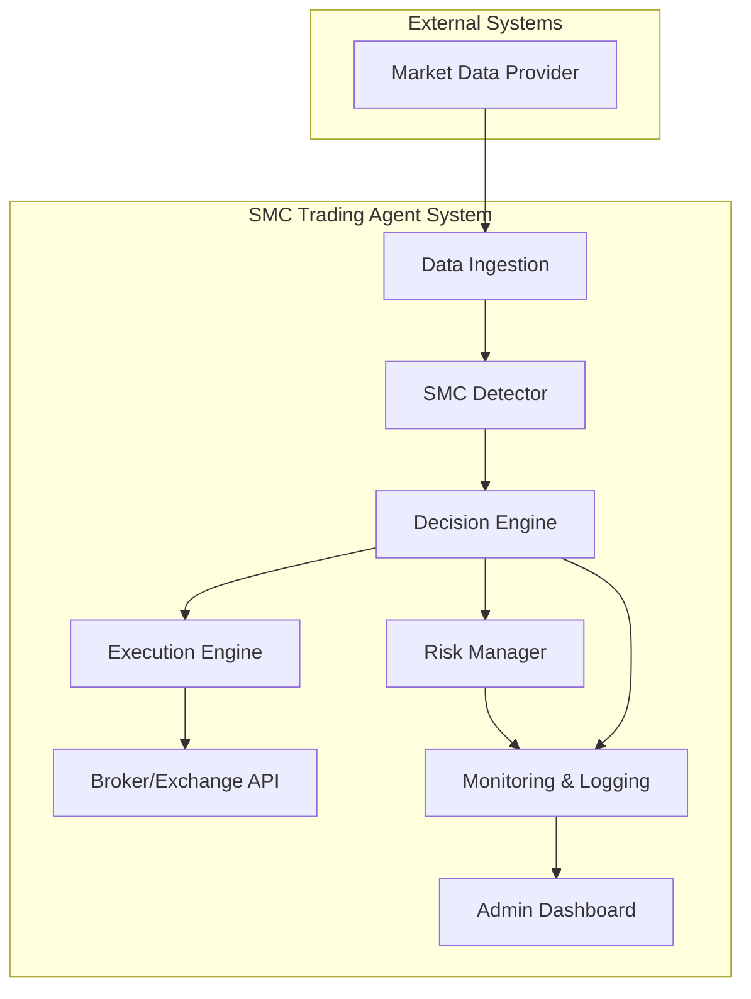

# Project Brief: SMC Trading Agent

## 1. Project Summary

This project aims to develop a sophisticated automated trading agent based on Smart Money Concepts (SMC). The agent will analyze market data in real-time to identify high-probability trading setups, execute trades, manage risk, and continuously learn from its performance using reinforcement learning.

## 2. Goals and Objectives

- **Primary Goal:** Achieve consistent profitability by automating SMC-based trading strategies.
- **Key Objectives:**
    - Develop robust SMC pattern detection algorithms (Order Blocks, BoS, CHoCH, etc.).
    - Implement a real-time decision engine to evaluate trade setups.
    - Build a secure and efficient trade execution engine.
    - Integrate a comprehensive risk management module.
    - Create a reinforcement learning pipeline for continuous model improvement.

## 3. Scope

- **In Scope:**
    - Real-time market data ingestion (initially crypto, expandable to other assets).
    - Backtesting capabilities.
    - Core SMC indicator detection.
    - Automated trade execution and management.
    - Performance monitoring and reporting.
- **Out of Scope:**
    - High-frequency trading (HFT).
    - User-facing trading interface (initially).
    - Unsupervised learning for strategy discovery.

## 4. System Boundaries

