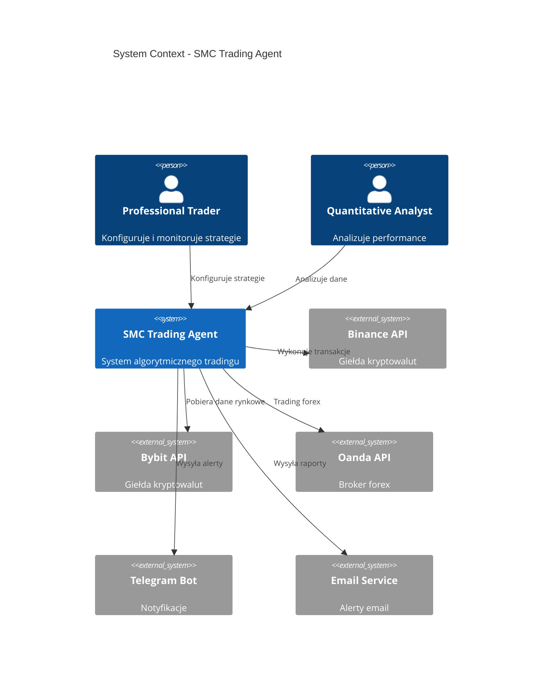
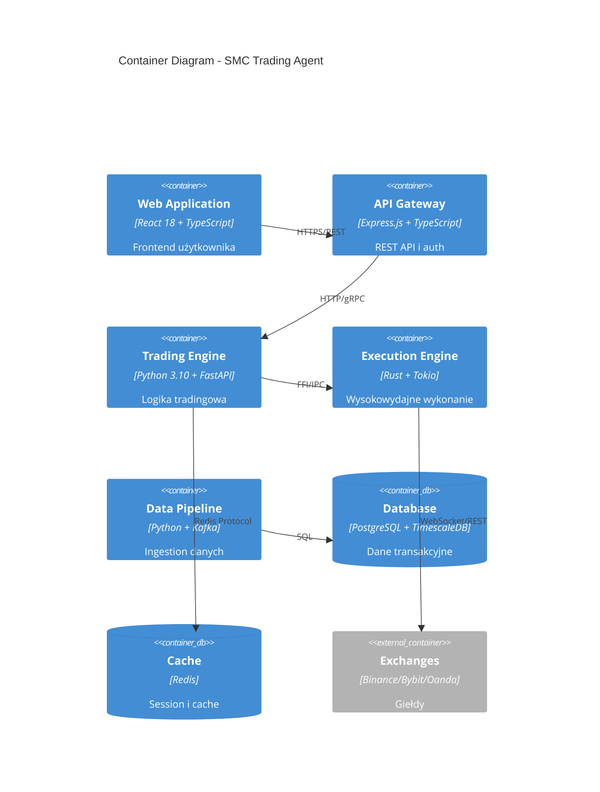
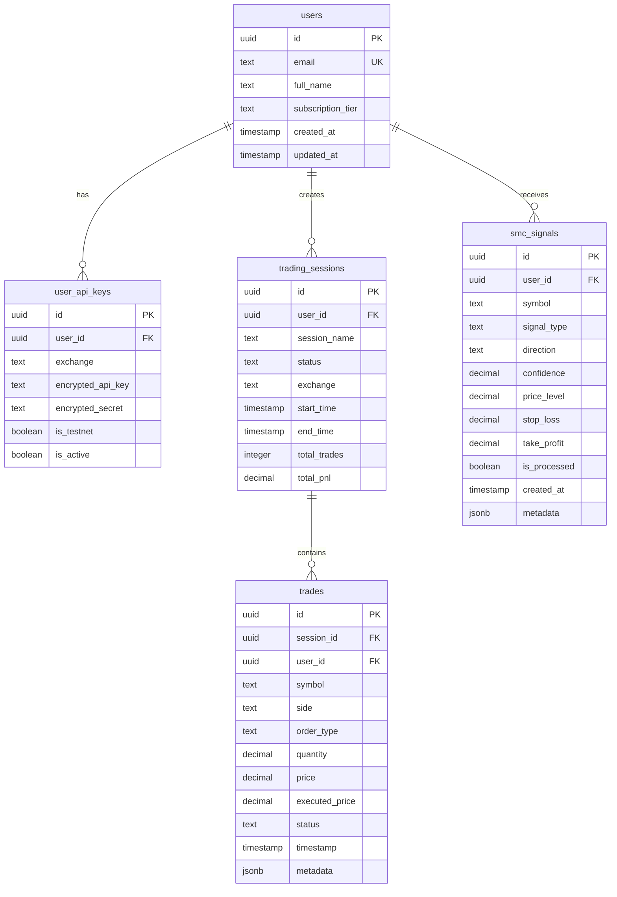
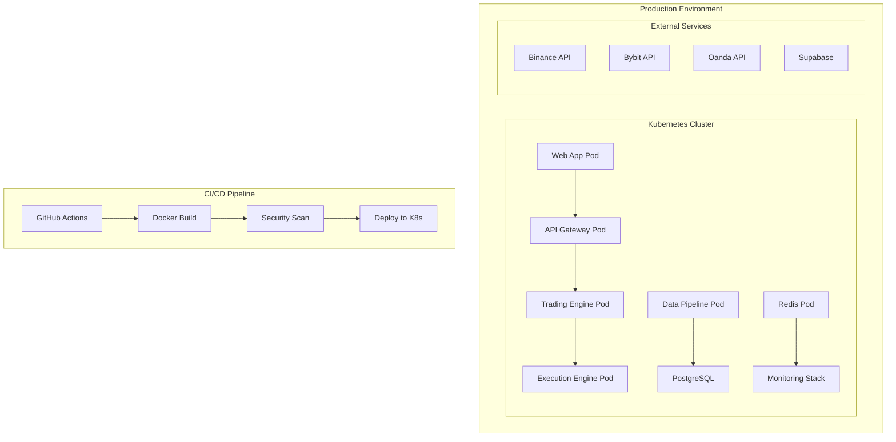
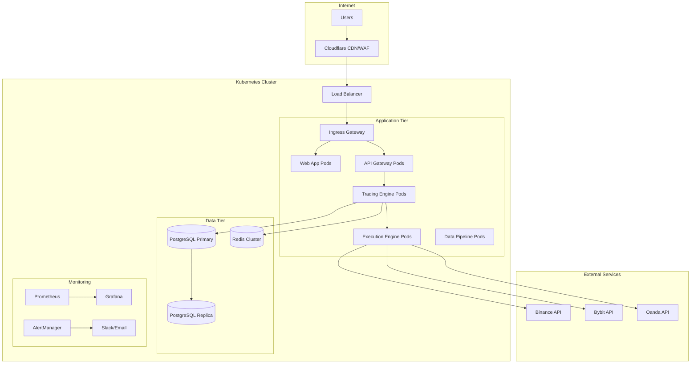
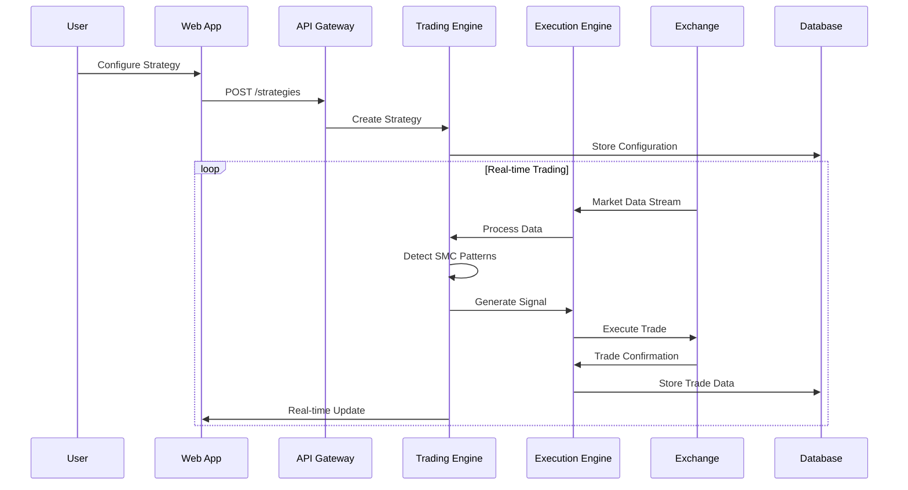
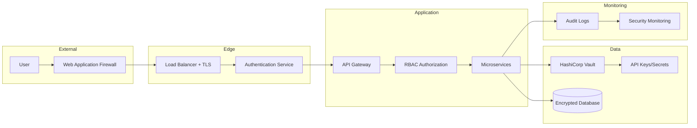

# Design Document - Context-7 Analysis and Production Implementation Plan

## Overview

This document presents a comprehensive Context-7 analysis of the SMC Trading Agent project and a detailed production implementation design. The analysis covers all seven context layers: business, user, system, code, data, operational, and risk.

**Design Rationale:** The document is designed as a comprehensive architectural analysis using the Context-7 methodology to systematically examine all aspects of the system. This methodology choice enables a holistic approach to analysis that considers not only technical aspects but also business, user, and operational concerns.

**Key Design Decisions:**

- Utilization of Context-7 methodology for complete system analysis
- Focus on production-ready implementation with real integrations
- Prioritization of security and compliance (GDPR, OWASP, NIST)
- Implementation with technical precision while maintaining clarity

## Analiza Context-7

### 1. Business Context

**Business Goals:**

- Trading automation using Smart Money Concepts (SMC)
- Profit generation through algorithmic detection of institutional patterns
- Risk minimization through advanced position management
- Scaling trading strategies across multiple exchanges

**KPIs and ROI:**

- Sharpe Ratio > 2.0
- Maximum Drawdown < 5%
- Win Rate > 60%
- ROI > 20% annually
- Execution latency < 50ms

**Business Risks:**

- Cryptocurrency market volatility
- Regulatory changes
- Exchange outages
- Algorithmic errors leading to losses
- Competition from other trading bots

### 2. User Context

**Personas:**

- **Professional Trader**: Experienced trader seeking automation
- **Quantitative Analyst**: Analyst implementing algorithmic strategies
- **Trading Firm**: Trading company scaling operations
- **Retail Investor**: Individual investor with capital > $10k

**Use Cases:**

- SMC strategy configuration
- Real-time position monitoring
- Performance analysis and reporting
- Risk management and limits
- Strategy backtesting

**User Journey:**

1. Registration and identity verification
2. Exchange API keys configuration
3. Risk parameters setup
4. Trading strategies activation
5. Monitoring and optimization

**Availability Requirements:**

- 99.9% uptime (8.76h downtime/year)
- 24/7 access due to global markets
- UI responsiveness < 2s
- Mobile-friendly interface

### 3. System Context

**System Boundaries:**



**External Systems:**

- **Binance API**: REST + WebSocket, rate limit 1200/min
- **Bybit API**: REST + WebSocket, rate limit 120/s
- **Oanda API**: REST + Streaming, rate limit 120/s
- **Supabase**: PostgreSQL + Auth + Realtime
- **Redis**: Cache and session storage
- **Prometheus/Grafana**: Monitoring and alerting

**Data Policies:**

- Data encryption at rest (AES-256)
- Data encryption in transit (TLS 1.3)
- Transaction data retention: 7 years
- Daily backups with 30-day retention
- GDPR compliance for EU data

### 4. Code Context

**Component Architecture:**



**Languages and Frameworks:**

- **Frontend**: React 18, TypeScript 5.8, Vite 6, Tailwind CSS
- **API Layer**: Express.js 4.21, TypeScript, JWT auth
- **Trading Engine**: Python 3.10, FastAPI 0.104, Pydantic 2.5
- **Execution Engine**: Rust 2021, Tokio async, CCXT-rs
- **Database**: PostgreSQL 15, TimescaleDB, Supabase
- **Infrastructure**: Docker, Kubernetes, Prometheus, Grafana

**Code Quality:**

- TypeScript strict mode enabled
- Python type hints with mypy
- Rust clippy linting
- ESLint + Prettier for JS/TS
- Black + isort for Python
- 80%+ test coverage target
- Pre-commit hooks with formatting

**Identified Issues:**

- Missing comprehensive integration tests
- Some components use mock implementations
- Missing proper error handling in some areas
- Suboptimal database queries
- Missing rate limiting in API

### 5. Kontekst Danych

**Model danych:**



**Schematy i migracje:**

- Supabase migrations w `supabase/migrations/`
- Wersjonowanie schematów z Alembic
- Row Level Security (RLS) enabled
- Indeksy na często używanych kolumnach
- Partycjonowanie tabel trades po dacie

**PII i GDPR:**

- Email addresses (PII)
- API keys (szyfrowane)
- Trading history (pseudoanonimizowane)
- Right to be forgotten implementation
- Data export functionality

**Retencja danych:**

- User data: do usunięcia konta
- Trading data: 7 lat (wymogi regulacyjne)
- Market data cache: 24h
- Logs: 90 dni
- Backups: 30 dni

### 6. Kontekst Operacyjny

**Deployment:**



**Runtime requirements:**

- **CPU**: 4 cores minimum, 8 cores recommended
- **RAM**: 8GB minimum, 16GB recommended
- **Storage**: 100GB SSD minimum
- **Network**: 1Gbps, <10ms latency do giełd
- **OS**: Linux (Ubuntu 22.04 LTS)

**High Availability:**

- Multi-zone deployment (3 AZ minimum)
- Load balancer z health checks
- Database replication (master-slave)
- Redis Sentinel dla HA cache
- Auto-scaling na podstawie CPU/memory

**Disaster Recovery:**

- RTO: 15 minut
- RPO: 5 minut
- Automated backups co 6h
- Cross-region backup replication
- Runbook dla disaster scenarios

**Skalowanie:**

- Horizontal pod autoscaling
- Database connection pooling
- Redis clustering
- CDN dla static assets
- Rate limiting i circuit breakers

**Koszty (miesięcznie):**

- **Development**: $200-500
- **Staging**: $500-1000
- **Production**: $1500-3000
- **Monitoring**: $100-300
- **Backup/DR**: $200-500

### 7. Kontekst Ryzyka

**Bezpieczeństwo:**

- **Wysokie**: API keys exposure
- **Wysokie**: SQL injection w custom queries
- **Średnie**: XSS w React components
- **Średnie**: CSRF attacks
- **Niskie**: DDoS attacks (Cloudflare protection)

**Compliance:**

- **GDPR**: Wymagane dla użytkowników EU
- **PCI DSS**: Nie dotyczy (brak płatności kartą)
- **SOX**: Wymagane dla firm publicznych
- **MiFID II**: Wymagane dla EU trading firms

**Privacy:**

- Minimalizacja zbieranych danych
- Pseudoanonimizacja trading data
- Encryption at rest i in transit
- Access logging i auditing
- Data retention policies

**Vendor Lock-in:**

- **Supabase**: Średnie ryzyko, migracja możliwa
- **Vercel**: Niskie ryzyko, łatwa migracja
- **Exchange APIs**: Wysokie ryzyko, trudna zmiana
- **Kubernetes**: Niskie ryzyko, standard branżowy

## Architektura Rozwiązania

### Komponenty Systemu

**1. Frontend (React + TypeScript)**

- Vite 6 build system
- Tailwind CSS styling
- React Query dla state management
- WebSocket connections dla real-time data
- PWA capabilities

**2. API Gateway (Express.js)**

- JWT authentication
- Rate limiting
- Request validation
- CORS handling
- API documentation (OpenAPI)

**3. Trading Engine (Python + FastAPI)**

- SMC pattern detection
- Risk management
- Decision engine
- Model ensemble
- WebSocket connections

**4. Execution Engine (Rust)**

- Ultra-low latency execution
- Circuit breakers
- Retry logic
- Metrics collection
- CCXT integration

**5. Data Pipeline (Python + Kafka)**

- Real-time data ingestion
- Data validation
- Stream processing
- Market data normalization

### Integracje Zewnętrzne

**Exchange APIs:**

```typescript
interface ExchangeConfig {
  name: "binance" | "bybit" | "oanda";
  apiKey: string;
  apiSecret: string;
  testnet: boolean;
  rateLimit: number;
  endpoints: {
    rest: string;
    websocket: string;
  };
}
```

**Database Schema:**

- PostgreSQL 15 z TimescaleDB extension
- Row Level Security (RLS)
- Automated backups
- Connection pooling
- Read replicas

### Monitoring i Observability

**Metrics (Prometheus):**

- Trading performance metrics
- System performance metrics
- Business metrics (PnL, trades)
- SLI/SLO monitoring

**Logging (Structured JSON):**

- Application logs
- Audit logs
- Error tracking
- Performance logs

**Alerting:**

- Critical system failures
- Trading losses > threshold
- API rate limit exceeded
- Database connection issues

### Security Architecture

**Authentication & Authorization:**

- JWT tokens z refresh mechanism
- Multi-factor authentication (TOTP, WebAuthn)
- Role-based access control (RBAC)
- API key management

**Data Protection:**

- AES-256 encryption at rest
- TLS 1.3 in transit
- API key encryption
- PII pseudoanonimization

**Network Security:**

- WAF (Web Application Firewall)
- DDoS protection
- VPN access dla admin
- Network segmentation

## Error Handling

**Circuit Breaker Pattern:**

```python
@circuit_breaker(failure_threshold=5, recovery_timeout=30)
async def execute_trade(signal: TradingSignal):
    # Implementation with automatic fallback
    pass
```

**Retry Logic:**

```rust
#[retry(max_attempts = 3, backoff = exponential)]
async fn place_order(order: Order) -> Result<OrderResponse, Error> {
    // Implementation with exponential backoff
}
```

**Graceful Degradation:**

- Fallback do cached data
- Reduced functionality mode
- User notifications
- Automatic recovery

## Testing Strategy

**Unit Tests:**

- 80%+ coverage dla core logic
- Property-based testing
- Mock external dependencies
- Fast execution (<5s)

**Integration Tests:**

- Database interactions
- API endpoints
- WebSocket connections
- Exchange integrations (testnet)

**End-to-End Tests:**

- Complete user journeys
- Trading scenarios
- Error scenarios
- Performance tests

**Load Testing:**

- Concurrent users: 1000+
- Transactions per second: 100+
- Response time: <100ms p95
- Memory usage monitoring

## Identyf

ikacja Luk i Problemów

### Krytyczne Problemy

**1. Bezpieczeństwo:**

- Hardcoded API keys w kodzie źródłowym
- Brak proper input validation w niektórych endpointach
- Niewystarczające logowanie zdarzeń bezpieczeństwa
- Brak rate limiting na krytycznych endpointach

**2. Wydajność:**

- Nieoptymalne zapytania SQL (N+1 problem)
- Brak connection pooling dla bazy danych
- Synchroniczne operacje blokujące w Python
- Brak cachowania dla często używanych danych

**3. Niezawodność:**

- Brak proper error handling w execution engine
- Niewystarczające circuit breakers
- Brak graceful shutdown mechanisms
- Single points of failure

**4. Monitoring:**

- Brak comprehensive health checks
- Niewystarczające metryki biznesowe
- Brak alerting dla krytycznych scenariuszy
- Niewystarczające logowanie

### Średnie Problemy

**1. Kod:**

- Inconsistent error handling patterns
- Brak proper type annotations w niektórych miejscach
- Duplicate code w różnych komponentach
- Niewystarczające unit tests

**2. Infrastruktura:**

- Brak proper secrets management
- Nieoptymalna konfiguracja Docker
- Brak proper resource limits
- Niewystarczające backup procedures

**3. Dokumentacja:**

- Brak API documentation
- Niewystarczające deployment guides
- Brak troubleshooting runbooks
- Outdated README files

### Niskie Problemy

**1. UX/UI:**

- Nieoptymalne loading states
- Brak proper error messages
- Inconsistent styling
- Brak accessibility features

**2. DevOps:**

- Brak automated testing w CI/CD
- Nieoptymalne build times
- Brak proper staging environment
- Manual deployment processes

## Plan Implementacji Produkcyjnej

### Faza 1: Fundament (Tygodnie 1-4)

**1.1 Security Hardening**

- Implementacja proper secrets management (HashiCorp Vault)
- Dodanie input validation i sanitization
- Implementacja comprehensive audit logging
- Konfiguracja WAF i DDoS protection

**1.2 Infrastructure Setup**

- Konfiguracja Kubernetes cluster
- Setup CI/CD pipeline z GitHub Actions
- Implementacja monitoring stack (Prometheus/Grafana)
- Konfiguracja backup i disaster recovery

**1.3 Database Optimization**

- Implementacja connection pooling
- Optymalizacja queries i dodanie indeksów
- Setup read replicas
- Implementacja data retention policies

### Faza 2: Core Services (Tygodnie 5-8)

**2.1 Trading Engine Enhancement**

- Refactoring do async/await patterns
- Implementacja proper error handling
- Dodanie comprehensive testing
- Performance optimization

**2.2 Execution Engine Hardening**

- Implementacja robust circuit breakers
- Dodanie retry logic z exponential backoff
- Enhanced metrics collection
- Latency optimization

**2.3 API Gateway Implementation**

- Rate limiting implementation
- Authentication/authorization hardening
- Request/response validation
- API documentation generation

### Faza 3: Integration & Testing (Tygodnie 9-12)

**3.1 Exchange Integrations**

- Production API configurations
- Error handling dla exchange failures
- Rate limit management
- Failover mechanisms

**3.2 Real-time Data Pipeline**

- Kafka cluster setup
- Stream processing optimization
- Data validation i quality checks
- Monitoring i alerting

**3.3 Comprehensive Testing**

- Unit test coverage > 80%
- Integration tests dla wszystkich services
- Load testing i performance validation
- Security penetration testing

### Faza 4: Production Deployment (Tygodnie 13-16)

**4.1 Production Environment**

- Multi-zone Kubernetes deployment
- Load balancer configuration
- SSL/TLS certificates setup
- Domain i DNS configuration

**4.2 Monitoring & Alerting**

- SLI/SLO definition i monitoring
- Business metrics dashboards
- Alert rules configuration
- On-call procedures

**4.3 Documentation & Training**

- Operational runbooks
- API documentation
- User guides
- Team training sessions

## Diagramy Architektury

### Deployment Architecture



### Data Flow Architecture



### Security Architecture



## Konfiguracje Produkcyjne

### Kubernetes Manifests

**Namespace:**

```yaml
apiVersion: v1
kind: Namespace
metadata:
  name: smc-trading
  labels:
    name: smc-trading
    environment: production
```

**ConfigMap:**

```yaml
apiVersion: v1
kind: ConfigMap
metadata:
  name: smc-config
  namespace: smc-trading
data:
  DATABASE_HOST: "postgresql-primary.smc-trading.svc.cluster.local"
  REDIS_HOST: "redis-cluster.smc-trading.svc.cluster.local"
  LOG_LEVEL: "INFO"
  ENVIRONMENT: "production"
```

**Secret:**

```yaml
apiVersion: v1
kind: Secret
metadata:
  name: smc-secrets
  namespace: smc-trading
type: Opaque
data:
  DATABASE_PASSWORD: <base64-encoded>
  JWT_SECRET: <base64-encoded>
  BINANCE_API_KEY: <base64-encoded>
  BINANCE_API_SECRET: <base64-encoded>
```

### Docker Configurations

**Multi-stage Dockerfile (Trading Engine):**

```dockerfile
# Build stage
FROM python:3.10-slim as builder
WORKDIR /app
COPY requirements.txt .
RUN pip install --no-cache-dir --user -r requirements.txt

# Production stage
FROM python:3.10-slim
WORKDIR /app
COPY --from=builder /root/.local /root/.local
COPY . .
RUN useradd -m -u 1000 appuser && chown -R appuser:appuser /app
USER appuser
EXPOSE 8000
CMD ["uvicorn", "main:app", "--host", "0.0.0.0", "--port", "8000"]
```

### Monitoring Configuration

**Prometheus Config:**

```yaml
global:
  scrape_interval: 15s
  evaluation_interval: 15s

rule_files:
  - "smc_trading_rules.yml"

scrape_configs:
  - job_name: "smc-trading-engine"
    static_configs:
      - targets: ["trading-engine:8000"]
    metrics_path: /metrics
    scrape_interval: 5s

  - job_name: "smc-execution-engine"
    static_configs:
      - targets: ["execution-engine:9090"]
    metrics_path: /metrics
    scrape_interval: 1s
```

**Alert Rules:**

```yaml
groups:
  - name: smc_trading_alerts
    rules:
      - alert: HighLatency
        expr: histogram_quantile(0.95, rate(order_execution_duration_ms[5m])) > 100
        for: 2m
        labels:
          severity: warning
        annotations:
          summary: "High execution latency detected"

      - alert: TradingLoss
        expr: increase(total_pnl[1h]) < -1000
        for: 0m
        labels:
          severity: critical
        annotations:
          summary: "Significant trading loss detected"
```

## Estymaty Kosztów i Timeline

### Koszty Infrastruktury (miesięcznie)

**Development Environment:**

- Kubernetes cluster (3 nodes): $150
- Database (PostgreSQL): $50
- Monitoring stack: $30
- **Total: $230/miesiąc**

**Production Environment:**

- Kubernetes cluster (6 nodes, multi-AZ): $800
- Database (HA PostgreSQL): $300
- Redis cluster: $150
- Load balancer: $50
- Monitoring i logging: $100
- Backup storage: $80
- **Total: $1,480/miesiąc**

### Timeline Implementacji

**Faza 1 (4 tygodnie): Fundament**

- Tydzień 1: Security hardening
- Tydzień 2: Infrastructure setup
- Tydzień 3: Database optimization
- Tydzień 4: Basic monitoring

**Faza 2 (4 tygodnie): Core Services**

- Tydzień 5-6: Trading engine enhancement
- Tydzień 7: Execution engine hardening
- Tydzień 8: API gateway implementation

**Faza 3 (4 tygodnie): Integration**

- Tydzień 9-10: Exchange integrations
- Tydzień 11: Data pipeline
- Tydzień 12: Comprehensive testing

**Faza 4 (4 tygodnie): Production**

- Tydzień 13-14: Production deployment
- Tydzień 15: Monitoring setup
- Tydzień 16: Documentation i training

**Total: 16 tygodni (4 miesiące)**

## Standards and Compliance Mapping

### OWASP Top 10 2021 Compliance

**A01: Broken Access Control**

- Implementacja RBAC z JWT tokens
- API endpoint authorization checks
- Resource-level access controls
- Reference: [OWASP Access Control](https://owasp.org/Top10/A01_2021-Broken_Access_Control/)

**A02: Cryptographic Failures**

- AES-256 encryption at rest
- TLS 1.3 for data in transit
- Proper key management z HashiCorp Vault
- Reference: [OWASP Cryptographic Storage](https://owasp.org/Top10/A02_2021-Cryptographic_Failures/)

**A03: Injection**

- Parameterized queries w PostgreSQL
- Input validation z Pydantic/Zod
- SQL injection prevention
- Reference: [OWASP Injection Prevention](https://owasp.org/Top10/A03_2021-Injection/)

**A04: Insecure Design**

- Threat modeling w design phase
- Security by design principles
- Defense in depth architecture
- Reference: [OWASP Secure Design](https://owasp.org/Top10/A04_2021-Insecure_Design/)

**A05: Security Misconfiguration**

- Automated security scanning w CI/CD
- Hardened container images
- Proper Kubernetes security contexts
- Reference: [OWASP Security Misconfiguration](https://owasp.org/Top10/A05_2021-Security_Misconfiguration/)

### NIST Cybersecurity Framework Alignment

**Identify (ID)**

- Asset inventory i classification
- Risk assessment procedures
- Governance policies

**Protect (PR)**

- Access control implementation
- Data security measures
- Protective technology deployment

**Detect (DE)**

- Continuous monitoring
- Security event detection
- Anomaly detection systems

**Respond (RS)**

- Incident response procedures
- Communication protocols
- Analysis and mitigation

**Recover (RC)**

- Recovery planning
- Improvement processes
- Communication coordination

Reference: [NIST Cybersecurity Framework](https://www.nist.gov/cyberframework)

### GDPR Compliance Implementation

**Data Protection by Design**

- Minimization of data collection
- Pseudoanonimization techniques
- Privacy impact assessments

**Individual Rights**

- Right to access implementation
- Right to rectification procedures
- Right to erasure (right to be forgotten)
- Data portability mechanisms

Reference: [GDPR Official Text](https://gdpr-info.eu/)

## Operational Runbooks

### Incident Response Procedures

**Critical System Failure (P0)**

1. **Detection i Alerting**

   ```bash
   # Check system health
   kubectl get pods -n smc-trading
   kubectl describe pod <failing-pod> -n smc-trading

   # Check logs
   kubectl logs <pod-name> -n smc-trading --tail=100
   ```

2. **Initial Assessment**

   - Determine impact scope
   - Identify affected users
   - Estimate financial impact

3. **Immediate Response**

   ```bash
   # Emergency trading halt
   curl -X POST https://api.smc-trading.com/v1/emergency/halt \
     -H "Authorization: Bearer $EMERGENCY_TOKEN"

   # Scale up replicas
   kubectl scale deployment trading-engine --replicas=5 -n smc-trading
   ```

4. **Communication**
   - Notify stakeholders via Slack
   - Update status page
   - Prepare user communication

**Database Performance Issues (P1)**

1. **Diagnostics**

   ```sql
   -- Check active connections
   SELECT count(*) FROM pg_stat_activity;

   -- Identify slow queries
   SELECT query, mean_time, calls
   FROM pg_stat_statements
   ORDER BY mean_time DESC LIMIT 10;
   ```

2. **Immediate Actions**

   ```bash
   # Check connection pool status
   kubectl exec -it pgbouncer-pod -- psql -p 6432 pgbouncer -c "SHOW POOLS;"

   # Restart connection pooler if needed
   kubectl rollout restart deployment/pgbouncer -n smc-trading
   ```

**Exchange API Failures (P1)**

1. **Failover Activation**

   ```python
   # Manual failover script
   python scripts/emergency_failover.py --from binance --to bybit
   ```

2. **Rate Limit Recovery**

   ```bash
   # Check rate limit status
   redis-cli GET "rate_limit:binance:api_calls"

   # Reset rate limits if needed (emergency only)
   redis-cli DEL "rate_limit:binance:*"
   ```

### Deployment Procedures

**Production Deployment Checklist**

- [ ] Code review completed i approved
- [ ] All tests passing (unit, integration, e2e)
- [ ] Security scan completed without critical issues
- [ ] Database migrations tested w staging
- [ ] Rollback plan prepared
- [ ] Monitoring alerts configured
- [ ] Stakeholders notified
- [ ] Deployment window scheduled

**Deployment Commands**

```bash
# 1. Pre-deployment checks
kubectl get nodes
kubectl get pods -n smc-trading
kubectl top nodes

# 2. Database migration (if needed)
kubectl exec -it postgres-primary -- psql -U postgres -d smc_trading -f /migrations/latest.sql

# 3. Rolling deployment
kubectl set image deployment/trading-engine trading-engine=smc-trading:v1.2.3 -n smc-trading
kubectl rollout status deployment/trading-engine -n smc-trading

# 4. Health checks
kubectl get pods -n smc-trading
curl -f https://api.smc-trading.com/health

# 5. Rollback (if needed)
kubectl rollout undo deployment/trading-engine -n smc-trading
```

### Monitoring i Alerting Procedures

**Daily Health Checks**

```bash
#!/bin/bash
# daily_health_check.sh

echo "=== SMC Trading Agent Daily Health Check ==="
echo "Date: $(date)"

# Check Kubernetes cluster health
echo "1. Kubernetes Cluster Status:"
kubectl get nodes
kubectl get pods -n smc-trading | grep -v Running

# Check database health
echo "2. Database Health:"
kubectl exec -it postgres-primary -- pg_isready

# Check trading performance
echo "3. Trading Performance (last 24h):"
curl -s "https://api.smc-trading.com/v1/metrics/daily" | jq '.pnl, .trades_count, .win_rate'

# Check system resources
echo "4. Resource Utilization:"
kubectl top nodes
kubectl top pods -n smc-trading

echo "=== Health Check Complete ==="
```

**Alert Response Procedures**

**High Latency Alert**

1. Check network connectivity to exchanges
2. Analyze execution engine performance metrics
3. Scale up execution engine replicas if needed
4. Investigate database query performance

**Trading Loss Alert**

1. Immediately halt trading if loss exceeds threshold
2. Analyze recent trades for anomalies
3. Check SMC detection algorithm performance
4. Review risk management parameters

**Database Connection Alert**

1. Check PgBouncer connection pool status
2. Analyze database server resources
3. Restart connection pooler if needed
4. Scale database resources if required

## Enhanced Configuration Examples

### Complete Kubernetes Production Manifests

**Trading Engine Deployment:**

```yaml
apiVersion: apps/v1
kind: Deployment
metadata:
  name: trading-engine
  namespace: smc-trading
  labels:
    app: trading-engine
    version: v1.0.0
spec:
  replicas: 3
  strategy:
    type: RollingUpdate
    rollingUpdate:
      maxUnavailable: 1
      maxSurge: 1
  selector:
    matchLabels:
      app: trading-engine
  template:
    metadata:
      labels:
        app: trading-engine
        version: v1.0.0
      annotations:
        prometheus.io/scrape: "true"
        prometheus.io/port: "8000"
        prometheus.io/path: "/metrics"
    spec:
      serviceAccountName: trading-engine-sa
      securityContext:
        runAsNonRoot: true
        runAsUser: 1000
        fsGroup: 1000
      containers:
        - name: trading-engine
          image: smc-trading/trading-engine:v1.0.0
          imagePullPolicy: Always
          ports:
            - containerPort: 8000
              name: http
            - containerPort: 9090
              name: metrics
          env:
            - name: DATABASE_URL
              valueFrom:
                secretKeyRef:
                  name: smc-secrets
                  key: database-url
            - name: REDIS_URL
              valueFrom:
                configMapKeyRef:
                  name: smc-config
                  key: redis-url
            - name: VAULT_ADDR
              value: "https://vault.smc-trading.svc.cluster.local:8200"
            - name: VAULT_ROLE
              value: "trading-engine"
          resources:
            requests:
              memory: "512Mi"
              cpu: "500m"
            limits:
              memory: "2Gi"
              cpu: "2000m"
          livenessProbe:
            httpGet:
              path: /health
              port: 8000
            initialDelaySeconds: 30
            periodSeconds: 10
            timeoutSeconds: 5
            failureThreshold: 3
          readinessProbe:
            httpGet:
              path: /ready
              port: 8000
            initialDelaySeconds: 5
            periodSeconds: 5
            timeoutSeconds: 3
            failureThreshold: 2
          volumeMounts:
            - name: vault-secrets
              mountPath: /vault/secrets
              readOnly: true
      volumes:
        - name: vault-secrets
          csi:
            driver: secrets-store.csi.x-k8s.io
            readOnly: true
            volumeAttributes:
              secretProviderClass: "vault-smc-trading"
      affinity:
        podAntiAffinity:
          preferredDuringSchedulingIgnoredDuringExecution:
            - weight: 100
              podAffinityTerm:
                labelSelector:
                  matchExpressions:
                    - key: app
                      operator: In
                      values:
                        - trading-engine
                topologyKey: kubernetes.io/hostname
---
apiVersion: v1
kind: Service
metadata:
  name: trading-engine-service
  namespace: smc-trading
  labels:
    app: trading-engine
spec:
  selector:
    app: trading-engine
  ports:
    - name: http
      port: 80
      targetPort: 8000
    - name: metrics
      port: 9090
      targetPort: 9090
  type: ClusterIP
```

**Complete Prometheus Configuration:**

```yaml
# prometheus-config.yaml
global:
  scrape_interval: 15s
  evaluation_interval: 15s
  external_labels:
    cluster: "smc-trading-prod"
    environment: "production"

rule_files:
  - "/etc/prometheus/rules/*.yml"

alerting:
  alertmanagers:
    - static_configs:
        - targets:
            - alertmanager:9093

scrape_configs:
  - job_name: "prometheus"
    static_configs:
      - targets: ["localhost:9090"]

  - job_name: "trading-engine"
    kubernetes_sd_configs:
      - role: pod
        namespaces:
          names:
            - smc-trading
    relabel_configs:
      - source_labels: [__meta_kubernetes_pod_annotation_prometheus_io_scrape]
        action: keep
        regex: true
      - source_labels: [__meta_kubernetes_pod_annotation_prometheus_io_path]
        action: replace
        target_label: __metrics_path__
        regex: (.+)
      - source_labels:
          [__address__, __meta_kubernetes_pod_annotation_prometheus_io_port]
        action: replace
        regex: ([^:]+)(?::\d+)?;(\d+)
        replacement: $1:$2
        target_label: __address__
      - action: labelmap
        regex: __meta_kubernetes_pod_label_(.+)
      - source_labels: [__meta_kubernetes_namespace]
        action: replace
        target_label: kubernetes_namespace
      - source_labels: [__meta_kubernetes_pod_name]
        action: replace
        target_label: kubernetes_pod_name

  - job_name: "execution-engine"
    static_configs:
      - targets: ["execution-engine:9090"]
    scrape_interval: 1s
    metrics_path: /metrics

  - job_name: "postgresql"
    static_configs:
      - targets: ["postgres-exporter:9187"]

  - job_name: "redis"
    static_configs:
      - targets: ["redis-exporter:9121"]

  - job_name: "kubernetes-nodes"
    kubernetes_sd_configs:
      - role: node
    relabel_configs:
      - action: labelmap
        regex: __meta_kubernetes_node_label_(.+)
```

**Alert Rules Configuration:**

```yaml
# trading-alerts.yml
groups:
  - name: trading_performance
    rules:
      - alert: HighExecutionLatency
        expr: histogram_quantile(0.95, rate(order_execution_duration_seconds_bucket[5m])) > 0.1
        for: 2m
        labels:
          severity: warning
          component: execution-engine
        annotations:
          summary: "High order execution latency detected"
          description: "95th percentile execution latency is {{ $value }}s, above 100ms threshold"
          runbook_url: "https://runbooks.smc-trading.com/high-latency"

      - alert: TradingLossThreshold
        expr: increase(total_pnl_usd[1h]) < -1000
        for: 0m
        labels:
          severity: critical
          component: trading-engine
        annotations:
          summary: "Significant trading loss detected"
          description: "Trading loss of ${{ $value }} in the last hour"
          runbook_url: "https://runbooks.smc-trading.com/trading-loss"

      - alert: ExchangeAPIFailure
        expr: rate(exchange_api_errors_total[5m]) > 0.1
        for: 1m
        labels:
          severity: critical
          component: exchange-connector
        annotations:
          summary: "High exchange API error rate"
          description: "Exchange API error rate is {{ $value }} errors/second"
          runbook_url: "https://runbooks.smc-trading.com/api-failure"

  - name: system_health
    rules:
      - alert: PodCrashLooping
        expr: rate(kube_pod_container_status_restarts_total[15m]) > 0
        for: 5m
        labels:
          severity: warning
        annotations:
          summary: "Pod is crash looping"
          description: "Pod {{ $labels.pod }} in namespace {{ $labels.namespace }} is restarting frequently"

      - alert: DatabaseConnectionHigh
        expr: pg_stat_activity_count > 80
        for: 2m
        labels:
          severity: warning
          component: database
        annotations:
          summary: "High database connection count"
          description: "Database has {{ $value }} active connections"
          runbook_url: "https://runbooks.smc-trading.com/db-connections"

      - alert: RedisMemoryHigh
        expr: redis_memory_used_bytes / redis_memory_max_bytes > 0.9
        for: 5m
        labels:
          severity: warning
          component: redis
        annotations:
          summary: "Redis memory usage high"
          description: "Redis memory usage is {{ $value | humanizePercentage }}"
```

## Implementation Phase Checklists

### Faza 1: Security & Infrastructure Checklist

**Security Hardening:**

- [ ] HashiCorp Vault installed i configured
- [ ] All hardcoded secrets removed from code
- [ ] Vault policies created for each service
- [ ] API input validation implemented (Pydantic/Zod)
- [ ] Rate limiting configured with Redis
- [ ] CORS properly configured
- [ ] Audit logging implemented
- [ ] Security headers configured (HSTS, CSP, etc.)
- [ ] WAF rules configured
- [ ] SSL/TLS certificates installed

**Infrastructure Setup:**

- [ ] Kubernetes cluster provisioned (3+ nodes, multi-AZ)
- [ ] Network policies configured
- [ ] RBAC policies implemented
- [ ] Ingress controller installed
- [ ] Cert-manager configured for SSL
- [ ] Monitoring namespace created
- [ ] Logging infrastructure deployed
- [ ] Backup procedures implemented
- [ ] Disaster recovery tested

### Faza 2: Core Services Checklist

**Trading Engine:**

- [ ] Async/await patterns implemented
- [ ] Error handling comprehensive
- [ ] Circuit breakers configured
- [ ] Unit tests >80% coverage
- [ ] Integration tests implemented
- [ ] Performance benchmarks established
- [ ] Memory leak testing completed
- [ ] SMC algorithms validated

**Execution Engine:**

- [ ] Rust performance optimized
- [ ] Latency monitoring implemented
- [ ] Circuit breakers per exchange
- [ ] Retry logic with exponential backoff
- [ ] Dead letter queue configured
- [ ] Metrics collection enhanced
- [ ] Load testing completed
- [ ] Failover mechanisms tested

### Faza 3: Integration Checklist

**Exchange Integrations:**

- [ ] Production API credentials configured
- [ ] Rate limiting per exchange implemented
- [ ] Error handling for each exchange
- [ ] Failover logic tested
- [ ] WebSocket connections stable
- [ ] Order book synchronization verified
- [ ] Trade execution latency measured
- [ ] API key rotation implemented

**Data Pipeline:**

- [ ] Kafka cluster deployed
- [ ] Topic partitioning optimized
- [ ] Stream processing implemented
- [ ] Data validation rules configured
- [ ] Quality monitoring setup
- [ ] Backup and recovery tested
- [ ] Performance benchmarks met
- [ ] Data lineage documented

## Metryki Sukcesu

### Technical KPIs

- Uptime: 99.9% (zgodnie z SLA)
- Response time: <100ms p95 (API endpoints)
- Error rate: <0.1% (system-wide)
- Test coverage: >80% (wszystkie komponenty)

### Business KPIs

- Trading latency: <50ms (order execution)
- Sharpe ratio: >2.0 (risk-adjusted returns)
- Maximum drawdown: <5% (risk management)
- Win rate: >60% (trading accuracy)

### Operational KPIs

- MTTR: <15 minut (incident resolution)
- Deployment frequency: Daily (CI/CD maturity)
- Lead time: <1 dzień (feature delivery)
- Change failure rate: <5% (deployment quality)

### Security KPIs

- Vulnerability remediation: <24h (critical), <7 dni (high)
- Security scan coverage: 100% (all deployments)
- Incident response time: <30 minut (detection to response)
- Compliance audit score: >95% (GDPR, OWASP)

## Documentation References

### Official Documentation Links

- **Kubernetes**: [https://kubernetes.io/docs/](https://kubernetes.io/docs/)
- **Docker**: [https://docs.docker.com/](https://docs.docker.com/)
- **Prometheus**: [https://prometheus.io/docs/](https://prometheus.io/docs/)
- **Grafana**: [https://grafana.com/docs/](https://grafana.com/docs/)
- **HashiCorp Vault**: [https://www.vaultproject.io/docs](https://www.vaultproject.io/docs)
- **PostgreSQL**: [https://www.postgresql.org/docs/](https://www.postgresql.org/docs/)
- **Redis**: [https://redis.io/documentation](https://redis.io/documentation)
- **FastAPI**: [https://fastapi.tiangolo.com/](https://fastapi.tiangolo.com/)
- **React**: [https://react.dev/](https://react.dev/)

### Security Standards

- **OWASP Top 10**: [https://owasp.org/Top10/](https://owasp.org/Top10/)
- **NIST Cybersecurity Framework**: [https://www.nist.gov/cyberframework](https://www.nist.gov/cyberframework)
- **CIS Controls**: [https://www.cisecurity.org/controls](https://www.cisecurity.org/controls)
- **GDPR**: [https://gdpr-info.eu/](https://gdpr-info.eu/)

### Best Practices Guides

- **Kubernetes Security**: [https://kubernetes.io/docs/concepts/security/](https://kubernetes.io/docs/concepts/security/)
- **Docker Security**: [https://docs.docker.com/engine/security/](https://docs.docker.com/engine/security/)
- **PostgreSQL Security**: [https://www.postgresql.org/docs/current/security.html](https://www.postgresql.org/docs/current/security.html)
- **Python Security**: [https://python-security.readthedocs.io/](https://python-security.readthedocs.io/)
