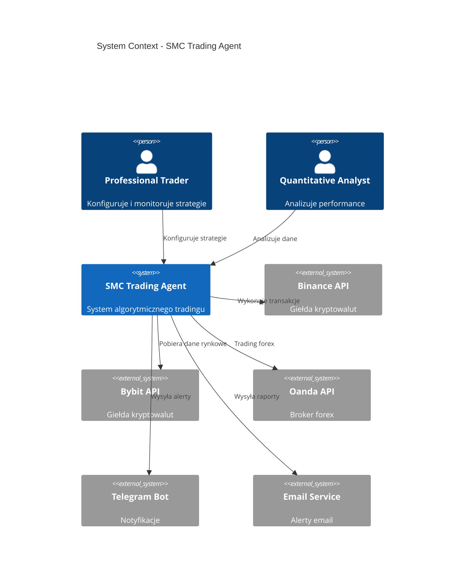
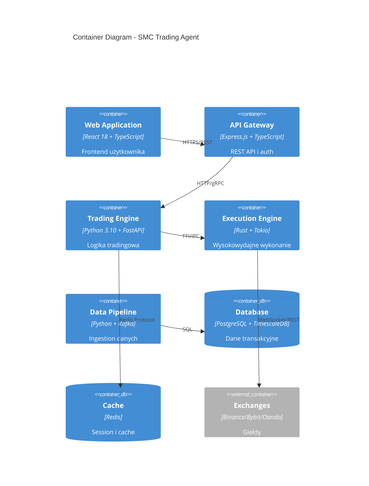
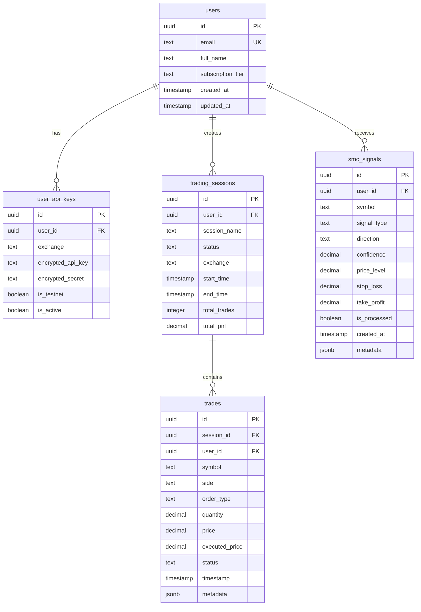
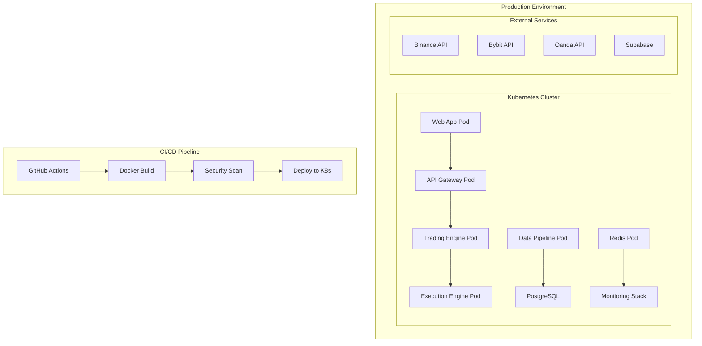
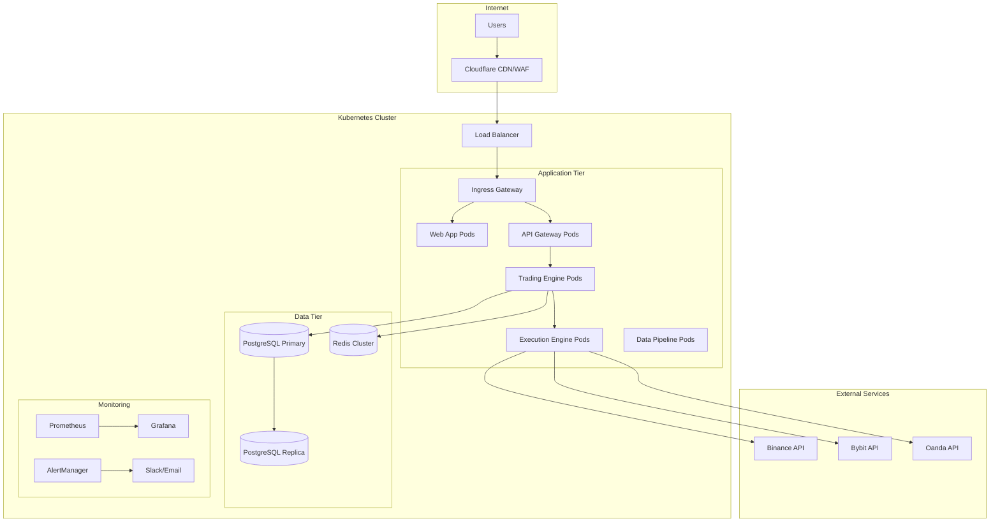
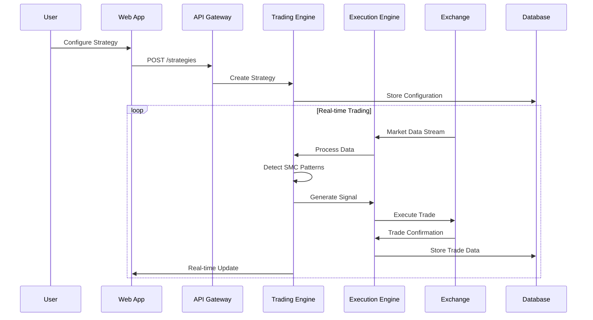
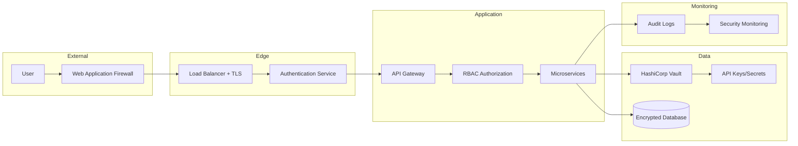

# Projekt - Analiza Context-7 i Plan Implementacji Produkcyjnej SMC Trading Agent

## Przegląd

Ten dokument przedstawia kompleksową analizę Context-7 projektu SMC Trading Agent oraz szczegółowy projekt implementacji produkcyjnej. Analiza obejmuje wszystkie siedem warstw kontekstu: biznesowy, użytkownika, systemowy, kodu, danych, operacyjny i ryzyka.

## Analiza Context-7

### 1. Kontekst Biznesowy

**Cele biznesowe:**
- Automatyzacja tradingu z wykorzystaniem Smart Money Concepts (SMC)
- Generowanie zysków poprzez algorytmiczne wykrywanie wzorców instytucjonalnych
- Minimalizacja ryzyka poprzez zaawansowane zarządzanie pozycjami
- Skalowanie strategii tradingowych na wielu giełdach

**KPI i ROI:**
- Sharpe Ratio > 2.0
- Maximum Drawdown < 5%
- Win Rate > 60%
- ROI > 20% rocznie
- Latencja wykonania < 50ms

**Ryzyka biznesowe:**
- Zmienność rynków kryptowalut
- Zmiany regulacyjne
- Awarie giełd
- Błędy algorytmiczne prowadzące do strat
- Konkurencja od innych botów tradingowych

### 2. Kontekst Użytkownika

**Persony:**
- **Professional Trader**: Doświadczony trader szukający automatyzacji
- **Quantitative Analyst**: Analityk implementujący strategie algorytmiczne  
- **Trading Firm**: Firma tradingowa skalująca operacje
- **Retail Investor**: Inwestor detaliczny z kapitałem > $10k

**Przypadki użycia:**
- Konfiguracja strategii SMC
- Monitoring pozycji w czasie rzeczywistym
- Analiza performance i raportowanie
- Zarządzanie ryzykiem i limitami
- Backtesting strategii

**Journey użytkowników:**
1. Rejestracja i weryfikacja tożsamości
2. Konfiguracja API keys giełd
3. Ustawienie parametrów ryzyka
4. Aktywacja strategii tradingowych
5. Monitoring i optymalizacja

**Wymagania dostępności:**
- 99.9% uptime (8.76h downtime/rok)
- Dostęp 24/7 ze względu na globalne rynki
- Responsywność < 2s dla UI
- Mobile-friendly interface

### 3. Kontekst Systemowy

**Granice systemu:**


**Systemy zewnętrzne:**
- **Binance API**: REST + WebSocket, rate limit 1200/min
- **Bybit API**: REST + WebSocket, rate limit 120/s  
- **Oanda API**: REST + Streaming, rate limit 120/s
- **Supabase**: PostgreSQL + Auth + Realtime
- **Redis**: Cache i session storage
- **Prometheus/Grafana**: Monitoring i alerting

**Polityki danych:**
- Szyfrowanie danych w spoczynku (AES-256)
- Szyfrowanie w transporcie (TLS 1.3)
- Retencja danych transakcyjnych: 7 lat
- Backup codziennie z 30-dniową retencją
- GDPR compliance dla danych EU

### 4. Kontekst Kodu

**Architektura komponentów:**


**Języki i frameworki:**
- **Frontend**: React 18, TypeScript 5.8, Vite 6, Tailwind CSS
- **API Layer**: Express.js 4.21, TypeScript, JWT auth
- **Trading Engine**: Python 3.10, FastAPI 0.104, Pydantic 2.5
- **Execution Engine**: Rust 2021, Tokio async, CCXT-rs
- **Database**: PostgreSQL 15, TimescaleDB, Supabase
- **Infrastructure**: Docker, Kubernetes, Prometheus, Grafana

**Jakość kodu:**
- TypeScript strict mode enabled
- Python type hints z mypy
- Rust clippy linting
- ESLint + Prettier dla JS/TS
- Black + isort dla Python
- 80%+ test coverage target
- Pre-commit hooks z formatowaniem

**Problemy zidentyfikowane:**
- Brak kompletnych testów integracyjnych
- Niektóre komponenty używają mock implementacji
- Brak proper error handling w niektórych miejscach
- Nieoptymalne zapytania do bazy danych
- Brak rate limiting w API

### 5. Kontekst Danych

**Model danych:**


**Schematy i migracje:**
- Supabase migrations w `supabase/migrations/`
- Wersjonowanie schematów z Alembic
- Row Level Security (RLS) enabled
- Indeksy na często używanych kolumnach
- Partycjonowanie tabel trades po dacie

**PII i GDPR:**
- Email addresses (PII)
- API keys (szyfrowane)
- Trading history (pseudoanonimizowane)
- Right to be forgotten implementation
- Data export functionality

**Retencja danych:**
- User data: do usunięcia konta
- Trading data: 7 lat (wymogi regulacyjne)
- Market data cache: 24h
- Logs: 90 dni
- Backups: 30 dni

### 6. Kontekst Operacyjny

**Deployment:**


**Runtime requirements:**
- **CPU**: 4 cores minimum, 8 cores recommended
- **RAM**: 8GB minimum, 16GB recommended  
- **Storage**: 100GB SSD minimum
- **Network**: 1Gbps, <10ms latency do giełd
- **OS**: Linux (Ubuntu 22.04 LTS)

**High Availability:**
- Multi-zone deployment (3 AZ minimum)
- Load balancer z health checks
- Database replication (master-slave)
- Redis Sentinel dla HA cache
- Auto-scaling na podstawie CPU/memory

**Disaster Recovery:**
- RTO: 15 minut
- RPO: 5 minut
- Automated backups co 6h
- Cross-region backup replication
- Runbook dla disaster scenarios

**Skalowanie:**
- Horizontal pod autoscaling
- Database connection pooling
- Redis clustering
- CDN dla static assets
- Rate limiting i circuit breakers

**Koszty (miesięcznie):**
- **Development**: $200-500
- **Staging**: $500-1000  
- **Production**: $1500-3000
- **Monitoring**: $100-300
- **Backup/DR**: $200-500

### 7. Kontekst Ryzyka

**Bezpieczeństwo:**
- **Wysokie**: API keys exposure
- **Wysokie**: SQL injection w custom queries
- **Średnie**: XSS w React components
- **Średnie**: CSRF attacks
- **Niskie**: DDoS attacks (Cloudflare protection)

**Compliance:**
- **GDPR**: Wymagane dla użytkowników EU
- **PCI DSS**: Nie dotyczy (brak płatności kartą)
- **SOX**: Wymagane dla firm publicznych
- **MiFID II**: Wymagane dla EU trading firms

**Privacy:**
- Minimalizacja zbieranych danych
- Pseudoanonimizacja trading data
- Encryption at rest i in transit
- Access logging i auditing
- Data retention policies

**Vendor Lock-in:**
- **Supabase**: Średnie ryzyko, migracja możliwa
- **Vercel**: Niskie ryzyko, łatwa migracja
- **Exchange APIs**: Wysokie ryzyko, trudna zmiana
- **Kubernetes**: Niskie ryzyko, standard branżowy

## Architektura Rozwiązania

### Komponenty Systemu

**1. Frontend (React + TypeScript)**
- Vite 6 build system
- Tailwind CSS styling
- React Query dla state management
- WebSocket connections dla real-time data
- PWA capabilities

**2. API Gateway (Express.js)**
- JWT authentication
- Rate limiting
- Request validation
- CORS handling
- API documentation (OpenAPI)

**3. Trading Engine (Python + FastAPI)**
- SMC pattern detection
- Risk management
- Decision engine
- Model ensemble
- WebSocket connections

**4. Execution Engine (Rust)**
- Ultra-low latency execution
- Circuit breakers
- Retry logic
- Metrics collection
- CCXT integration

**5. Data Pipeline (Python + Kafka)**
- Real-time data ingestion
- Data validation
- Stream processing
- Market data normalization

### Integracje Zewnętrzne

**Exchange APIs:**
```typescript
interface ExchangeConfig {
  name: 'binance' | 'bybit' | 'oanda';
  apiKey: string;
  apiSecret: string;
  testnet: boolean;
  rateLimit: number;
  endpoints: {
    rest: string;
    websocket: string;
  };
}
```

**Database Schema:**
- PostgreSQL 15 z TimescaleDB extension
- Row Level Security (RLS)
- Automated backups
- Connection pooling
- Read replicas

### Monitoring i Observability

**Metrics (Prometheus):**
- Trading performance metrics
- System performance metrics  
- Business metrics (PnL, trades)
- SLI/SLO monitoring

**Logging (Structured JSON):**
- Application logs
- Audit logs
- Error tracking
- Performance logs

**Alerting:**
- Critical system failures
- Trading losses > threshold
- API rate limit exceeded
- Database connection issues

### Security Architecture

**Authentication & Authorization:**
- JWT tokens z refresh mechanism
- Multi-factor authentication (TOTP, WebAuthn)
- Role-based access control (RBAC)
- API key management

**Data Protection:**
- AES-256 encryption at rest
- TLS 1.3 in transit
- API key encryption
- PII pseudoanonimization

**Network Security:**
- WAF (Web Application Firewall)
- DDoS protection
- VPN access dla admin
- Network segmentation

## Error Handling

**Circuit Breaker Pattern:**
```python
@circuit_breaker(failure_threshold=5, recovery_timeout=30)
async def execute_trade(signal: TradingSignal):
    # Implementation with automatic fallback
    pass
```

**Retry Logic:**
```rust
#[retry(max_attempts = 3, backoff = exponential)]
async fn place_order(order: Order) -> Result<OrderResponse, Error> {
    // Implementation with exponential backoff
}
```

**Graceful Degradation:**
- Fallback do cached data
- Reduced functionality mode
- User notifications
- Automatic recovery

## Testing Strategy

**Unit Tests:**
- 80%+ coverage dla core logic
- Property-based testing
- Mock external dependencies
- Fast execution (<5s)

**Integration Tests:**
- Database interactions
- API endpoints
- WebSocket connections
- Exchange integrations (testnet)

**End-to-End Tests:**
- Complete user journeys
- Trading scenarios
- Error scenarios
- Performance tests

**Load Testing:**
- Concurrent users: 1000+
- Transactions per second: 100+
- Response time: <100ms p95
- Memory usage monitoring
## Identyf
ikacja Luk i Problemów

### Krytyczne Problemy

**1. Bezpieczeństwo:**
- Hardcoded API keys w kodzie źródłowym
- Brak proper input validation w niektórych endpointach
- Niewystarczające logowanie zdarzeń bezpieczeństwa
- Brak rate limiting na krytycznych endpointach

**2. Wydajność:**
- Nieoptymalne zapytania SQL (N+1 problem)
- Brak connection pooling dla bazy danych
- Synchroniczne operacje blokujące w Python
- Brak cachowania dla często używanych danych

**3. Niezawodność:**
- Brak proper error handling w execution engine
- Niewystarczające circuit breakers
- Brak graceful shutdown mechanisms
- Single points of failure

**4. Monitoring:**
- Brak comprehensive health checks
- Niewystarczające metryki biznesowe
- Brak alerting dla krytycznych scenariuszy
- Niewystarczające logowanie

### Średnie Problemy

**1. Kod:**
- Inconsistent error handling patterns
- Brak proper type annotations w niektórych miejscach
- Duplicate code w różnych komponentach
- Niewystarczające unit tests

**2. Infrastruktura:**
- Brak proper secrets management
- Nieoptymalna konfiguracja Docker
- Brak proper resource limits
- Niewystarczające backup procedures

**3. Dokumentacja:**
- Brak API documentation
- Niewystarczające deployment guides
- Brak troubleshooting runbooks
- Outdated README files

### Niskie Problemy

**1. UX/UI:**
- Nieoptymalne loading states
- Brak proper error messages
- Inconsistent styling
- Brak accessibility features

**2. DevOps:**
- Brak automated testing w CI/CD
- Nieoptymalne build times
- Brak proper staging environment
- Manual deployment processes

## Plan Implementacji Produkcyjnej

### Faza 1: Fundament (Tygodnie 1-4)

**1.1 Security Hardening**
- Implementacja proper secrets management (HashiCorp Vault)
- Dodanie input validation i sanitization
- Implementacja comprehensive audit logging
- Konfiguracja WAF i DDoS protection

**1.2 Infrastructure Setup**
- Konfiguracja Kubernetes cluster
- Setup CI/CD pipeline z GitHub Actions
- Implementacja monitoring stack (Prometheus/Grafana)
- Konfiguracja backup i disaster recovery

**1.3 Database Optimization**
- Implementacja connection pooling
- Optymalizacja queries i dodanie indeksów
- Setup read replicas
- Implementacja data retention policies

### Faza 2: Core Services (Tygodnie 5-8)

**2.1 Trading Engine Enhancement**
- Refactoring do async/await patterns
- Implementacja proper error handling
- Dodanie comprehensive testing
- Performance optimization

**2.2 Execution Engine Hardening**
- Implementacja robust circuit breakers
- Dodanie retry logic z exponential backoff
- Enhanced metrics collection
- Latency optimization

**2.3 API Gateway Implementation**
- Rate limiting implementation
- Authentication/authorization hardening
- Request/response validation
- API documentation generation

### Faza 3: Integration & Testing (Tygodnie 9-12)

**3.1 Exchange Integrations**
- Production API configurations
- Error handling dla exchange failures
- Rate limit management
- Failover mechanisms

**3.2 Real-time Data Pipeline**
- Kafka cluster setup
- Stream processing optimization
- Data validation i quality checks
- Monitoring i alerting

**3.3 Comprehensive Testing**
- Unit test coverage > 80%
- Integration tests dla wszystkich services
- Load testing i performance validation
- Security penetration testing

### Faza 4: Production Deployment (Tygodnie 13-16)

**4.1 Production Environment**
- Multi-zone Kubernetes deployment
- Load balancer configuration
- SSL/TLS certificates setup
- Domain i DNS configuration

**4.2 Monitoring & Alerting**
- SLI/SLO definition i monitoring
- Business metrics dashboards
- Alert rules configuration
- On-call procedures

**4.3 Documentation & Training**
- Operational runbooks
- API documentation
- User guides
- Team training sessions

## Diagramy Architektury

### Deployment Architecture


### Data Flow Architecture


### Security Architecture


## Konfiguracje Produkcyjne

### Kubernetes Manifests

**Namespace:**
```yaml
apiVersion: v1
kind: Namespace
metadata:
  name: smc-trading
  labels:
    name: smc-trading
    environment: production
```

**ConfigMap:**
```yaml
apiVersion: v1
kind: ConfigMap
metadata:
  name: smc-config
  namespace: smc-trading
data:
  DATABASE_HOST: "postgresql-primary.smc-trading.svc.cluster.local"
  REDIS_HOST: "redis-cluster.smc-trading.svc.cluster.local"
  LOG_LEVEL: "INFO"
  ENVIRONMENT: "production"
```

**Secret:**
```yaml
apiVersion: v1
kind: Secret
metadata:
  name: smc-secrets
  namespace: smc-trading
type: Opaque
data:
  DATABASE_PASSWORD: <base64-encoded>
  JWT_SECRET: <base64-encoded>
  BINANCE_API_KEY: <base64-encoded>
  BINANCE_API_SECRET: <base64-encoded>
```

### Docker Configurations

**Multi-stage Dockerfile (Trading Engine):**
```dockerfile
# Build stage
FROM python:3.10-slim as builder
WORKDIR /app
COPY requirements.txt .
RUN pip install --no-cache-dir --user -r requirements.txt

# Production stage  
FROM python:3.10-slim
WORKDIR /app
COPY --from=builder /root/.local /root/.local
COPY . .
RUN useradd -m -u 1000 appuser && chown -R appuser:appuser /app
USER appuser
EXPOSE 8000
CMD ["uvicorn", "main:app", "--host", "0.0.0.0", "--port", "8000"]
```

### Monitoring Configuration

**Prometheus Config:**
```yaml
global:
  scrape_interval: 15s
  evaluation_interval: 15s

rule_files:
  - "smc_trading_rules.yml"

scrape_configs:
  - job_name: 'smc-trading-engine'
    static_configs:
      - targets: ['trading-engine:8000']
    metrics_path: /metrics
    scrape_interval: 5s

  - job_name: 'smc-execution-engine'
    static_configs:
      - targets: ['execution-engine:9090']
    metrics_path: /metrics
    scrape_interval: 1s
```

**Alert Rules:**
```yaml
groups:
  - name: smc_trading_alerts
    rules:
      - alert: HighLatency
        expr: histogram_quantile(0.95, rate(order_execution_duration_ms[5m])) > 100
        for: 2m
        labels:
          severity: warning
        annotations:
          summary: "High execution latency detected"
          
      - alert: TradingLoss
        expr: increase(total_pnl[1h]) < -1000
        for: 0m
        labels:
          severity: critical
        annotations:
          summary: "Significant trading loss detected"
```

## Estymaty Kosztów i Timeline

### Koszty Infrastruktury (miesięcznie)

**Development Environment:**
- Kubernetes cluster (3 nodes): $150
- Database (PostgreSQL): $50
- Monitoring stack: $30
- **Total: $230/miesiąc**

**Production Environment:**
- Kubernetes cluster (6 nodes, multi-AZ): $800
- Database (HA PostgreSQL): $300
- Redis cluster: $150
- Load balancer: $50
- Monitoring i logging: $100
- Backup storage: $80
- **Total: $1,480/miesiąc**

### Timeline Implementacji

**Faza 1 (4 tygodnie): Fundament**
- Tydzień 1: Security hardening
- Tydzień 2: Infrastructure setup
- Tydzień 3: Database optimization
- Tydzień 4: Basic monitoring

**Faza 2 (4 tygodnie): Core Services**
- Tydzień 5-6: Trading engine enhancement
- Tydzień 7: Execution engine hardening
- Tydzień 8: API gateway implementation

**Faza 3 (4 tygodnie): Integration**
- Tydzień 9-10: Exchange integrations
- Tydzień 11: Data pipeline
- Tydzień 12: Comprehensive testing

**Faza 4 (4 tygodnie): Production**
- Tydzień 13-14: Production deployment
- Tydzień 15: Monitoring setup
- Tydzień 16: Documentation i training

**Total: 16 tygodni (4 miesiące)**

## Metryki Sukcesu

### Technical KPIs
- Uptime: 99.9%
- Response time: <100ms p95
- Error rate: <0.1%
- Test coverage: >80%

### Business KPIs  
- Trading latency: <50ms
- Sharpe ratio: >2.0
- Maximum drawdown: <5%
- Win rate: >60%

### Operational KPIs
- MTTR: <15 minut
- Deployment frequency: Daily
- Lead time: <1 dzień
- Change failure rate: <5%